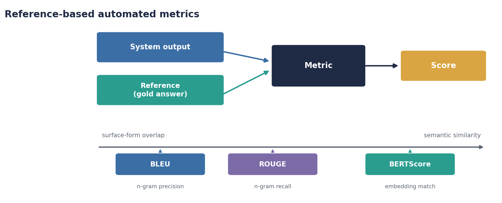
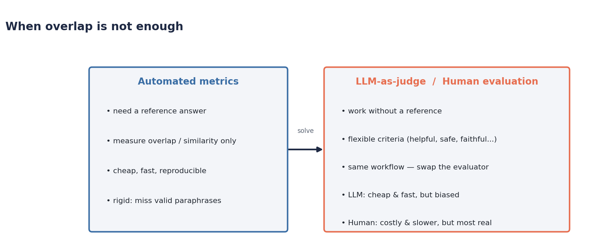
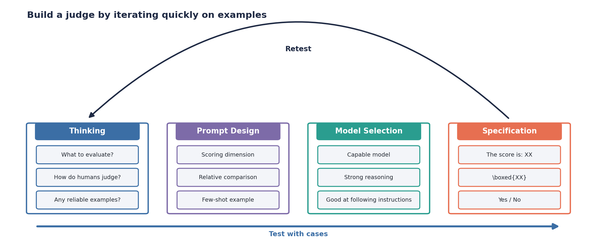
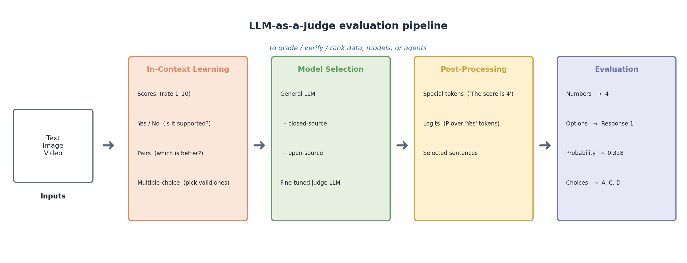
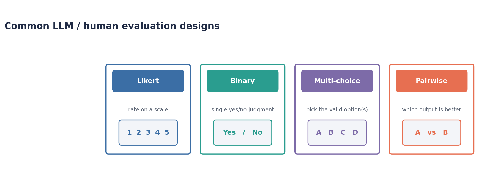
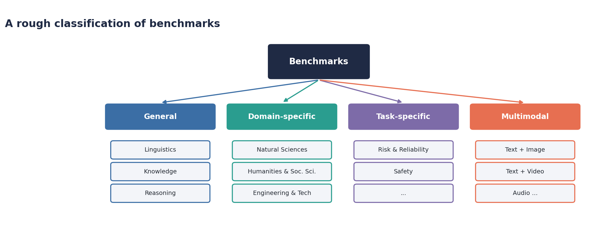
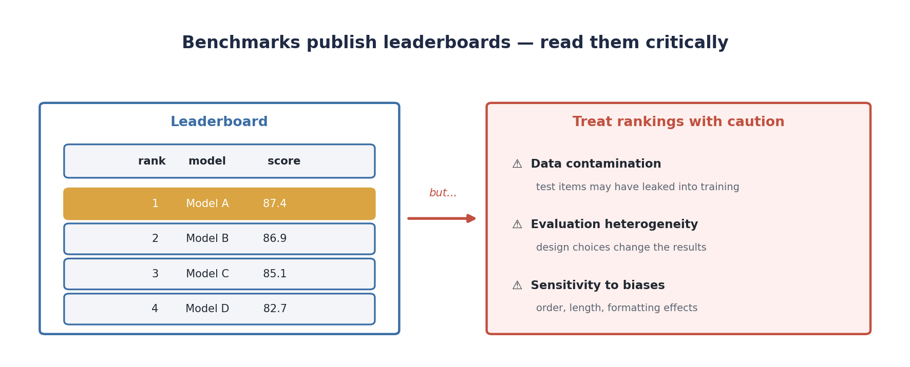
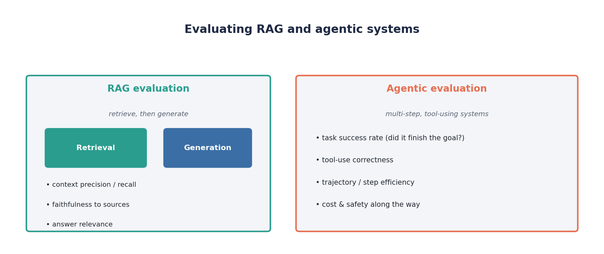

# Evaluating Generative Systems

Building a generative system is only half the job; the harder half is knowing whether it is any good. Unlike a classifier, which is either right or wrong on each example, a generative model produces open-ended text for which there is rarely a single correct answer. This tutorial surveys the main families of evaluation — automated metrics, LLM-as-judge and human evaluation, benchmarks and leaderboards, and the specialised setups needed for RAG and agentic systems — and then builds a small evaluation pipeline that applies two of them to a real model.

---

## Part 1 — Automated Metrics

The oldest and cheapest way to evaluate a generative system is to compare its output against a **reference** (a gold answer written by a human) using an automated metric. The system output and the reference go into a metric, and a single score comes out.

<p align="center">

</p>

The three most common metrics sit on a spectrum from pure *surface-form overlap* to *semantic similarity*:

- **BLEU** (Bilingual Evaluation Understudy) measures **n-gram precision**: what fraction of the n-grams in the output also appear in the reference, with a brevity penalty discouraging overly short outputs. It was designed for machine translation.
- **ROUGE** (Recall-Oriented Understudy for Gisting Evaluation) measures **n-gram recall**: what fraction of the reference's n-grams are captured by the output. ROUGE-1 and ROUGE-2 use unigrams and bigrams; ROUGE-L uses the longest common subsequence. It was designed for summarization.
- **BERTScore** moves from surface form to meaning. Instead of matching exact tokens, it embeds the output and the reference with a contextual encoder and matches tokens by **cosine similarity** in embedding space, so "the film was great" and "the movie was excellent" can score highly despite sharing almost no words.

**Their limitations.** All three are convenient, fast, and reproducible, but they share a fundamental weakness: they reward resemblance to *one particular reference*. A perfectly good output that is phrased differently from the reference is penalised, and BLEU/ROUGE in particular correlate weakly with human judgments of quality on open-ended tasks. They cannot assess properties that have nothing to do with the reference — helpfulness, safety, factual correctness, tone, or instruction-following — and they require a reference to exist at all, which rules out the many tasks (creative writing, open-ended dialogue, brainstorming) where no single gold answer can be written down.

---

## Part 2 — LLM-as-Judge and Human Evaluation

The limitations above motivate a different approach: instead of comparing to a fixed reference, ask an *evaluator* to judge the output directly. This buys two things at once — **flexibility**, because the evaluator can be asked about any criterion (not just semantic similarity), and **reference-free evaluation**, because the judgment is made on the output itself, so it works even when no gold answer exists.

<p align="center">

</p>

There are two ways to supply that evaluator, and they are essentially the *same workflow with the evaluator swapped*: **LLM-as-judge** uses a capable language model, while **human evaluation** uses people. Because the procedure is identical, the trade-off is about who does the judging. Humans are the gold standard — their judgments are the "real" thing every automatic method is trying to approximate — but they are slow and expensive, and they bring their own well-documented biases. An LLM judge is fast and cheap and can score thousands of outputs in minutes, but it inherits the model's biases (favouring longer answers, the first option presented, its own writing style) and so must be validated against humans before it is trusted.

### Building an LLM-as-Judge

A good judge is not written in one shot; it is developed by **iterating quickly on examples**, much like prompt engineering. A practical loop moves through four stages, testing against labelled cases and retesting after each change:

<p align="center">

</p>

1. **Thinking** — decide *what* to evaluate, study how humans judge it, and gather a few reliable labelled examples to test against.
2. **Prompt Design** — define the scoring dimension(s), decide whether a relative (pairwise) comparison would be more reliable than an absolute score, and add a worked example.
3. **Model Selection** — pick a model capable enough for the task, with strong reasoning and good instruction-following.
4. **Specification** — pin down the exact output format the judge must produce (`The score is: X`, a boxed value, or a plain `Yes / No`) so the result can be parsed reliably.

Zooming out, the full judging pipeline is a sequence of stages from raw inputs to a parsed verdict:

<p align="center">

</p>

The **inputs** (text, image, video) are framed by an **in-context learning** choice of judgment format; a **model** is selected (general closed- or open-source, or a fine-tuned judge); the raw response is turned into a structured signal in **post-processing** (parsing special tokens, reading the logits over answer tokens, or extracting selected sentences); and the result is read off as the final **evaluation** (a number, an option, a probability, or a set of choices).

### Common Evaluation Designs

Whether the evaluator is a model or a person, the judgment is usually framed in one of four ways:

<p align="center">

</p>

- **Likert** — rate the output on an ordinal scale (e.g. 1–5 for relevance or coherence). Rich, but absolute scores drift between raters.
- **Binary** — a single yes/no judgment ("is this answer factually supported?"). Simple and reliable for well-defined questions.
- **Multi-choice** — select the valid option(s) from a fixed set. Useful when the space of acceptable answers is enumerable.
- **Pairwise** — given two outputs, choose which is better. Relative comparisons are often *more reliable* than absolute scores, which is why they dominate model-vs-model evaluation.

---

## Part 3 — Benchmarks and Leaderboards

A single evaluation tells you about one model on one task. To compare methods across the community, the field relies on **benchmarks**. A widely used definition describes a benchmark as:

> "a particular combination of a dataset or sets of datasets [. . . ] and a metric, conceptualized as representing one or more specific tasks or sets of abilities, picked up by a community of researchers as a shared framework for the comparison of methods."

In other words, a benchmark bundles *data + metric + a shared agreement to use it*. Benchmarks are often grouped by the kind of ability they target:

<p align="center">

</p>

- **General** — broad abilities such as *Linguistics*, *Knowledge*, and *Reasoning*.
- **Domain-specific** — expertise in a field, such as the *Natural Sciences*, the *Humanities & Social Sciences*, or *Engineering & Technology*.
- **Task-specific** — a narrow capability, such as *Risk & Reliability* or safety.
- **Multimodal** — abilities that span modalities (text + image, text + video, audio), evaluated with their own dedicated benchmarks.

### Leaderboards — Read Them Critically

Many benchmarks publish public **leaderboards** that rank the models submitted to them and highlight the top performers for the abilities being tested. Leaderboards are useful, but rankings should be treated with caution.

<p align="center">

</p>

Two problems recur:

- **Data contamination** — if a benchmark's test items have leaked into a model's training data (a real risk for anything scraped from the public web), the model is effectively being tested on examples it has already seen, and its score is inflated.
- **Evaluation heterogeneity and biases** — evaluation design choices materially change the results. The same model can rank differently depending on the prompt template, the decoding settings, or the scoring rule, and judges (human or LLM) are sensitive to superficial features such as the **order** options are presented in and the **length** of an answer. A leaderboard number is only meaningful alongside the exact protocol that produced it.

---

## Part 4 — Evaluating RAG and Agentic Systems

Modern generative systems are often more than a single model call, and they need evaluation that looks at the whole system rather than one output.

<p align="center">

</p>

**Retrieval-Augmented Generation (RAG)** systems first *retrieve* supporting documents and then *generate* an answer conditioned on them, so evaluation has to cover both halves. The retrieval side is judged on whether it surfaced the right context (context precision and recall); the generation side is judged on whether the answer is *faithful* to the retrieved context (no hallucinated claims) and *relevant* to the question. Dedicated RAG benchmarks and frameworks measure these components separately so a failure can be traced to either retrieval or generation.

**Agentic systems** plan over multiple steps and call external tools, so the meaningful unit of evaluation is the whole *trajectory*, not a single response. The headline metric is **task success rate** — did the agent actually accomplish the goal? — supported by finer-grained measures of tool-use correctness, the efficiency of the trajectory (how many steps and how much cost it took), and safety along the way. A growing set of agentic benchmarks scores models on realistic multi-step tasks rather than isolated question answering.

---

## Tutorial

The companion script [`evaluating.py`](./evaluating.py) builds an evaluation pipeline for a single generative model, applying **two** of the approaches above to the same outputs. The model is an instruction-tuned model from Hugging Face served with **vLLM**.

### Pipeline

1. **Generate.** Pull a small slice of a summarization **benchmark from Hugging Face** (`cnn_dailymail` by default, streamed so nothing large is downloaded) and have the model summarize each source document.
2. **Automated metrics (Part 1).** Score every generated summary against the benchmark's reference summary with **BLEU**, **ROUGE-1/2/L**, and — if `bert_score` is installed — **BERTScore**.
3. **LLM-as-judge (Part 2).** Run the *same* model as a judge over the generations using a Likert + binary rubric: rate **relevance** and **coherence** (1–5) and decide **faithfulness** (yes/no), returning a strict JSON verdict that is then parsed.
4. **Compare.** Aggregate both views and report the correlation between ROUGE-L and the judge's score — a concrete demonstration that overlap metrics and judgments do not always agree.

All generations and metrics are written to `./outputs/` as JSON.

### Running

```bash
python evaluating.py
```

Everything is configurable via environment variables:

```bash
MODEL_NAME=Qwen/Qwen3-8B N_SAMPLES=20 python evaluating.py
```

| Variable | Default | Meaning |
|---|---|---|
| `MODEL_NAME` | `Qwen/Qwen3-8B` | Hugging Face model id served by vLLM |
| `DATASET_NAME` | `cnn_dailymail` | Hugging Face benchmark to evaluate on |
| `DATASET_CONFIG` | `3.0.0` | Dataset configuration name |
| `N_SAMPLES` | `20` | Number of benchmark examples to score |
| `HF_HOME` | `/export/projects/nlp/.cache` | Shared Hugging Face cache directory |
| `MAX_MODEL_LEN` | `4096` | vLLM context length |


---

## Dockerfile

```dockerfile
FROM ubuntu:24.04

RUN apt-get update && \
    apt-get install -y \
    python3-pip \
    python3-venv \
    && apt-get clean

RUN python3 -m venv /opt/venv
ENV PATH="/opt/venv/bin:$PATH"

COPY requirements.txt /tmp/
RUN pip install --upgrade pip wheel
RUN pip install -r /tmp/requirements.txt

WORKDIR /app
COPY evaluating.py .
RUN mkdir -p outputs

# The GPU is provided by the host at run time:
#   docker build -t eval-tutorial .
#   docker run --rm --gpus all \
#       -v /export/projects/nlp/.cache:/export/projects/nlp/.cache \
#       eval-tutorial
CMD ["python3", "evaluating.py"]
```

## Requirements

```
vllm>=0.6.0
datasets>=2.18.0
rouge-score>=0.1.2
sacrebleu>=2.4.0
numpy>=1.24.0
# optional, heavier: enables BERTScore (downloads a ~1.4 GB encoder)
bert-score>=0.3.13
```

`datasets` loads the online benchmark; `rouge-score` and `sacrebleu` are lightweight and provide ROUGE and BLEU. `bert_score` is optional — the script computes BERTScore only if it is importable and otherwise skips it gracefully.
