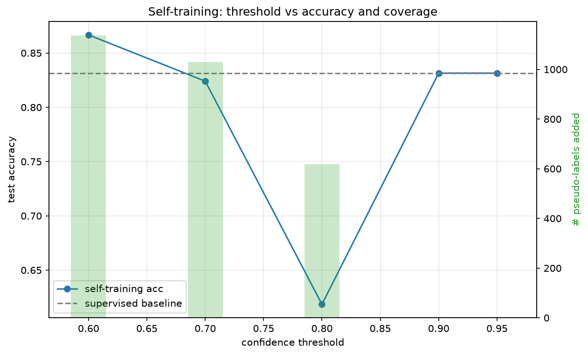
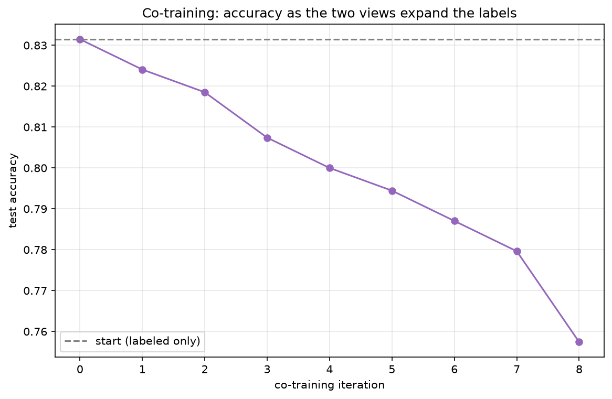
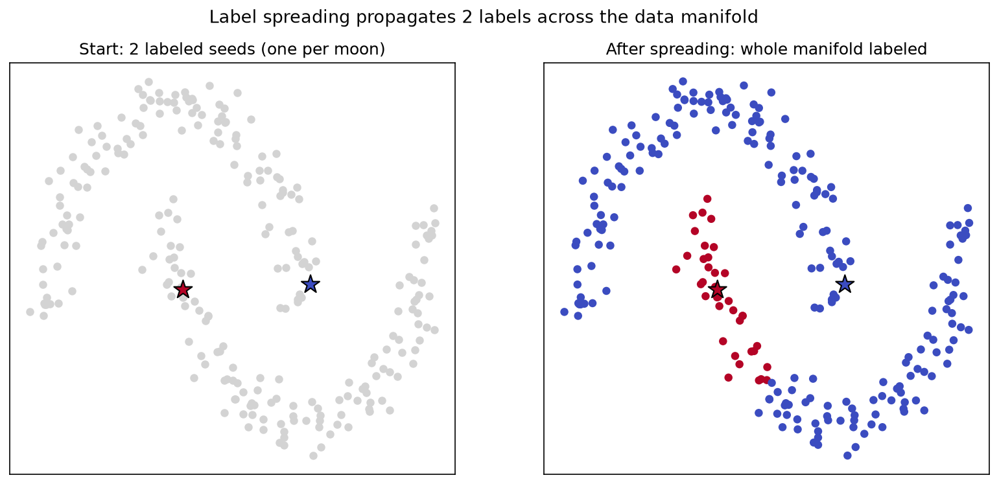
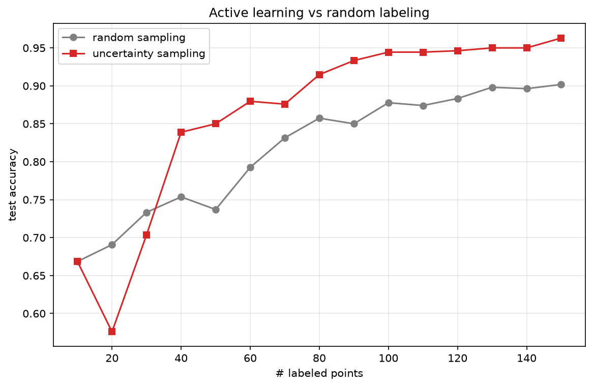
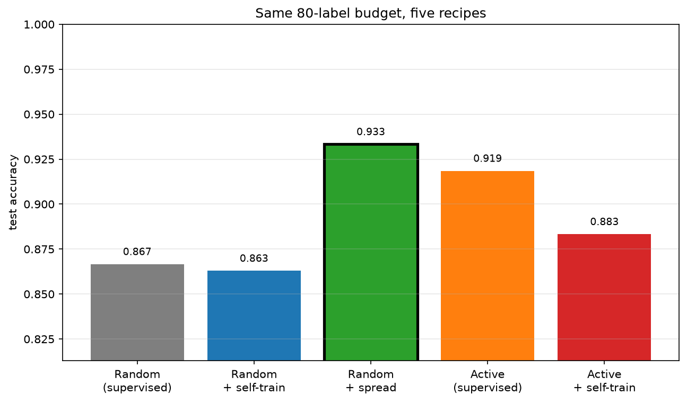

# Semi-Supervised and Active Learning

Labels are the expensive part of machine learning. A radiologist annotating scans, a linguist tagging sentences, a human rating outputs — each label costs time and money, while *unlabeled* data (raw images, text, logs) is often nearly free and abundant. **Semi-supervised learning (SSL)** and **active learning** both attack this asymmetry, from two complementary directions:

- **Semi-supervised learning** — make the most of the unlabeled data you *already have*.
- **Active learning** — spend a tiny labeling budget on the *few points most worth labeling*.

This tutorial builds and compares the main techniques on scikit-learn's `digits` dataset (8×8 handwritten digits, 10 classes), starting from a deliberately tiny labeled set. The companion script `semi_supervised.py` runs six stages and writes a figure for each to `./images/`.

---

## 1. The Setup: A Little Labeled, A Lot Unlabeled

We hide almost all the labels: keep just a handful per class as **labeled**, mark the rest **unlabeled** (`-1`), and hold out a test set. A plain supervised model trained on only the labeled points gives the **baseline** every method must beat. The whole field exists because that baseline leaves information on the table — the geometry of the unlabeled points says a lot about where the class boundaries should go.

Every SSL method leans on one of two assumptions:

- **Cluster assumption** — points in the same dense cluster share a label; decision boundaries should fall in low-density regions.
- **Manifold assumption** — data lies on a lower-dimensional surface, and points close *along that surface* share a label.

---

## 2. Self-Training

The simplest SSL method, and a surprisingly strong one. Train on the labels you have, predict the unlabeled points, then **promote the most confident predictions to "pseudo-labels"**, add them to the training set, and retrain. Repeat.

```
   labeled ──train──▶ model ──predict──▶ unlabeled
      ▲                                         │
      │              keep predictions           │
      └──────  above a confidence threshold ◀───
```

The **confidence threshold** is the key knob:

- **Low threshold** → many pseudo-labels, but more of them wrong. Errors get baked in and reinforced — *confirmation bias*.
- **High threshold** → fewer, safer pseudo-labels, smaller gain.

<p align="center">

</p>

The blue line is test accuracy across thresholds; the dashed line is the supervised baseline; the green bars show how many pseudo-labels each threshold admits. The sweet spot balances coverage against pseudo-label noise.

---

## 3. Co-Training

Co-training uses **two different "views"** of each example — two feature subsets that are each sufficient to classify and, ideally, conditionally independent given the label. Two classifiers, one per view, take turns **teaching each other**: each adds its most confident predictions on the unlabeled pool to the *shared* labeled set, so each classifier learns from examples the other was sure about.

```
   view A (left half)  ──▶ classifier A ──
                                           ├─▶ confident picks ─▶ shared labels
   view B (right half) ──▶ classifier B ──
```

In the script we split each digit image into its **left** and **right** halves — two genuinely different views of the same character. As the two views trade confident guesses, the shared labeled pool grows and accuracy climbs:

<p align="center">

</p>

Co-training shines when the views are truly complementary (classic example: classifying web pages from their *text* vs their *inbound link* text). With weak or redundant views it degenerates back toward self-training.

---

## 4. Label Propagation and Label Spreading

Graph-based SSL takes the **manifold assumption** literally. Build a graph connecting each point to its nearest neighbours, seed it with the few known labels, and let those labels **spread along the edges** until every node is labeled. A point ends up with whatever label flows most strongly to it through the graph.

- **Label Propagation** clamps the known labels hard.
- **Label Spreading** is a soft, noise-tolerant variant with a regularization term.

The effect is easiest to see on the two-moons dataset — from just **one labeled seed per moon**, the labels flow around each curved cluster:

<p align="center">

</p>

Left: two lone seeds. Right: the whole manifold labeled after spreading. This is exactly the case where a straight-line supervised classifier from two points would fail badly, but the graph follows the curved structure. Graph methods are **transductive** by nature (they label the specific unlabeled points you gave them); scikit-learn's implementation also supports inductive prediction on new points.

---

## 5. Active Learning

The others exploit unlabeled data passively. Active learning turns the question around: **if I can afford to label N more points, which N should I choose?** Instead of labeling at random, label the points the current model is **most uncertain** about — they carry the most information.

A common, cheap uncertainty measure is **margin sampling**: the smaller the gap between the model's top-two predicted class probabilities, the more confused it is on that point.

```
   loop:
     train model on current labels
     score every unlabeled point by uncertainty
     ask the oracle to label the most uncertain batch
     add them, repeat
```

Given the *same labeling budget*, uncertainty sampling reaches higher accuracy than random sampling, because it doesn't waste labels on points the model already handles:

<p align="center">

</p>

The red curve (uncertainty) sits above the grey curve (random) — the same accuracy for fewer labels, which is the whole point when labels are expensive.

---

## 6. Putting It Together

The two ideas are complementary: **active learning chooses *what* to label; self-training exploits *what you didn't*.** The final stage fixes a labeling budget and compares five recipes head to head on the same test set:

1. Random labels, supervised (the baseline)
2. Random labels + self-training
3. Random labels + label spreading
4. **Active** learning, supervised
5. **Active** learning + self-training

<p align="center">

</p>

The combination of picking informative points *and* mining the unlabeled remainder typically wins — beating either technique on its own for the same annotation cost.

---

## Tutorial

### Requirements

CPU-only, no GPU and no dataset download (the data ships with scikit-learn).

```bash
pip install -r requirements.txt
```

### Run

```bash
python semi_supervised.py            # all six stages
python semi_supervised.py --stage 2  # just self-training
python semi_supervised.py --stage 5  # just active learning
```

Each stage prints its results to the console and writes a figure to `./images/`:

| File | Stage |
|------|-------|
| `self_training.png` | Self-training: threshold vs accuracy & coverage |
| `co_training.png` | Co-training accuracy over iterations |
| `label_propagation.png` | Label spreading across the two-moons manifold |
| `active_learning.png` | Active vs random labeling curves |
| `ssl_comparison.png` | Five recipes on the same labeling budget |

> **Note:** exact numbers vary a little with the random seed and scikit-learn
> version, but the qualitative story is stable: every method beats the
> tiny-labeled-set baseline, and active + self-training tends to win.
