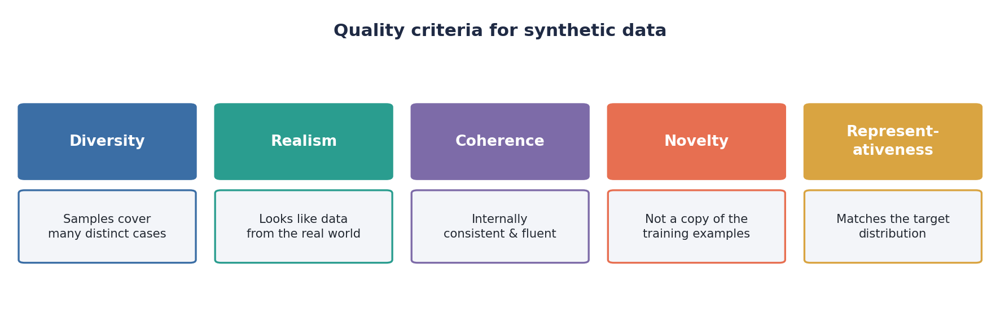
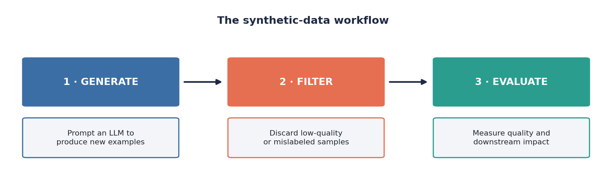
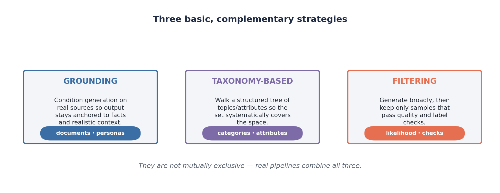
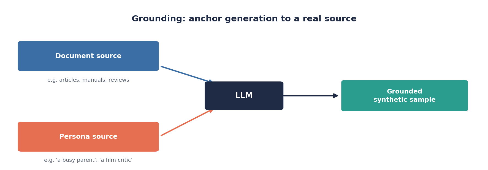
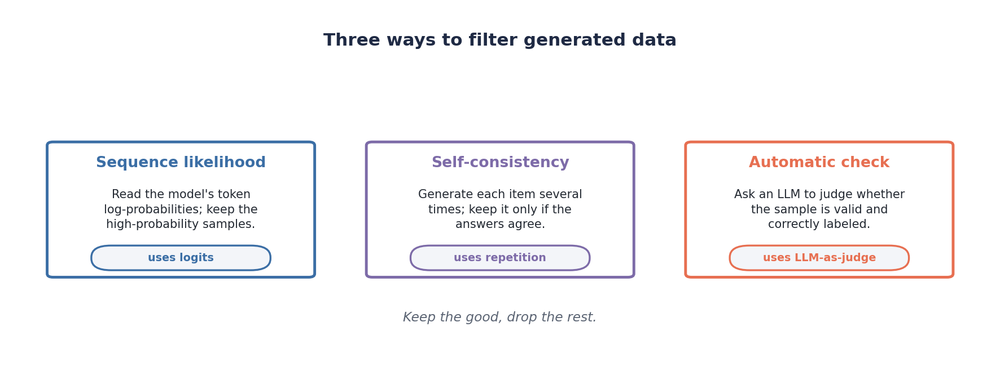
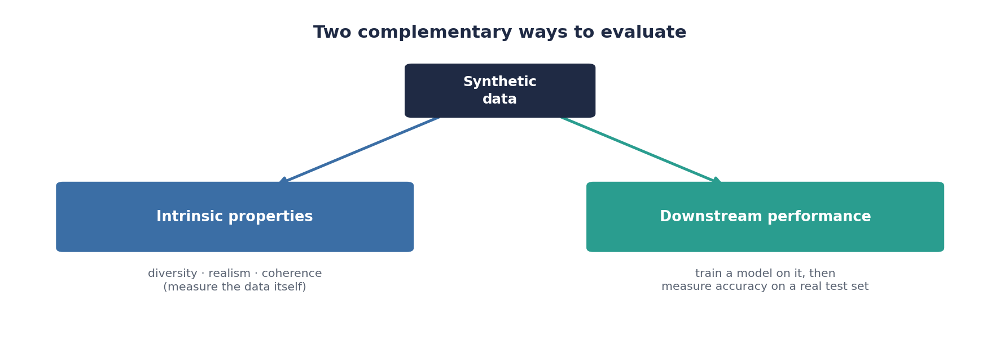

# Synthetic Data Generation with LLMs

As of September 2024, there are over 1,000 datasets labeled as "synthetic" on the Hugging Face platform. The reason is simple: large language models can now produce training data on demand, cheaply, in any language, and for almost any task. Synthetic data plays a crucial role in boosting the performance of machine-learning models across a variety of downstream tasks, including text classification, clinical text mining, and code generation.

But generation is only half the story. A model is only as good as the data it learns from, so raw LLM output cannot be trusted blindly — it can be repetitive, mislabeled, or subtly unrealistic. A useful synthetic dataset is one that scores well on a handful of recurring **quality criteria**:

<p align="center">

</p>

- **Diversity** — the samples cover many distinct cases rather than rephrasing the same few.
- **Realism** — the samples look like data that could have come from the real world.
- **Coherence** — each sample is internally consistent and fluent.
- **Novelty** — the samples are not near-copies of the prompt or the seed examples.
- **Representativeness** — the distribution of samples matches the distribution the model will face at deployment.

This tutorial walks through the full loop end to end: **generate** synthetic training data, **filter** it for quality, and **evaluate** the **downstream impact** of using it.

<p align="center">

</p>

The companion script [`synthetic.py`](./synthetic.py) implements this loop on a sentiment-classification task using a single open model served with [vLLM](https://github.com/vllm-project/vllm).

---

## Three Common Strategies

There are many elaborate recipes for generating synthetic data, but most of them are combinations of just three basic strategies: **grounding**, **taxonomy-based generation**, and **filtering**. They are *complementary* rather than competing — a real pipeline typically grounds generation in some source, optionally organizes the prompts around a taxonomy, and then filters whatever comes out.

<p align="center">

</p>

### Grounding

Left to its own devices, an LLM asked to "write a product review" will fall back on the most generic, high-probability text it knows, and a thousand such requests produce a thousand near-identical reviews. **Grounding** breaks this by conditioning generation on an external source, so each sample is anchored to something concrete.

<p align="center">

</p>

Two common forms of grounding are:

- **Document-grounded** — the prompt includes a real document (an article, a manual, a transcript) and asks the model to generate data *about* or *from* it. This is the basis of most question-answering and summarization datasets.
- **Persona-grounded** — the prompt includes a short description of a fictional author ("a busy parent of three", "a film critic who dislikes sequels") and asks the model to write *as that person*. Because the personas differ, the outputs differ, which directly improves **diversity** and **realism**. This is the form of grounding used in the exercise.

### Taxonomy-Based Generation

Grounding makes individual samples richer; **taxonomy-based generation** makes the *collection* more complete. The idea is to first lay out a structured tree — categories, sub-categories, and attributes that describe the space you care about — and then generate samples for each leaf of the tree. For a sentiment dataset, the taxonomy might cross product *domains* (electronics, restaurants, films) with *aspects* (price, quality, service) and *sentiment intensity* (mildly negative, strongly positive). Walking the tree guarantees the set systematically covers the space instead of clustering around whatever the model finds easiest, which improves **representativeness**.

### Filtering

The first two strategies shape what the model *produces*; **filtering** decides what you *keep*. The standard approach is to over-generate and then discard the weak samples. Three filtering techniques recur in the literature:

<p align="center">

</p>

- **Sequence likelihood** — read the model's own token log-probabilities for a sample and keep only the high-probability ones. The intuition is that text the model finds very *unlikely* is often degenerate, off-task, or contains a label the model itself does not believe. In practice you ask the serving engine for the `logprobs` and threshold on a per-token average, or — as in the exercise — on the probability the model assigns to the *claimed label*.
- **Self-consistency** — generate the same item several times (or ask the same question in several ways) and keep it only if the answers agree. Disagreement is a cheap, automatic signal that the sample is ambiguous or that the label is unreliable.
- **Automatic check (LLM-as-judge)** — put a second LLM pass in the loop whose only job is to verify each sample: *does this review actually express the sentiment it is labeled with, and is it coherent?* Keep the samples that pass.

These three are themselves complementary: likelihood filtering is essentially free because the scores fall out of generation, self-consistency trades extra compute for a robustness signal, and the automatic check catches semantic problems the other two miss.

---

## Evaluating Synthetic Data

How do you know whether your synthetic data is any good? There are two complementary answers, and a serious project reports both.

<p align="center">

</p>

**Intrinsic evaluation** measures properties of the data *itself*, without ever training a model. These are the quality criteria from the introduction made measurable: diversity can be approximated by the fraction of distinct n-grams or by pairwise embedding distances; realism and coherence can be scored by an LLM judge; representativeness can be checked by comparing the synthetic distribution to a small sample of real data. Intrinsic metrics are fast and let you iterate on the generation prompt before spending any training compute.

**Downstream evaluation** measures what ultimately matters: does a model *trained on* the synthetic data perform better? The recipe is to train a fixed model architecture on the synthetic dataset, then measure its accuracy on a **held-out set of real, human-labeled examples**. Holding the test set fixed and real is what makes the comparison meaningful — you are asking whether the synthetic data taught the model something that transfers to reality. Comparing two datasets (for example, a naive one against a grounded-and-filtered one) under the same protocol isolates the contribution of each generation choice.

Intrinsic metrics tell you *why* a dataset is good or bad; downstream metrics tell you *whether* it helped. The exercise focuses on the downstream measurement, which is the harder and more decisive of the two.

---

## Tutorial

The companion script [`synthetic.py`](./synthetic.py) demonstrates the full loop on a **binary sentiment-classification** task: positive vs. negative reviews. It uses a single instruction-tuned model from Hugging Face, served locally with **vLLM**, for synthetic review generation, sequence-likelihood scoring, and LLM-as-judge filtering. For the downstream measurement, it fine-tunes a transformer sequence classifier on each synthetic dataset and evaluates it on a fixed held-out set of reviews.

### Pipeline

1. **Baseline generation.** Prompt the model with a plain instruction to write short labeled reviews. This is the naive dataset: fast to produce, but less grounded and typically lower in diversity.

2. **Persona-grounded and taxonomy-based generation.** Generate a larger pool of reviews using prompts that condition the model on both a persona and a concrete review domain, such as a budget smartphone, a hotel stay, a productivity app, or a local restaurant. This is the *grounding* and *taxonomy* strategy in action: the model is guided to produce more specific and varied reviews while preserving the requested sentiment label.

3. **Filtering and selection.** Score the grounded pool using two filtering techniques:
   - a **sequence-likelihood** check that asks the model to classify each review as positive or negative, then reads first-token `logprobs` to estimate the probability assigned to the claimed label; and
   - an **automatic check** using an LLM-as-judge pass, where the model rates each candidate as `GOOD`, `BORDERLINE`, or `BAD` for sentiment-classification training.

   The final *grounded + filtered* dataset is selected from the scored pool while preserving class balance and domain coverage. `GOOD` examples are preferred, while `BORDERLINE` examples may still be used when they provide realistic sentiment variation.

4. **Downstream evaluation.** Fine-tune the same transformer sequence classifier separately on the baseline dataset, the grounded unfiltered dataset, and the grounded + filtered dataset. Evaluate each trained classifier on the same fixed held-out review set and report accuracy and macro-F1 so the impact of grounding and filtering is visible.

All generated datasets, scored examples, filtered examples, and final metrics are written to a `./outputs/` directory as JSON.

### Running

```bash
python synthetic.py
```

```bash
MODEL_NAME=Qwen/Qwen3-8B N_PER_CLASS=40 python synthetic.py
```

| Variable | Default | Meaning |
|---|---|---|
| `MODEL_NAME` | `Qwen/Qwen3-8B` | Hugging Face model id served by vLLM |
| `N_PER_CLASS` | `40` | Samples generated per sentiment class per dataset |
| `LABEL_CONF_THRESHOLD` | `0.60` | Min. probability the model must assign to a sample's label to survive likelihood filtering |
| `HF_HOME` | `/export/projects/nlp/.cache` | Shared Hugging Face cache directory |
| `MAX_MODEL_LEN` | `4096` | vLLM context length |

---

## Dockerfile

The script is meant to run inside a container on a GPU server. The image is based on Ubuntu, a virtual environment, and the Python dependencies — and the GPU is provided by the host at run time.

```dockerfile
FROM nvidia/cuda:12.4.1-runtime-ubuntu22.04

RUN apt-get update && \
    apt-get install -y \
    python3-pip \
    python3-venv \
    && apt-get clean

RUN python3 -m venv /opt/venv
ENV PATH="/opt/venv/bin:$PATH"

COPY requirements.txt /tmp/
RUN pip install --upgrade pip wheel
RUN pip install -r /tmp/requirements.txt

WORKDIR /app
COPY synthetic.py .
RUN mkdir -p outputs

CMD ["python3", "synthetic.py"]
```

Build and run (the `--gpus all` flag exposes the host GPU to vLLM):

```bash
docker build -t synthetic-tutorial .
docker run --rm --gpus all \
    -v ${HOME}/.cache/huggingface:/root/.cache/huggingface \
    synthetic-tutorial
```

## Requirements

```
vllm>=0.6.0
torch>=2.0.0
transformers>=4.40.0
scikit-learn>=1.3.0
numpy>=1.24.0
```


