# Data Cleaning, Feature Engineering & Dimensionality Reduction

## Introduction

Raw data is almost never ready for modelling. Before any algorithm can learn from data, it must pass through several preparation stages: cleaning away inconsistencies and errors, identifying and handling missing values, engineering features into a form that algorithms can interpret, and optionally reducing the number of dimensions to improve efficiency and interpretability. This tutorial walks through all four stages in the order a practitioner would typically encounter them — from the first look at a messy dataset through to a compact, model-ready representation. Each section explains the **what**, **why**, and **how** so that you build genuine understanding.

---

## Part I: Data Cleaning

### What is data cleaning?

Data cleaning is the process of detecting and correcting errors, inconsistencies, and artefacts in a raw dataset so that the data accurately and consistently represents the real-world phenomenon it describes. Common problems include inconsistent capitalisation, stray punctuation, extra whitespace, duplicate rows, and misaligned dataset joins. Skipping cleaning leads to silent errors that propagate through every downstream step.

---

### 1. Convert Everything to Lowercase

#### What is it?

Lowercase normalisation is the process of converting all string values in a column to their lowercase equivalent so that the same word is always stored in the same form.

#### Why does it matter?

Without normalisation, `"Technology"`, `"TECHNOLOGY"`, `"technology"`, and `"TeCHnOloGy"` are treated as four distinct categories. This inflates cardinality, breaks grouping and filtering operations, and causes silent mismatches during merges. In a typical survey or form-entry dataset, tens of such variants can accumulate for a single column.

#### The logic

Apply `.str.lower()` to every text column immediately after loading. This is one of the cheapest operations in the entire pipeline and should happen before any other text processing.

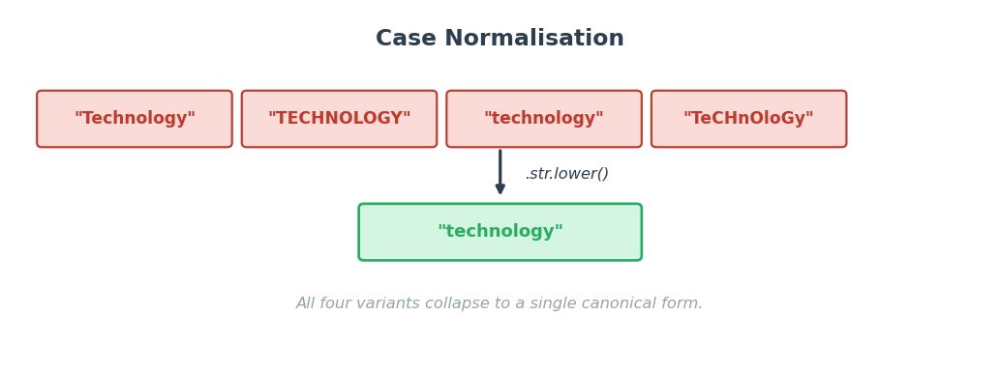

---

### 2. Remove Symbols and Punctuation

#### What is it?

Symbol removal strips characters that are not semantically meaningful for analysis — currency signs, hash symbols, parentheses, exclamation marks, slashes, and similar — from string values so that the underlying information is left in a clean, parseable form.

#### Why does it matter?

A salary stored as `"$1,200.00"` cannot be cast to a float until the `$` and `,` are removed. Likewise, `"N/A!!"` will not match `"NA"` in a lookup unless both are stripped to the same form. These artefacts come from spreadsheet exports, web scraping, form inputs, and database migrations — they are routine, not exceptional.

#### The logic

Use `str.replace()` with a regex pattern to remove (or replace) unwanted characters while keeping meaningful ones. Define a whitelist of allowed characters rather than a blacklist, since new artefact types appear constantly. Apply after lowercase normalisation.

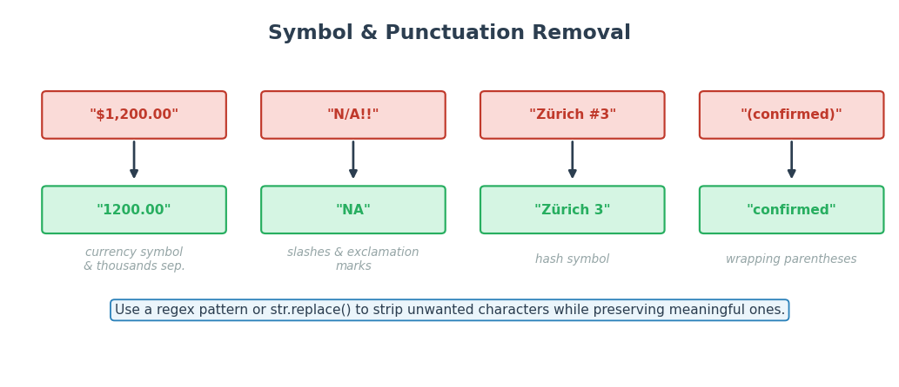

---

### 3. Remove Whitespace

#### What is it?

Whitespace cleaning removes leading spaces, trailing spaces, double spaces, tabs, and embedded newline characters from string values, leaving only the canonical single-spaced form.

#### Why does it matter?

`"London"` and `" London"` (with a leading space) are different strings. They will not match in a merge, group-by, or comparison, and they will appear as separate categories in a frequency table. Whitespace artefacts are invisible in most display tools, making them particularly deceptive bugs.

#### The logic

- **Leading / trailing spaces**: `str.strip()` handles both in one call.
- **Internal double spaces**: `str.replace(r'\s+', ' ', regex=True)` collapses any run of whitespace to a single space.
- **Embedded newlines and tabs**: replace `\n`, `\r`, and `\t` before collapsing.

Apply whitespace cleaning after symbol removal so that stripping a symbol does not inadvertently leave a double space.

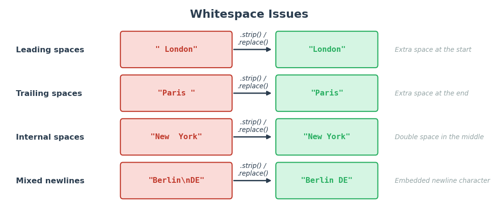

---

### 4. Remove Duplicates

#### What is it?

Duplicate removal identifies and eliminates rows that represent the same real-world entity more than once.

- **Full duplicates**: every column is identical. These are unambiguously redundant and are safe to drop with `drop_duplicates()`.
- **Partial duplicates**: key columns (e.g. customer ID) match but other columns differ (e.g. city or score). These require a decision: keep the most recent record, the most complete record, or merge conflicting values — all of which require domain knowledge.

#### Why does it matter?

Duplicate rows inflate counts, skew aggregations (mean, sum, percentages), distort model training by over-weighting certain observations, and produce misleading reports. In join-heavy pipelines, duplicates can also trigger row explosions that multiply the dataset many-fold.

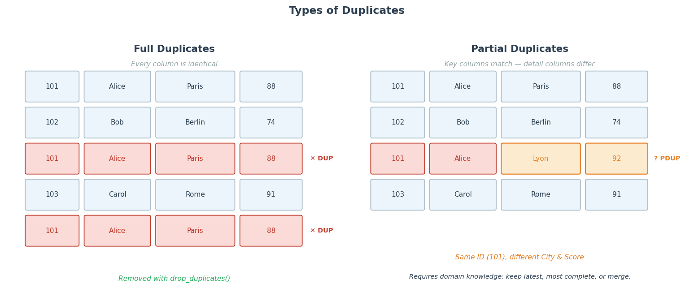

---

### 5. Merging Datasets

#### What is it?

A merge (or join) combines two tables using one or more shared key columns, creating a wider table that contains information from both sources.

#### Why does sequence matter?

When merging three or more tables, the order in which joins are performed can produce completely different — and often incorrect — results. Joining on a key that does not yet exist in the intermediate table causes missing rows or a Cartesian product explosion.

#### The logic

1. Identify the shared key between each pair of tables.
2. Merge in an order where the key column is present in both tables at the time of the join.
3. Validate row counts before and after each join to catch unexpected multiplications or row losses.
4. Use an inner join by default and switch to left/right joins only when you need to preserve unmatched rows.

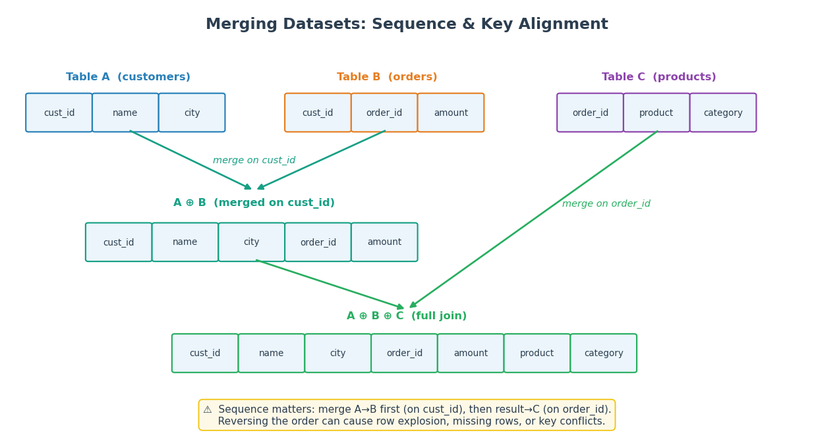

---

## Part II: Missing Data Treatment

### What is missing data?

Missing data is the absence of a value that should have been recorded. It is pervasive: sensor failures, skipped survey questions, system outages, privacy redactions, and data entry errors all produce missingness. Before deciding how to handle missing values, you must understand **how much** data is missing, **where** the missingness occurs, and **why** the values are absent — the answers determine which treatment strategy is valid.

---

### 1. Standardising Missing Data

Raw datasets represent missingness in many different ways: Python `None`, pandas `NaN`, the strings `"N/A"`, `"n/a"`, `"NA"`, `"null"`, `"NULL"`, `"#N/A"`, empty strings `""`, whitespace-only strings `"  "`, placeholder characters `"?"`, and sentinel numerics like `-999` or `0`. Until all of these are unified to a single canonical null (typically `NaN` in pandas), operations like `isnull()`, `dropna()`, and imputers will silently miss a large fraction of the actual missing data.

The first step is always to build a list of all representations observed in your data and pass them to `na_values` when reading, or replace them explicitly afterwards.

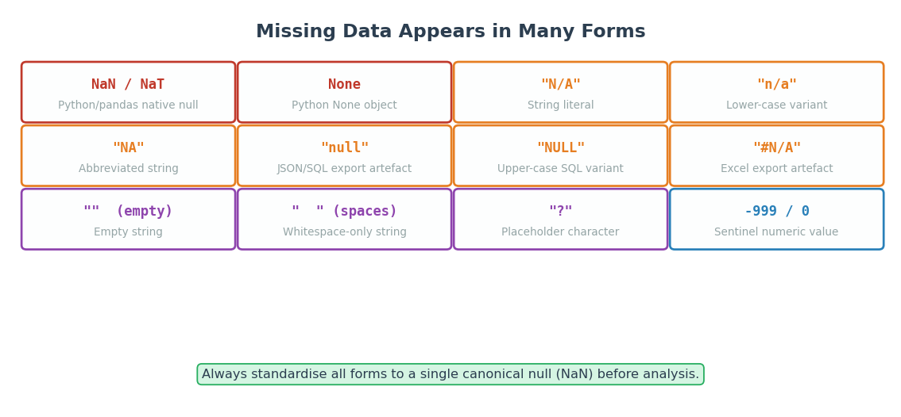

---

### 2. Visualising Missing Data

Before treating missing values, visualise their extent and pattern. A **missing data matrix** plots each row of the dataset as a horizontal strip, colouring cells blue (present) or white (missing). This reveals:

- Which columns have high missingness.
- Whether missingness is **block-structured** (e.g. a column was only collected after a certain date) or **scattered** (random rows).
- Which rows are affected by multiple missing columns simultaneously.

A **column completeness bar chart** shows the percentage of non-null values per column and is the quickest way to identify columns too sparse to be useful.

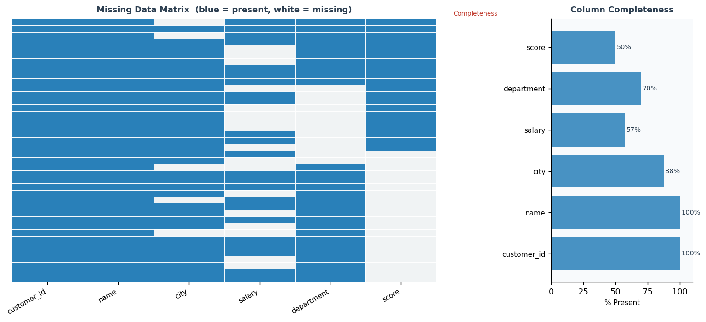

---

### 3. Missing Data Mechanisms (MCAR, MAR, MNAR)


Understanding *why* data is missing is as important as knowing *how much* is missing.  
The mechanism behind missingness determines which analysis or treatment approaches are appropriate and what kind of distortions may be introduced.

#### MCAR — Missing Completely At Random

Missingness is unrelated to any variable in the dataset, whether observed or unobserved.  
The missing values form a random subset of the data.

**Example:**  
A sensor randomly drops 5% of readings due to hardware jitter.

**Implications:**
- Removing rows with missing values does not systematically distort relationships in the data.
- However, discarding data reduces sample size
- This situation is relatively rare in real-world datasets.

#### MAR — Missing At Random

Missingness depends on observed variables, but not on the missing value itself once those variables are taken into account.

In other words, after conditioning on available data, the missingness behaves randomly.

**Example:**  
Junior employees are less likely to report their salary — missingness depends on experience (observed), not directly on salary.

**Implications:**
- Methods like regression imputation, KNN, or iterative imputation can be appropriate.
- These methods rely on correctly modeling relationships using observed variables.
- If important predictors of missingness are omitted, results can still be distorted.
- This assumption cannot be verified from the data alone — it must be justified based on context and domain knowledge.

#### MNAR — Missing Not At Random

Missingness depends on the value that is missing, even after accounting for observed variables.

This creates a feedback loop: the reason data is missing is tied to the missing value itself.

**Example:**  
Respondents with very high salaries choose not to disclose them.

**Implications:**
- Standard imputation methods may reinforce or amplify existing distortions.
- Addressing this case typically requires:
  - domain knowledge,
  - additional data collection, or
  - explicitly modeling the missingness process i.e., building a separate model for why data is missing—often as a function of the missing value itself—and using it alongside the data model so that imputed values are consistent both with observed patterns and with the fact that they are missing, unlike MAR where imputation relies only on the data model)
- There is no general-purpose method that resolves this scenario without making strong assumptions.

#### Practical Perspective

- **MCAR**: rare but simple to handle  
- **MAR**: commonly assumed, requires careful modeling using observed data  
- **MNAR**: common in sensitive or behavioral data, hardest to address; requires modeling both the missing process and the observed data. 

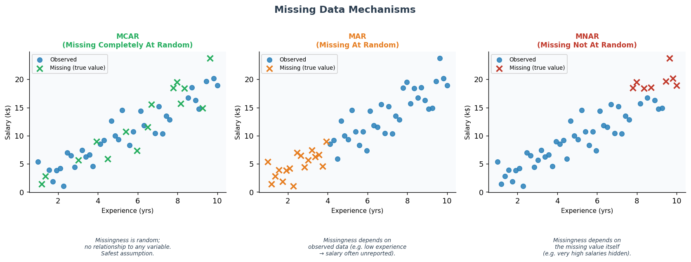

---

### 4. Missing Data Treatment

There are two broad families of treatments: **deletion** and **imputation**.

**Deletion**
- *Listwise (complete-case) deletion*: drop every row that contains at least one missing value. Simple and unbiased (i.e., no distortions) under MCAR; biased under MAR/MNAR. Safe when missingness is low (< 5%).
- *Column deletion*: drop a column if it is missing more than ~50% of its values, because imputation at that level introduces more noise than signal.

**Imputation**
- *Mean / median / mode*: replace each missing value with the column statistic. Fast but ignores relationships between variables.
- *KNN imputation*: find the k nearest complete rows (by Euclidean distance on observed columns) and use their average. Respects local structure.
- *Model-based / iterative imputation* (e.g. `IterativeImputer`): model each column as a function of all other columns, iterating until convergence. Best for MAR with complex inter-variable dependencies.
- *Indicator flag*: add a binary column recording where values were imputed. This lets a downstream model learn from the pattern of missingness — useful under MNAR.

**Decision guide**

| Missingness | Mechanism | Recommended treatment |
|---|---|---|
| > 50% of column | Any | Consider dropping the column |
| < 5% | MCAR | Listwise deletion or simple imputation |
| 5–50% | MCAR | Simple imputation |
| 5–50% | MAR | Model-based imputation (KNN / iterative) |
| Any | MNAR | Domain knowledge; flag as category |

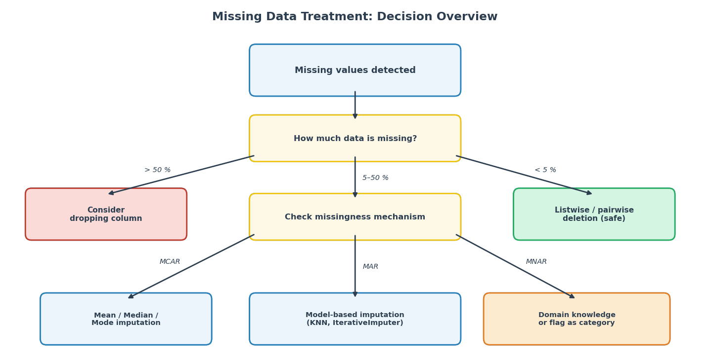

---

## Part III: Feature Engineering

### What is feature engineering?

Feature engineering is the process of transforming raw variables into representations that machine learning algorithms can interpret effectively. Raw data contains strings, categorical labels, mixed measurement scales, and distributions of wildly varying range. Most algorithms require numeric inputs on a consistent scale, and many are sensitive to the relative magnitudes of features. This section covers the two most fundamental transformations: **encoding** (turning categories into numbers) and **scaling** (bringing numeric features onto a common scale), followed by **correlation analysis** to understand relationships between features.

---

### 1. Encoding Categorical Variables

Categorical variables store discrete labels rather than quantities. Before a model can use them, they must be converted to numbers. The correct encoding depends on whether the variable is **nominal** (no inherent order) or **ordinal** (a meaningful order exists).

#### Nominal Encoding (One-Hot)

**What**: One-hot encoding (also called dummy encoding) creates one new binary column per category. A row receives a `1` in the column that matches its category and `0` in all others.

**Why**: Algorithms that compute distances or dot products (linear regression, SVM, KNN, neural networks) would interpret integer labels (0, 1, 2) as implying an order and a magnitude that do not exist for nominal categories. One-hot encoding avoids this false ordering.

**High cardinality**: if a column has hundreds of categories (e.g. city names), one-hot encoding creates hundreds of sparse columns and may degrade model performance. Alternatives include target encoding, frequency encoding, or embedding layers.

#### Ordinal Encoding

**What**: Ordinal encoding maps each category to a single integer that preserves the natural order of the levels.

**Why**: For genuinely ordered variables (e.g. seniority: junior < mid < senior < lead), the numeric distance between integers carries meaning that a model can exploit. Using one-hot encoding here throws away the ordering information.

**When to use vs one-hot**: use ordinal encoding only when the order is real and the gaps between levels are approximately equal (or when using tree-based models that split on thresholds, where the absolute gap does not matter). For variables where the order exists but the gaps are not equal, consider ordinal encoding with explicit category order.

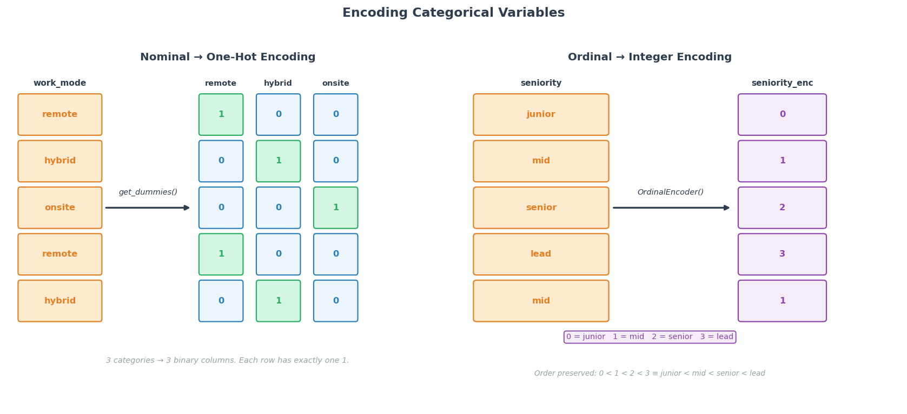

---

### 2. Feature Scaling

#### Why Scale Features?

Many machine learning algorithms are sensitive to the absolute magnitudes of features:

- **Distance-based algorithms** (KNN, SVM, k-means, PCA): a feature with range [0, 10 000] will dominate Euclidean distance calculations over a feature with range [0, 1], even if both are equally informative.
- **Gradient descent** (linear regression, logistic regression, neural networks): features on different scales cause elongated loss surfaces and slow, oscillating convergence.

**Tree-based models** (decision trees, random forests, gradient boosting) split on individual feature thresholds, so they are scale-invariant and do NOT require scaling.

#### Standardisation (Z-score / StandardScaler)

**Formula**: (x − mean) / std

**Result**: the transformed feature has mean = 0 and standard deviation = 1.

**Best for**: unbounded numeric data that is roughly normally distributed. Standardisation preserves the shape of the distribution and does not bound the output range, so it handles both positive and negative values naturally. Outliers still affect the mean and std, so they are not completely neutralised.

#### Min-Max Scaling

**Formula**: (x − min) / (max − min)

**Result**: maps all values to the interval [0, 1].

**Best for**: bounded data where you know the theoretical minimum and maximum (e.g. pixel intensities 0–255, percentages 0–100). Its main **weakness** is sensitivity to outliers: a single extreme value sets the min or max, compressing the entire bulk of the data into a very narrow range.

#### Robust Scaling

**Formula**: (x − median) / IQR

**Result**: the bulk of the data (the middle 50%) is scaled to a range of approximately [−0.5, 0.5], with outliers pushed further out but not amplified.

**Best for**: data with outliers that you want to retain (rather than remove). The median and IQR are resistant to outliers because they are based on ranks, not values.

Look at the images below. The first image represents a histogram of the raw data. Notice that its scale (the horizontal axis) is from 0 to 50. The following graphs illustrate the data after each scaling procedure. While the distribution remains hte same, the scale (the horizontal axis)changes. 

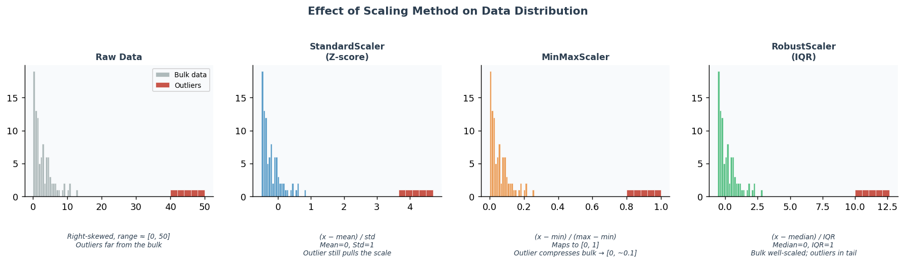

---

### 3. Correlation as a feature selection mechanism

#### What is Correlation?

Correlation measures the strength and direction of the linear (or monotonic) relationship between two numeric variables. It ranges from **−1** (perfect negative relationship: as one rises, the other falls by a proportional amount) through **0** (no linear relationship) to **+1** (perfect positive relationship). Correlation is a symmetric statistic: corr(A, B) = corr(B, A). It can be used to understand relationships. However, it can also be used as part of the feature engineering process.

#### Pearson, Spearman, and Kendall

**Pearson r**: measures the linear relationship. It is sensitive to outliers (which pull the line of best fit) and assumes that both variables are approximately normally distributed. This is the default in most software and the most commonly reported correlation.

**Spearman rho**: rank-based correlation. It measures monotonic relationships (one variable consistently increases as the other does, but not necessarily linearly). Robust to outliers and does not require normality. Use when the relationship is monotonic but non-linear, or when the data contains outliers.

**Kendall tau**: based on the number of concordant minus discordant pairs of observations. More conservative than Spearman (typically lower magnitude), better suited to small samples and data with many tied values. Preferred in academic settings for ordinal data.

#### Reading a Correlation Matrix

A correlation matrix shows the pairwise correlation between every pair of features simultaneously.

- The **diagonal** is always 1.0 (each variable is perfectly correlated with itself).
- The matrix is **symmetric**: the upper triangle mirrors the lower triangle.
- **Strong positive correlations** (r > 0.7): the two features move together strongly — consider multicollinearity if both are used as predictors in a linear model.
- **Strong negative correlations** (r < −0.7): the features move in opposite directions strongly.
- **Near-zero correlations**: no linear relationship — the features are orthogonal in the linear sense.

In **feature selection**, you can drop one feature from each highly correlated pair (keeping whichever has higher correlation with the target). In **model diagnostics**, high pairwise correlations among predictors are a warning sign for multicollinearity, which inflates standard errors in linear models.

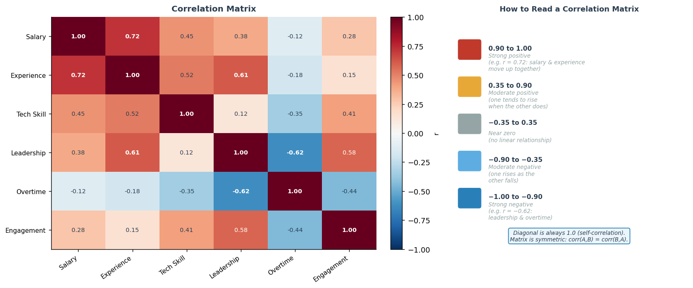

---

## Part IV: Dimensionality Reduction

### What is Dimensionality?

Every feature in a dataset adds one dimension. A dataset with 10 features lives in a 10-dimensional space; a dataset with 500 features lives in a 500-dimensional space. In practice, datasets have dozens to thousands of features. Two problems emerge as dimensionality grows: first, **visualisation** becomes impossible above three dimensions; second, many **algorithms** degrade in high-dimensional spaces for mathematical reasons that the following sections explain.

---

### 1. The Curse of Dimensionality

As the number of dimensions increases, high-dimensional spaces behave in counterintuitive and algorithmically problematic ways.

**Data becomes exponentially sparse**: to maintain the same data density as in one dimension, you need exponentially more samples. With 10 evenly distributed points in 1D, you need 10^2 = 100 points to cover a 2D space at the same density, 10^3 = 1 000 for 3D, and 10^10 (10 billion) for 10D. In practice, dataset sizes grow linearly while dimensionality grows faster.

**Distances between points converge**: in high dimensions, the ratio of the maximum pairwise distance to the minimum pairwise distance approaches 1. This means all points become approximately equidistant from each other. The consequence is that **distance metrics lose their discriminatory power**: nearest-neighbour algorithms (KNN, k-means, kernel SVM) can no longer meaningfully distinguish "near" from "far", and their performance degrades. This effect becomes apparent starting around 10–20 dimensions.

Notice the image below.

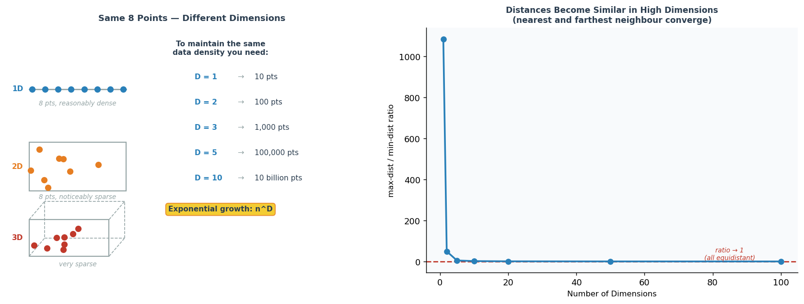

**Left: Same number of points, increasing dimensions**

With a fixed number of points, increasing the number of dimensions makes the space grow rapidly.  
As a result, the points occupy a smaller fraction of the space, and the empty (white) space increases.  
Even though the number of points is unchanged, the data becomes progressively more sparse.


**Middle: Maintaining the same density**

To keep the same level of coverage (i.e., similar spacing between points), the number of points must grow exponentially with the number of dimensions.  
In other words, if you want to cover a similar proportion of the space or maintain similar local neighborhoods, you need dramatically more data as dimensionality increases.


**Right: Distances become less informative**

In high dimensions, the difference between the nearest and farthest points shrinks.  
All points tend to be at similar distances from each other, making it harder to distinguish “close” from “far.”  
This reduces the effectiveness of distance-based methods such as KNN.

---

### 2. Principal Component Analysis (PCA)

**What it does**: PCA is a linear projection that finds the directions in the original feature space along which the data varies the most. The first principal component (PC1) points in the direction of maximum variance. The second (PC2) points in the direction of second-most variance, subject to being orthogonal (perpendicular) to PC1. Each subsequent component is orthogonal to all previous ones and captures the next largest share of variance.

**Scree plot**: plotting the fraction of variance explained by each component reveals how many components are needed to retain most of the information (a common threshold is 90%). The "elbow" in the curve suggests a natural cutoff.

**Axes are interpretable**: unlike non-linear methods, PCA axes are linear combinations of the original features. With the risk of oversimplfying the process, it can be said that it uses the correlation matrix in order to find these combinations. You can inspect the loadings (weights) to understand which original features contribute most to each PC. This makes PCA useful not just for compression but for understanding the dominant modes of variation in the data.

**Best for**: linearly structured data, preprocessing before linear models, and cases where interpretability of the reduced space matters. PCA is deterministic (no random initialisation) and has an exact analytical solution.

**Scaling**: PCA requires scaling because it is based on variance, which is sensitive to the scale of the variables. Features with larger magnitudes can dominate the principal components and distort the results.

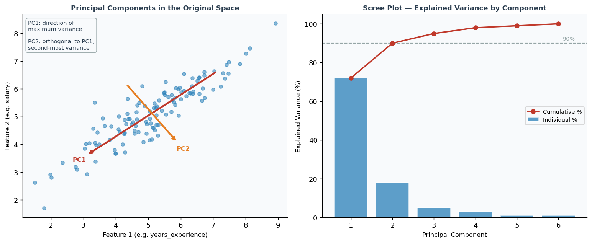

---

### 3. t-SNE

**What it does**: t-SNE (t-Distributed Stochastic Neighbour Embedding) is a non-linear dimensionality reduction method that places similar points close together in 2D (or 3D) by modelling pairwise similarities as probabilities. In the high-dimensional space, it defines a Gaussian probability distribution over neighbours of each point. In the 2D embedding, it uses a heavier-tailed Student-t distribution. It minimises the KL divergence between the two distributions, iteratively moving points until local neighbourhood structure is well-preserved.

**Axes are NOT interpretable**: the 2D coordinates produced by t-SNE have no meaning in terms of the original features. Only the relative positions of points matter — clusters that appear close together are genuinely similar; clusters far apart may or may not be dissimilar in the original space.

**Sensitive to `perplexity`**: this hyperparameter (typically 5–50) controls the effective number of neighbours each point considers. Different perplexity values can produce visually very different embeddings of the same data. Always try several values and never draw strong conclusions from a single run.

**Limitations**: computationally slow for large datasets, no out-of-sample mapping (you cannot project new points without rerunning the algorithm), and global distances between clusters are not preserved.

---

### 4. UMAP

**What it does**: UMAP (Uniform Manifold Approximation and Projection) is a non-linear method based on Riemannian geometry and fuzzy topological structure. Like t-SNE it preserves local neighbourhood structure, but it also preserves more of the **global structure** — the relative distances between different clusters are more meaningful than in t-SNE.

**Faster and more scalable**: UMAP runs significantly faster than t-SNE on large datasets and scales to millions of points with appropriate implementations. With a fixed random seed it is also more reproducible across runs.

**Axes are also NOT interpretable**: like t-SNE, the embedding axes have no direct relationship to the original features.

**`n_neighbors`**: the key hyperparameter, analogous to t-SNE's perplexity. Small values focus on very local structure; large values preserve more global structure at the cost of losing fine-grained local detail.

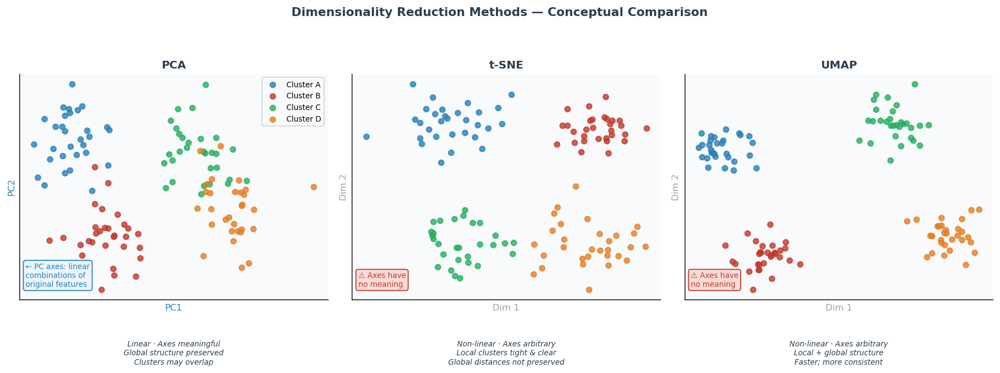

---

### 5. Choosing the Right Method

| | PCA | t-SNE | UMAP |
|---|---|---|---|
| Axes interpretable | Yes | No | No |
| Linear / Non-linear | Linear | Non-linear | Non-linear |
| Preserves global structure | Yes | Partially | Better than t-SNE |
| Speed | Fast | Slow | Moderate |
| Scales to large datasets | Yes | No | Yes |
| Best use | Feature reduction & preprocessing | Cluster visualisation | Both |

**Rule of thumb**: start with PCA to get an interpretable linear reduction and to understand the variance structure of your data. If clusters are not linearly separable, use UMAP (for a balance of local and global structure and speed) or t-SNE (if local cluster separation is the primary goal). Always fix the random seed for reproducibility with t-SNE and UMAP.

---

## Summary

Raw data requires a carefully ordered sequence of transformations before it is ready for modelling. **Part I** addressed the most common string-level problems — inconsistent capitalisation, stray symbols, whitespace artefacts, duplicate rows, and join ordering — that, if left uncorrected, silently corrupt every downstream step.

**Part II** dealt with missing data, which demands both diagnosis (how much, where, and why) and treatment (deletion for low or MCAR missingness; model-based imputation for MAR; domain knowledge for MNAR). Standardising all missing-value representations to a single canonical null is a prerequisite for any of these methods to work correctly.

**Part III** covered feature engineering: encoding categorical variables with one-hot encoding (for nominal categories) or ordinal encoding (for ordered categories), scaling numeric features with standardisation, min-max, or robust scaling depending on the distribution and outlier profile, and using correlation analysis to understand inter-feature relationships, detect multicollinearity, and guide feature selection.

**Part IV** introduced dimensionality reduction: the curse of dimensionality explains why high-dimensional data is fundamentally harder to work with, and PCA, t-SNE, and UMAP each offer different tradeoffs between interpretability, preservation of global versus local structure, and computational cost.

Together, these four stages form a complete data preparation pipeline. Applying them in order — clean first, handle missingness second, engineer features third, reduce dimensions last — produces datasets that are consistent, complete, appropriately encoded, and compact enough for effective modelling.

---

## Requirements

```bash
pip install pandas numpy matplotlib missingno scikit-learn seaborn umap-learn
```

| Package | Purpose |
|---|---|
| `pandas` | DataFrame operations, string methods, `isnull()`, `merge()` |
| `numpy` | Numerical arrays, random data generation |
| `matplotlib` | Plotting and visualisations |
| `missingno` | Missing data matrix and completeness charts |
| `scikit-learn` | `SimpleImputer`, `IterativeImputer`, scalers, `OrdinalEncoder`, `PCA`, `TSNE` |
| `seaborn` | Correlation heatmaps |
| `umap-learn` | UMAP dimensionality reduction |
