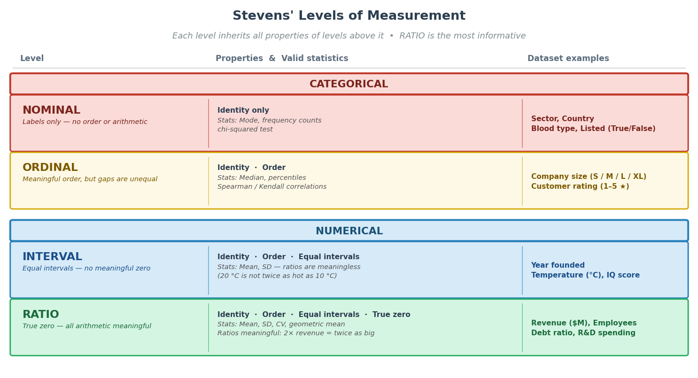
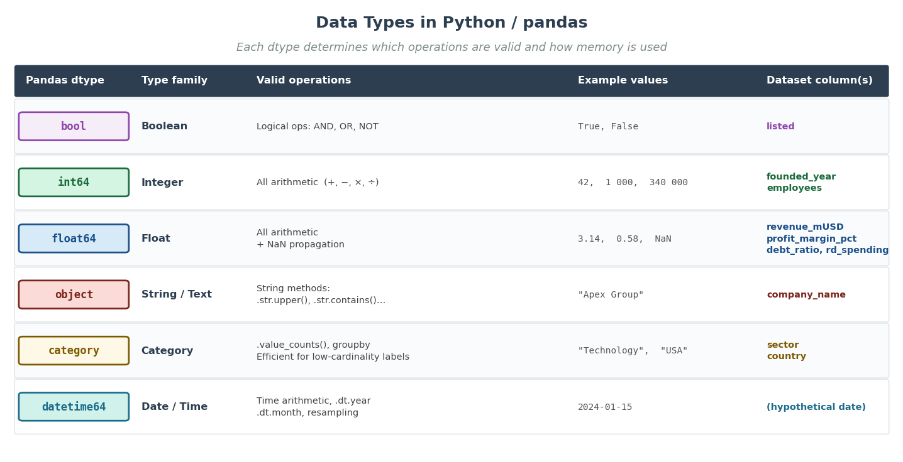
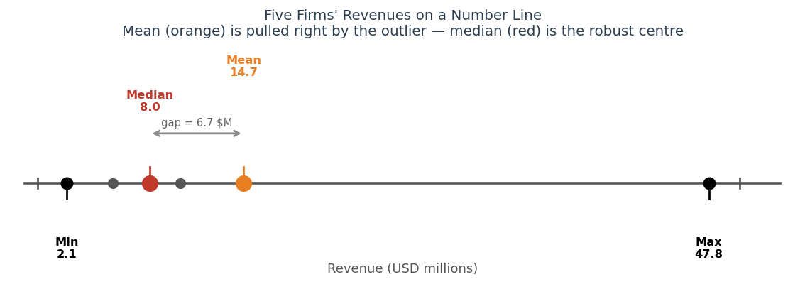
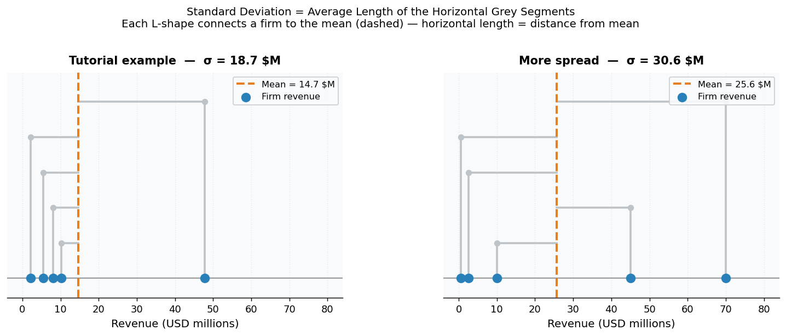
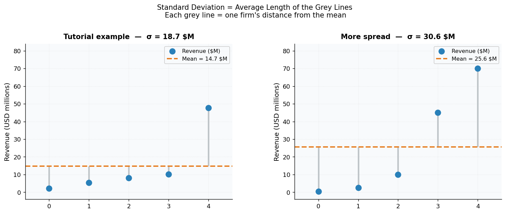
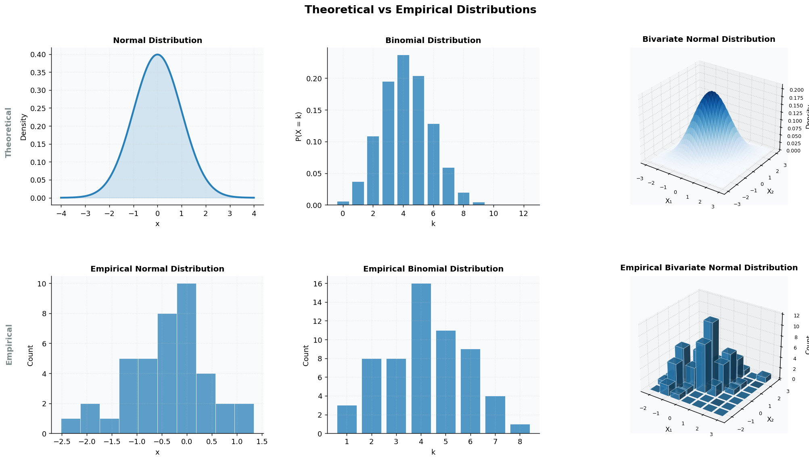
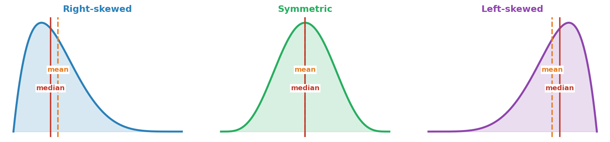
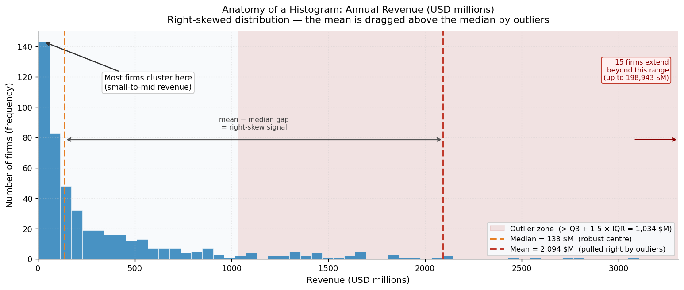
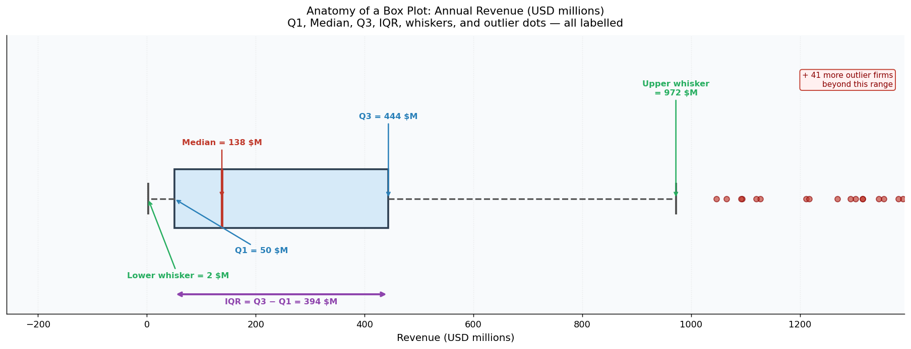
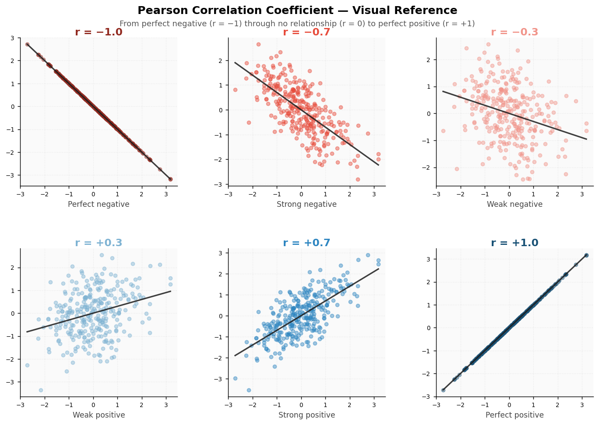

# Data Types and Exploratory Analysis

## Introduction

Every data science project begins with the same first question: *what do we actually have?* Before fitting models or drawing conclusions, you need to understand the structure, quality, and quirks of your data. This tutorial walks through the four foundational steps of Exploratory Data Analysis (EDA) — type inspection, descriptive statistics, distribution analysis, and correlation — applied to a corporate financial dataset covering 500 firms across multiple industries and countries. Notice that the dataset is messy: missing R&D values, skewed revenue figures, and extreme outliers are the norm in real financial data, not the exception.

---

## The Dataset: Corporate Financial Records

The dataset captures operational and financial attributes for 500 firms drawn from six industry sectors (Technology, Finance, Healthcare, Manufacturing, Retail, Energy) across eight countries. It is organized as a table where each row represents one company and each column represents one attribute. The columns are:

| Column | Description |
|---|---|
| `company_name` | Legal company name (free text) |
| `sector` | Industry classification (6 categories) |
| `country` | Country of headquarters (8 categories) |
| `founded_year` | Year the company was founded |
| `employees` | Number of full-time employees |
| `revenue_mUSD` | Annual revenue in USD millions |
| `profit_margin_pct` | Net profit as a percentage of revenue |
| `rd_spending_mUSD` | Annual R&D expenditure in USD millions (40% missing) |
| `debt_ratio` | Total debt divided by total assets (0–1 scale) |
| `listed` | Whether the firm is publicly traded (True/False) |

---

## Data Types

### What is it?

A **data type** describes the fundamental nature of the values in a column. This determines which operations, visualisations, and statistical methods are valid. Many classification systems exist; the most widely used is **Stevens' typology** , which defines four levels of measurement — nominal, ordinal, interval, and ratio — each inheriting all the properties of the levels before it. The diagram below summarises the four levels and what you can do at each one.



In practice, data science tools like Python and pandas deal with a slightly different set of data types. The diagram below maps each pandas dtype to its statistical family and shows which columns of the corporate dataset use it.



The typologies of data types presented so far are not exhaustive. In practice, you will also encounter other types of data such as text, images, audio, video, or graph data, each requiring specialized methods and representations.

**Also, notice that data type is different from how data is organized or stored.**  
Data type refers to the nature of the values (e.g. numerical, categorical), whereas data organization refers to the structure in which those values are arranged.Data can be organized in several common ways:

- **Tabular data**  
  Data is organized in rows and columns, where each row represents an observation and each column a variable. This is the most common format in data analysis and is typically used for numerical and categorical data.

- **Non-tabular data**  
  Data does not fit neatly into a rectangular table. Examples include text documents, images, audio files, or graph structures, where the organization may be hierarchical, spatial, or relational rather than row-based.

- **Time series data**  
  Data is indexed by time, meaning observations are ordered chronologically. This structure enables the analysis of trends, seasonality, and temporal patterns. Time series data is often stored in tabular form (e.g. with a time column), but the defining feature is the temporal ordering of observations rather than the table itself.


### Why does it matter for data science?

Applying the wrong operation to the wrong type produces silent errors. Computing the "mean sector" is nonsense. Treating an integer-encoded category (e.g. industry codes 1–6) as a continuous number will corrupt any distance-based algorithm. Some methods do not work on non-tabular data. Identifying types and structures correctly is the very first quality gate in any data science pipeline.

### Example

The table below shows the ten columns of the corporate dataset alongside their data types and the reasoning behind each classification:

| Column | Sample values | Pandas dtype | Classification | Reasoning |
|---|---|---|---|---|
| `company_name` | "Apex Group", "Nova Corp" | `object` | Text | Essentially unique per row; no arithmetic applies |
| `sector` | "Technology", "Retail" | `category` | Nominal categorical | 6 fixed labels; no natural ordering |
| `country` | "USA", "Germany" | `category` | Nominal categorical | 8 fixed labels; depending on the context, can be unordered or not; here is unordered |
| `founded_year` | 1954, 2003, 2018 | `int64` | Ordinal numerical | Year has ordering; differences are meaningful |
| `employees` | 42, 12 400, 340 000 | `int64` | Continuous numerical | Arithmetic (totals, averages) makes sense |
| `revenue_mUSD` | 0.9, 124.3, 95 000.0 | `float64` | Continuous numerical | Quantity with meaningful scale and distance |
| `profit_margin_pct` | −4.2, 8.7, 31.1 | `float64` | Continuous numerical | Can be negative; arithmetic is valid |
| `rd_spending_mUSD` | 12.4, NaN, 45.8 | `float64` | Numerical with missing | NaN = not reported, not zero |
| `debt_ratio` | 0.31, 0.58, 0.74 | `float64` | Continuous numerical (bounded) | Always between 0 and 1 |
| `listed` | True, False | `bool` | Binary categorical | Two states only |

Notice that `founded_year` is stored as an integer but behaves like an ordered category. And `rd_spending_mUSD` appears numerical but has a systematic missingness pattern — not all firms report R&D, so `NaN` means *not applicable*, not *unknown*. Dealing with this requires an introduction to missing data treatment, which is beyond the scope of this tutorial. 

---

## Descriptive Statistics

### What is it?

**Descriptive statistics** compress an entire column of values into a handful of numbers that summarise its centre, spread, and shape. For numerical columns the core measures are:

- **Mean** — the arithmetic average; add all values and divide by the count.
- **Median** — the middle value when the column is sorted; exactly 50% of values fall below it.
- **Standard deviation (σ)** — the average distance of individual values from the mean. A small σ means values cluster tightly around the mean; a large σ means they are spread out.
- **Min / Max / Percentiles** — the extremes and intermediate landmarks of the distribution.

For categorical columns, the equivalent summaries are the *count* per category and the most common value (the **mode**).

### Why does it matter for data science?

Descriptive statistics are your first sanity check. They immediately reveal missing values (a count below the row total), implausible extremes (a negative employee count), scale differences between columns (revenue in millions vs. ratio in 0–1), and skew (a mean far above the median). All of these influence every subsequent analysis step.


### Example

Consider five firms' annual revenues (USD millions): **2.1, 5.4, 8.0, 10.2, 47.8**

| Statistic | Value | Interpretation |
|---|---|---|
| Mean | 14.7 | Dragged upward by the large outlier (47.8) |
| Median | 8.0 | More representative of a "typical" firm in this group |
| Std deviation (σ) | 17.1 | Each firm is, on average, $17.1M away from the mean |
| Min | 2.1 | Smallest firm |
| Max | 47.8 | Largest firm — the outlier causing the mean–median gap |

Consider the five firms again. The image below plots them on an axis as grey dots. The mean and median are then placed as orange and red dots. Notice that one of the values is exactly the median (the median is always a value from the dataset). The minimum and the maximum are marked by black dots.  



The mean–median gap of 6.7 ($14.7M vs $8.0M) is a clear signal: the distribution is **right-skewed** (more on distributions in the next section). Where each statistic sits on the number line makes this immediately visible. Furthermore, the standard deviation of 17.1 relative to a mean of 14.7 tells you the spread is enormous relative to the centre.

The two diagrams below make the standard deviation concrete by plotting two groups of firm — the example presented so far and a more extreme set — with each firm's grey line showing its individual distance from the mean. The standard deviation is the average of those line lengths. The first diagram places revenue on the horizontal axis (each grey line is vertical then connects to the mean by a horizontal line); the second places revenue on the vertical axis (each grey line is vertical).





---

## Distributions and Outlier Detection

### What is it?

A **distribution** describes how the values of a variable spread across its range — where they cluster, how wide the spread is, and whether extreme values appear at the tails.

In data science we distinguish between **empirical** and **theoretical** distributions:

- An **empirical distribution** is what you actually observe in your data. It is specific to your sample: run it again with different data and you get a slightly different shape.
- A **theoretical distribution** is a mathematical model (e.g. the normal / Gaussian distribution, the log-normal, the exponential). These are idealisations that real data approximate but never perfectly match.

There are also other useful distinctions when describing distributions, such as **discrete vs. continuous** and **univariate vs. multivariate**.

- **Discrete distributions**  
  The variable takes on a finite or countable set of values, often integers.  
  *Examples:* number of employees, number of transactions.

- **Continuous distributions**  
  The variable can take any value within a range, including decimals.
  *Examples:* revenue, temperature, time.

- **Univariate distributions**  
  Describe the behaviour of a single variable.  
  *Example:* the distribution of revenue across firms.

- **Multivariate distributions**  
  Describe the joint behaviour of multiple variables, capturing relationships between them.  
  *Example:* the joint distribution of revenue and profit.

In practice, we always start with the empirical distribution — you plot the data you have and then ask: does it resemble a known theoretical shape? Answering this question then guides further analysis decisions. 

The image below shows some examples of theoretical distributions (top plots) and how their empirical counterparts can look like (bottom plots). 




Furthermore, distributions can differ in their shape:

- **Symmetric**  
  The left and right sides of the distribution are roughly mirror images. Values are evenly distributed around the centre.

- **Right-skewed (positively skewed)**  
  The distribution has a long tail to the right. Most values are concentrated on the lower end, with a few large values.

- **Left-skewed (negatively skewed)**  
  The distribution has a long tail to the left. Most values are concentrated on the higher end, with a few small values.




An **outlier** is a value that sits far from the rest of the distribution. It can be:
- **Legitimate** — a Fortune 500 firm genuinely earns 200 times more than average.
- **Erroneous** — a data-entry mistake (e.g. a revenue entered as 9 000 instead of 90).

You need to detect outliers before deciding which type they are and how to deal with them (removal or transformation). For an univariate distribution, this can be done visually by means of histograms and boxplots.

**Histogram** — divides the value range into equally-wide bins and counts how many observations fall into each. The height of each bar is the frequency (or density). The shape of the histogram tells you: is the distribution symmetric? Is it unimodal (one peak) or bimodal (two peaks)? Is the tail long on the left or the right?

**Box plot (box-and-whisker plot)** — a compact five-number summary: minimum (after removing outliers), Q1 (25th percentile), median, Q3 (75th percentile), and maximum. The box spans Q1 to Q3, which is the **interquartile range (IQR)**. Whiskers extend to the furthest non-outlier values; any point beyond the whiskers is plotted individually as a dot — these are the candidate outliers.

One way to detect outliers is by using **the IQR outlier rule (Tukey fences):**
> *Lower fence* = Q1 − 1.5 × IQR
> *Upper fence* = Q3 + 1.5 × IQR
>
> Any value outside these fences is flagged as a candidate outlier.

### Why does it matter for data science?

Many algorithms — linear regression, k-means clustering, principal component analysis — and statistical procedures have distributional assumptions. You need to know how to identify types of distributions to see if such assumptions hold. Furthermore, an outlier can dwarf all other values and cause distorted results. Detecting and understanding outliers before prevents this.

### Example

The annotated histogram below uses the corporate revenue column from the practice dataset to illustrate every element of a histogram. Notice the gap between the mean (dashed red) and the median (dashed orange) — this visual gap is your immediate signal of right skew. The red shading marks the outlier zone beyond the upper Tukey fence.



The annotated box plot below shows the same revenue data in a compact form. Each component is labelled: the lower and upper whiskers (the range of typical values), the box boundaries (Q1 and Q3), the red median line, the IQR bracket, and the individual red dots representing outliers beyond the upper Tukey fence.



Notice that the box plot is compact — it does not show the full shape of the distribution. Histograms and box plots are complementary: use histograms to understand shape, and box plots to compare multiple groups or to flag outliers quickly.

---

## Correlations

### What is it?

**Correlation** measures the degree to which two variables change together. The most common measure is the **Pearson correlation coefficient (r)**, which captures the *linear* relationship between two continuous variables. It ranges from −1 to +1. As a convention, the table below shows the meaning for various values of the r coefficient. 

| r value | Meaning |
|---|---|
| +1.0 | Perfect positive linear relationship |
| +0.7 | Strong positive linear relationship |
| +0.3 | Weak positive linear relationship |
| 0.0 | No linear relationship |
| −0.3 | Weak negative linear relationship |
| −0.7 | Strong negative linear relationship |
| −1.0 | Perfect negative linear relationship |

Notice that there are also other types of correlations that deal with non-linear data. The most common ones are:

- **Pearson (r)** — measures linear relationships between two continuous variables. Sensitive to outliers.
- **Point-biserial** — used when one variable is continuous and the other is binary (e.g. `revenue` vs `listed`). Mathematically equivalent to Pearson applied to a 0/1-encoded binary column.
- **Spearman (ρ)** — measures monotonic relationships (one variable consistently increases as the other increases, even if not in a straight line). Based on rank order rather than raw values. More robust to outliers than Pearson.
- **Kendall (τ)** — another rank-based measure, more robust for small samples.

Important caveats:
- **Pearson only captures linear relationships.** Two variables can have a strong curved (non-linear) relationship and still show r ≈ 0.
- **Correlation ≠ causation.** Larger firms have higher revenue *and* more R&D spending, but spending more on R&D does not automatically cause revenue to grow.
- A **correlation matrix** (in Python:`df.corr()`) gives all pairwise correlations at once and is best visualised as a colour-coded heatmap.


### Why does it matter for data science?

Correlation reveals two things: (1) which variables might be predictive of a target (e.g. `employees` and `revenue` are likely correlated), and (2) **multicollinearity** — when two predictor variables are so strongly correlated that including both in a model adds noise. Knowing your correlations guides feature selection before modelling.


### Example

The reference chart below shows six scatter plots, each generated with a specific Pearson correlation value from −1.0 to +1.0. Use it as a visual calibration tool: when you encounter an r value in an analysis, this chart tells you what the underlying scatter plot likely looks like.



Key observations from the chart:
- At **r = ±1.0**, all points fall exactly on a straight line — a perfect linear relationship that is rarely seen in real data.
- At **r = ±0.7**, the linear trend is clearly visible but with visible scatter around the line. This is a "strong" correlation in most social science and business contexts.
- At **r = ±0.3**, the trend is barely visible by eye. The relationship exists but is weak — a wide cloud of points with only a slight tilt.
- At **r = 0.0** (not shown but implied between the ±0.3 panels), the scatter plot is a formless cloud with no discernible slope.


---

## Summary

Exploratory Data Analysis is the indispensable preamble to any data science project. The four steps covered here — type inspection, descriptive statistics, distribution analysis, and correlation — form a systematic protocol for understanding any new dataset. Starting with types prevents you from applying invalid operations. Descriptive statistics surface missing values and scale differences. Distribution plots reveal shape, skew, and outliers. Correlation analysis shows how variables relate to one another and to your target. Together, these steps transform a raw table of numbers into a understood dataset that you can confidently pass to a model. Try it for yourself in the code. 

---

## Requirements

```bash
pip install pandas numpy matplotlib seaborn scipy
```

| Package | Purpose |
|---|---|
| `pandas` | DataFrame creation, type casting, groupby, `describe()` |
| `numpy` | Numerical arrays, log transforms, random data generation |
| `matplotlib` | All plot creation and annotation |
| `seaborn` | Heatmap for correlation matrix |
| `scipy` | Skewness calculation (`scipy.stats.skew`) |
