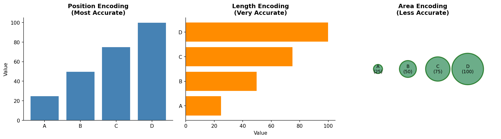
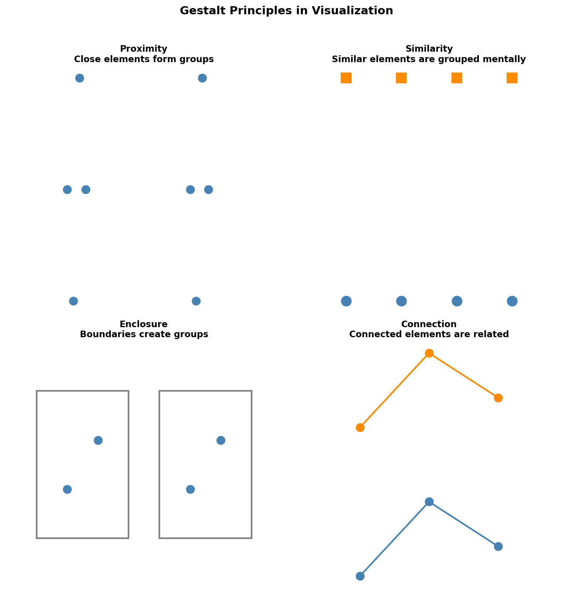
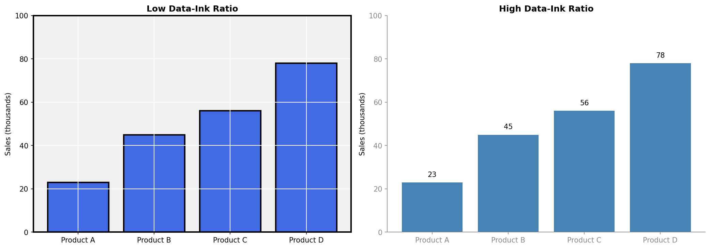

# Data Visualization 

## Historical evolution

Data visualization has undergone a remarkable transformation over the past three centuries, shaped by advances in mathematics, statistics, technology, and design thinking. Its evolution can be divided into three major eras:

1. <strong>Pre-Digital Era (1750–1950)</strong><br>

William Playfair (1786) introduced many of the chart types still in use today, such as bar charts, line charts, and pie charts. He also established a visual vocabulary for quantitative comparison. Later, Charles Minard (1869) produced the famous graphic depicting Napoleon’s disastrous Russian campaign, a masterpiece often cited as one of the most effective statistical graphics ever created. 

2. <strong>Statistical Graphics Era (1950–1990)</strong><br>

During the rise of modern statistics, researchers began exploring visualization not merely as illustration but as an integral tool for data analysis. Jacques Bertin, through Semiology of Graphics (1967), developed a systematic theory of visual variables—position, size, color, shape—that defined how data could be encoded perceptually. John Tukey introduced Exploratory Data Analysis (1977) and created visualizations like the box plot, encouraging analysts to visually interrogate data before applying formal models. Edward Tufte further revolutionized (1983) the field by advocating for clarity, minimalism, and high data density, famously critiquing “chartjunk” and introducing the principle of maximizing the data-ink ratio.

3. <strong>Interactive Era (1990–Present)</strong><br>

With the apparition of personal computers and the web, visualization entered a new phase defined by interactivity and real-time data. Ben Shneiderman articulated the Visual Information Seeking Mantra (2005): “overview first, zoom and filter, then details on demand”, which remains a guiding principle for interactive interface design. Leland Wilkinson formalized the Grammar of Graphics (2006), providing a theoretical foundation for many modern plotting libraries. The apparition of tools and frameworks such as D3.js, Plotly, and Tableau has democratized visualization creation and motivated developers to build rich, interactive visual stories from complex datasets.

## Current Challenges

<strong>Scale</strong><br>
Modern datasets often contain billions of data points, making it impractical to visualize every individual record directly. Rendering such volumes can overwhelm users. To address this, techniques such as aggregation (summarizing data), sampling (selecting representative subsets), and progressive rendering (loading visuals incrementally) are used to maintain performance and readability.

<strong>Velocity</strong><br>
In many applications, data is generated continuously in real time (e.g., sensors, financial markets, user activity). Visualizations must adapt dynamically without constant full recomputation. Common solutions include incremental updates, which update only changed data, and windowing techniques, which focus on recent or relevant slices of streaming data.

<strong>Complexity</strong><br>
High-dimensional datasets, with many variables, are difficult to represent in traditional 2D charts. This complexity can obscure patterns rather than reveal them. Approaches such as dimensionality reduction (e.g., PCA, t-SNE, UMAP) help project data into lower dimensions, while small multiples (repeating simple charts across categories) allow comparisons without overwhelming the viewer.

<strong>Accessibility</strong><br>
Effective visualizations must be usable by diverse audiences, including those with visual impairments. For example, approximately 8% of males have some form of color blindness. To ensure accessibility, designers use redundant encoding (combining color with shape, size, or labels) and pattern fills to distinguish categories beyond color alone.

<strong>Literacy</strong><br>
Audiences vary widely in their ability to interpret charts and statistical information. A visualization that is clear to an expert may confuse a beginner. To bridge this gap, designers use layered complexity (starting simple and allowing deeper exploration) and annotations (labels, highlights, explanations) to guide interpretation.

<strong>Trust</strong><br>
Visualizations can be misleading, whether intentionally or unintentionally, contributing to misinformation. Distorted scales, omitted data, or biased design choices can undermine credibility. Building trust requires transparent methodology (clearly explaining data sources and transformations) and uncertainty visualization (showing confidence intervals, error bars, or variability).

# Core principles
## Perceptual Principles

Human visual perception is not equally sensitive to all types of visual encodings. Some visual channels allow for highly precise quantitative comparisons, while others introduce ambiguity or distortion. Cleveland and McGill (1984 study) established a hierarchy of perceptual accuracy, ranking how effectively people interpret quantitative differences across common visual encodings:

1. Position on common scale (most accurate)
2. Position on non-aligned scales
3. Length
4. Angle / Slope
5. Area
6. Volume / Color saturation (least accurate)

This ranking provides an essential guideline for visualization design, prioritizing positional encodings over color intensity or volume helps ensure clarity and reduces misinterpretation.



## Gestalt Principles

Effective visualization manipulates the ways humans organize and interpret visual information. The Gestalt principles describe the cognitive rules our brains follow when grouping elements, and they play a crucial role in chart clarity and user comprehension. 

- Proximity suggests that elements placed close together are naturally perceived as belonging to the same group, making spacing a powerful tool for structuring information. 
- Similarity highlights that we group objects that look alike—through color, shape, or size—enabling designers to signal categorical relationships effortlessly. 
- Enclosure shows that when elements share a boundary or background region, we intuitively see them as a coherent unit. 
- Connection, such as linking points with lines, strongly communicates relationship or sequence, often more powerfully than proximity alone. 
- Finally, continuity reflects our tendency to follow smooth, continuous lines or patterns, which helps viewers interpret trends within line charts or flow diagrams. 



## Data-Ink Ratio

“Above all else, show the data.” — Edward Tufte

The concept of the data-ink ratio emphasizes that every element in a visualization should serve the purpose of communicating data. It represents the proportion of ink (or on-screen pixels) devoted to actual data compared with the total ink used in the graphic. A high data-ink ratio reflects a clean, efficient visualization free from unnecessary decoration or distraction. 

Designers can maximize this ratio by eliminating redundant encodings such as:

- Redundant data encoding
- Chartjunk (decorative elements)
- Unnecessary gridlines and borders
- 3D effects that add no information



## Ethical Considerations

Data visualizations can easily mislead, whether intentionally or unintentionally, through poor design choices or selective data representation. 

- One common issue is the use of truncated axes, such as starting a y-axis at 95%, which exaggerates small differences; a more ethical alternative is to start at zero or clearly indicate the truncation. 
- Similarly, cherry-picked timeframes can present only favorable trends while hiding broader context, whereas responsible design requires showing complete or representative time ranges. 
- Visual distortions also arise from area misuse, particularly in 3D charts like pie charts, where perspective skews perception; replacing these with simple 2D representations improves accuracy. 
- Another frequent problem is dual-axis abuse, where two unrelated variables appear correlated due to shared space; separating charts or normalizing scales provides a more honest comparison. 
- Omitting uncertainty—such as showing only point estimates—can falsely imply precision, while including confidence intervals or error bars better reflects the data’s true variability.

A guiding principle in ethical visualization is that a chart should communicate the same core message whether viewed briefly or examined in depth. 

# Chart Taxonomy and Selection

A well selected chart increases understanding while a poorly chosen one obscures it. Effective chart selection rests on three core factors. 

First, data characteristics define what is even possible, whether variables are categorical or continuous, whether the dataset is short and wide or long and tall, and how many dimensions or observations it contains. 

Second, the communication goal shapes the overall intent: what question should the visualization answer, what story should it reveal, or what comparison should it highlight? 

Finally, the audience determines the appropriate level of complexity. Technical experts may prefer dense multivariate displays, while general audiences often benefit from simpler visuals that communicate quickly and intuitively. 

## Primary Question Categories

Different analytical questions map to different chart families. Comparison questions, such as how categories differ, often rely on bar charts, grouped bars, or dot plots. Distribution questions, focusing on how values spread, call for histograms, box plots, or violin plots. Composition questions, focusing on parts of a whole, may use stacked bars, pies, or treemaps. Relationship questions explore how variables interact and are served by scatter plots, heatmaps, or parallel coordinate plots. Trend questions about change over time typically use line charts, area charts, or streamgraphs. Geospatial questions about location require choropleths, point maps, or flow maps. Finally, hierarchy questions benefit from treemaps, sunbursts, or dendrograms. 

What is your primary goal?
│
├─── COMPARE values ─────────────────────────────────────────┐
│    │                                                       │
│    ├─ Few categories? ──────────────────────► Bar Chart    │
│    ├─ Many categories? ─────────────────────► Dot Plot     │
│    └─ Across time/groups? ──────────────────► Grouped Bar  │ │                                                            │
├─── Show DISTRIBUTION ──────────────────────────────────────┤
│    │                                                       │
│    ├─ Single variable? ─────────────────────► Histogram    │
│    ├─ Compare distributions? ───────────────► Violin/Box   │
│    └─ Show all points? ─────────────────────► Strip Plot   │
│                                                            │
├─── Show RELATIONSHIP ──────────────────────────────────────┤
│    │                                                       │
│    ├─ Two variables? ───────────────────────► Scatter      │
│    ├─ Many variables? ──────────────────────► Heatmap      │
│    └─ With categories? ─────────────────────► Color Scatter│
│                                                            │
├─── Show TREND over time ───────────────────────────────────┤
│    │                                                       │
│    ├─ Continuous? ──────────────────────────► Line Chart   │
│    └─ Part-to-whole? ───────────────────────► Stacked Area │
│                                                            │
└─── Show COMPOSITION ───────────────────────────────────────┘
     │
     ├─ Static snapshot? ─────────────────────► Pie/Treemap
     └─ Over time? ───────────────────────────► Stacked Bar

Below are concise guidelines for selecting specific charts within the major families.

### Bar & Comparison Charts
- Bar Chart: Comparing a single measure across categories
- Grouped Bar: Comparing multiple measures or time periods side-by-side
- Dot Plot: When precise comparison matters more than bar magnitude
- Lollipop Chart: Highlighting change or deviation from a baseline
### Distribution Charts
- Histogram: Fast understanding of distribution shape
- Density (KDE): Smooth comparison of multiple distributions
- Box Plot: Comparing medians, quartiles, and outliers across groups
- Violin Plot: Visualizing both box-plot summary and distribution shape
- Strip Plot: Best for small datasets where individual points matter
- ECDF: Precise percentile-based distribution comparison
### Relationship Charts
- Basic Scatter Plot: Two continuous variables, moderate sample size
- Multi-Encoded Scatter: Adding size/color to represent 3–4 variables
- Categorical Scatter: Comparing relationships across groups
- Heatmap: Exploring many pairwise relationships or correlations
### Trend & Temporal Charts
- Line Chart: Core tool for trends over time
- Area Chart: Emphasis on magnitude for one or few series
- Stacked Area Chart: Showing how components change within a total
- Aggregated Line + Error Bars: Showing trend with uncertainty

# Color Theory, Scales, and Interactivity
## Color Spaces and Perception

Color is one of the most powerful visual channels in data visualization, capable of encoding categories and magnitudes. However, it is also one of the most frequently misused, often leading to confusion when applied incorrectly. A key concept in using color effectively is understanding color spaces, which define how colors are represented and manipulated.

- RGB (Red, Green, Blue) color space is optimized for digital displays and is the standard for web-based visualization, but it is not perceptually uniform. 
- HSL (Hue, Saturation, Lightness) provides a more intuitive way to adjust colors, making it useful for design tasks. 
- LAB (Lightness, A, B) and HCL (Hue, Chroma, Luminance) are designed to align more closely with human perception. These spaces support perceptual uniformity, meaning that equal numerical changes correspond to equal perceived differences in color. For this reason, perceptually uniform color spaces such as LAB and especially HCL are preferred in high-quality visualizations.

## Colorblind-Safe Design

A significant portion of the population experiences color vision deficiency, approximately 8% of males and 0.5% of females, with deuteranopia (red-green confusion) being the most common form. Visualizations that rely solely on color differences can therefore exclude or mislead a substantial number of users.

Designers should follow a few key practices:
- First, color should never be the only encoding channel. Combining it with shapes, patterns, or direct labels creates redundancy and improves clarity. 
- Second, using colorblind-friendly palettes, such as viridis, cividis, or carefully designed ColorBrewer palettes, helps maintain distinguishability across user groups. 
- Finally, visualizations should be tested using simulation tools (e.g., Coblis or built-in accessibility checkers) to verify that they remain interpretable under different types of color vision.

## Scale Types

Scales are the bridge between data and visual representation, mapping data values (the domain) to visual properties (the range). Choosing an appropriate scale is critical, as it directly affects how patterns and relationships are perceived.

- Linear scales are the most commonly used and provide a direct, proportional mapping between values and visual position. 
- When data spans several orders of magnitude, logarithmic scales are more appropriate, as they compress large ranges and reveal multiplicative relationships. 
- Power or square root scales are particularly useful when encoding values as areas (e.g., bubble charts), helping correct perceptual distortion. 
- For categorical data, ordinal scales assign discrete positions or colors. 
- Time scales are specifically designed to handle temporal data, ensuring proper spacing and formatting of dates. 

## Interaction Patterns 
Modern data visualization extends beyond static charts into interactive systems that allow users to explore data dynamically. Many interaction techniques are inspired by Ben Shneiderman’s well-known principle: 

“Overview first, zoom and filter, then details on demand.” 

This mantra emphasizes progressive exploration, enabling users to start broad and drill down into specifics.

Interactive systems often combine multiple patterns to create fluid analytical experiences:

- Selection: Details on Demand (Hover/Click)
Users trigger tooltips or panels that reveal precise values and contextual metadata, allowing deeper inspection without cluttering the main view.
- Exploration: Zoom and Pan
Users navigate dense or large-scale data by focusing on regions of interest, especially useful for time series and geospatial visualizations.
- Connection mechanisms: Brushing and Linking
Users can coordinate multiple views. Selecting a subset in one view highlights corresponding data across other views, enabling coordinated multi-dimensional analysis.
- Filtering
Controls such as sliders, dropdowns, and checkboxes allow users to dynamically subset data based on numeric ranges, categories, or search queries.
- Animation and Playback
Temporal or categorical changes are revealed progressively, helping users understand evolution and transitions over time.
- Cross-Filtering (Multi-view Coordination)
Interactions in one component propagate across all views in a dashboard, ensuring consistency and reinforcing relationships between different visual representations.

## Installation

```bash
# Create a virtual environment
python -m venv data-visualization-course
source data-visualization-course/bin/activate  # Windows: data-visualization-course\Scripts\activate

# Install dependencies
pip install panel
pip install hvplot
pip install matplotlib
pip install seaborn
pip install plotly
```

### Quick Start

```bash
# Run entirely
panel serve data_vizualisation.py --show # run inside the virtual environment
```