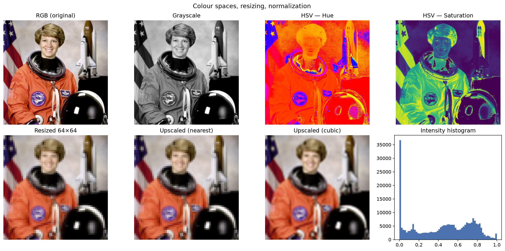
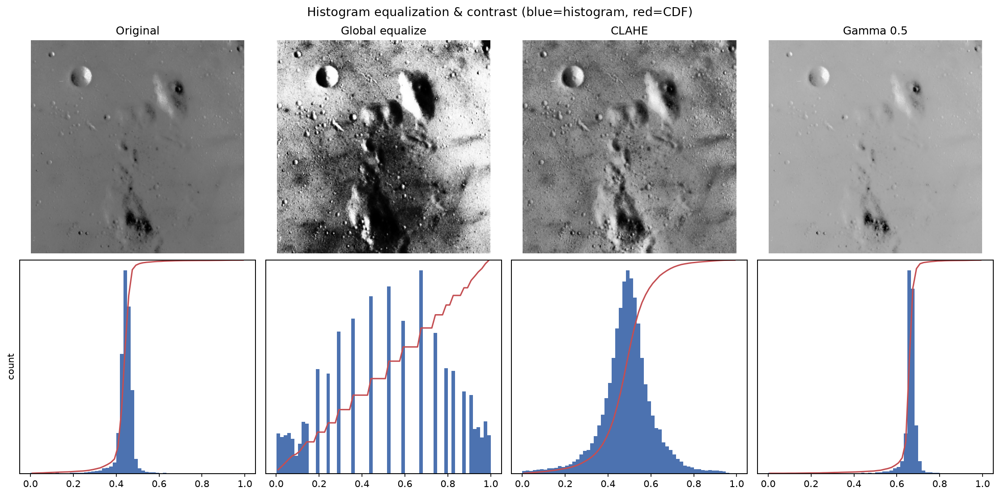
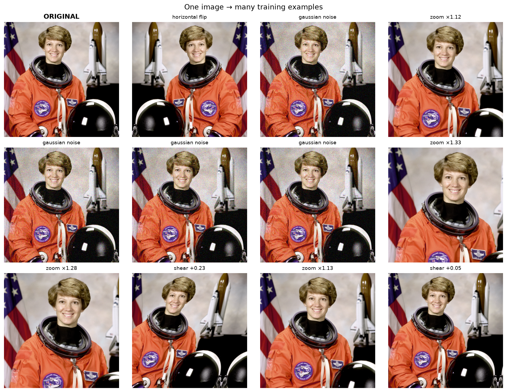
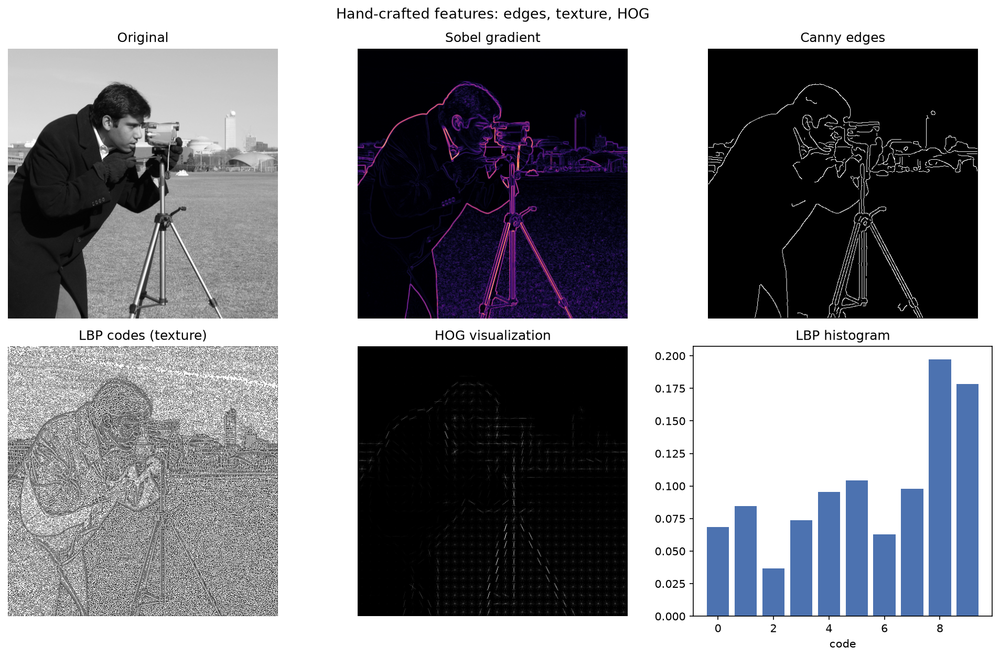
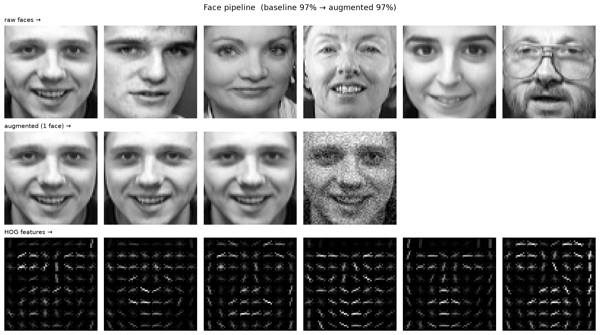

# 🖼️ Image Preprocessing — From Pixels to Features

Before a single convolution runs, every computer-vision system faces the same
problem NLP does with text: **how do we turn raw, messy pixels into clean,
regular input a model can learn from?** This tutorial covers the classical
image-preprocessing foundations — colour, contrast, augmentation, and feature
extraction — that still sit in front of every modern vision model.

```
Raw Image → [Colour / Resize] → [Normalize] → [Contrast / Equalize] → [Augment] → [Feature Extraction]
              encode, fit size    common scale   reveal detail          expand data   edges, texture, HOG
```

## 1. Domain Evolution and Challenges

### 1.1 A Brief History of Computer Vision

```
1960s ─────── 1980s ─────── 2000s ─────── 2012 ──────── 2015+ ─────── 2020+
  │             │             │             │              │              │
Hand-coded    Filters &     Hand-crafted   Deep CNNs     Very deep     Vision
geometry      edge ops      features +     (AlexNet on   nets, ResNet  Transformers
(blocks       (Sobel,       classifiers    ImageNet)     detection,    (ViT), multi-
 world)        Canny)       (SIFT, HOG+SVM)              segmentation   modal models
```

| Era | Approach | Limitation |
|-----|----------|------------|
| **Filters** | Hand-coded convolution kernels (Sobel, Gaussian) | Only low-level cues; no semantics |
| **Hand-crafted features** | SIFT / HOG / LBP + a classifier (SVM) | Features designed by humans, brittle across domains |
| **Deep CNNs** | Learn the feature hierarchy from data | Data-hungry; still need clean, normalized, augmented input |
| **Vision Transformers** | Patch embeddings + self-attention | Very compute/data-hungry; preprocessing never went away |

> Even a Vision Transformer begins with the topics in this tutorial: resize,
> normalize, and augment. Preprocessing didn't disappear — it moved in front of
> the network.

### 1.2 Why Images Are Hard

A pixel value is not the same as *meaning*. The same object produces wildly
different arrays depending on conditions:

| Challenge | Example |
|-----------|---------|
| **Illumination** | The same face under sunlight vs shadow — very different pixels |
| **Viewpoint / pose** | A mug from the side vs top-down |
| **Scale** | An object near vs far fills different pixel counts |
| **Intra-class variation** | "chair" spans thousands of shapes |
| **Background clutter / occlusion** | The object is partially hidden or camouflaged |
| **Sensor noise** | High-ISO grain, compression artefacts, blur |
| **Colour constancy** | White balance shifts the whole colour distribution |

Preprocessing tames the low-level layers of this variation so the model can
spend its capacity on *semantics* instead of lighting and framing.

## 2. Images as Arrays: Colour, Size, Scale

An image is a NumPy array: grayscale is `(H, W)`, colour is `(H, W, 3)`. Row 0
is the **top**; the last axis indexes colour channels.

### 2.1 Data Types and Ranges

| Representation | Range | When |
|----------------|-------|------|
| `uint8` | 0–255 (integers) | Storage, display, file I/O |
| `float` | 0.0–1.0 | Most algorithms (`img_as_float`) |
| standardized `float` | ≈ −3…+3 (zero mean) | Neural-network input |

Mixing these silently breaks things — a `0.5` float looks black if a viewer
expects `uint8`. Pick a convention early and convert explicitly.

### 2.2 Colour Spaces

| Space | Channels | Good for |
|-------|----------|----------|
| **RGB** | Red, Green, Blue | Default; how images are stored |
| **Grayscale** | Intensity | Structure/edges when colour is irrelevant. `0.299R + 0.587G + 0.114B` (luminance-weighted, *not* a flat mean) |
| **HSV** | Hue, Saturation, Value | Colour thresholding independent of brightness |
| **LAB** | Lightness, a, b | Perceptually uniform colour comparison |

### 2.3 Resizing and Interpolation

Models need a fixed input size, so resizing is mandatory.

| Method | Behaviour |
|--------|-----------|
| Nearest neighbour | Fast, blocky; preserves hard labels (use for masks) |
| Bilinear / bicubic | Smooth; the default for photos |
| Anti-aliasing | Blur *before* downscaling to avoid jagged aliasing |

Squashing a non-square image to a square **distorts aspect ratio** — crop or
pad instead when shape matters.

### 2.4 Normalization

```
Min-max:        x' = (x − min) / (max − min)          → [0, 1]
Standardize:    x' = (x − μ) / σ                       → zero mean, unit variance
Per-channel:    x' = (x − μ_c) / σ_c                   → ImageNet: μ=[.485,.456,.406]
```

**Golden rule:** compute statistics on the **training set only**, then apply the
same numbers to validation and test — otherwise you leak information.

<p align="center"></p>
<p align="center"><em>Lab 1 — the same image as RGB, grayscale and HSV channels; downscaled and upscaled variants; and its intensity histogram.</em></p>

## 3. Contrast and Histogram Techniques

An image's **histogram** is the distribution of its intensity values. Low
contrast = a narrow spike; good contrast = a spread across the range.

### 3.1 Histogram Equalization

Remap intensities so the **cumulative distribution** becomes roughly linear —
every brightness level ends up about equally common, stretching contrast to the
full range.

- **Global equalization** — one histogram for the whole image. Simple, but a
  bright region can wash out a dark one, and noise gets amplified.
- **CLAHE** (Contrast-Limited Adaptive Histogram Equalization) — equalize small
  tiles independently, clipping each tile's histogram to limit noise. The
  standard for uneven lighting (medical, satellite imagery).

### 3.2 Contrast Stretching and Gamma

| Technique | Formula | Effect |
|-----------|---------|--------|
| **Percentile stretch** | map [p2, p98] → [0, 1] | Linear, robust to outliers |
| **Gamma correction** | `out = in^γ` | γ>1 darkens, γ<1 brightens (non-linear tone curve) |
| **Log correction** | `out = log(1 + in)` | Compresses bright range, lifts shadows |

| When to use | Pick |
|-------------|------|
| Quick, safe default | Percentile contrast stretch |
| Maximise global contrast | Histogram equalization |
| Uneven / local lighting | CLAHE |
| Match display / brighten without clipping | Gamma |

<p align="center"></p>
<p align="center"><em>Lab 2 — original vs global equalization vs CLAHE vs gamma, each with its histogram (blue) and cumulative distribution (red).</em></p>

## 4. Data Augmentation

Augmentation manufactures new, plausible training examples by transforming
existing ones. It teaches **invariance** and fights **overfitting** — extra data
for free.

### 4.1 Geometric Transforms (change *where* pixels are)

| Transform | Teaches |
|-----------|---------|
| Horizontal flip | Left/right symmetry |
| Rotation ±° | Camera-tilt invariance |
| Translation / crop | Object can appear anywhere |
| Shear / affine | Mild viewpoint change |
| Scale / zoom | Distance invariance |

### 4.2 Photometric Transforms (change pixel *values*)

| Transform | Teaches |
|-----------|---------|
| Brightness / gamma | Different exposure, time of day |
| Contrast jitter | Haze, backlighting |
| Gaussian noise | Sensor / ISO-noise robustness |
| Blur | Motion / focus tolerance |
| Colour jitter | White-balance / camera differences |

### 4.3 The Label-Preserving Rule

Augmentation must **not change the correct answer**:

- Vertically flipping a `6` makes a `9` — **wrong** for digit OCR.
- Horizontally flipping a car photo — fine.
- Rotating a chest X-ray 90° — anatomically impossible; it hurts the model.

Choose transforms that match the **real** variation your data will encounter.
Augment **only the training set**, and do it **after** the train/test split so
near-duplicates don't leak across it.

<p align="center"></p>
<p align="center"><em>Lab 3 — one source image turned into many label-preserving training variants (flips, rotations, shifts, shear, noise, zoom).</em></p>

## 5. Feature Extraction

Before CNNs learned features, vision used **hand-crafted descriptors** — fast,
interpretable, training-free. They still power classical pipelines and make a
CNN's early layers intuitive.

### 5.1 Edges — Image Gradients

An **edge** is where intensity changes sharply (a large gradient).

| Detector | Output | Idea |
|----------|--------|------|
| **Sobel** | Gradient magnitude | `√(Gx² + Gy²)` per pixel |
| **Canny** | Thin binary edge map | Gradient + non-max suppression + hysteresis thresholds |

### 5.2 Texture — LBP and GLCM

Texture is the spatial *pattern* of intensities (smooth? rough? striped?).

- **Local Binary Patterns (LBP)** — threshold each pixel against its neighbours
  to form a code; the histogram of codes describes local texture. Rotation-
  invariant variants are popular for faces and materials.
- **Gray-Level Co-occurrence Matrix (GLCM)** — count how often intensity pairs
  occur at a given offset, then summarise with *contrast*, *homogeneity*,
  *energy*, and *correlation*.

### 5.3 HOG — Shape via Gradient Orientations

**Histogram of Oriented Gradients** bins gradient *directions* inside small
cells, then normalizes over blocks for lighting invariance. The result is a
fixed-length vector encoding **shape** — famously the basis of the Dalal &
Triggs (2005) pedestrian detector.

```
edges  →  texture  →  HOG (shape)   ── hand-crafted
                                        ▼
                            a CNN's early layers learn
                            strikingly similar detectors,
                            but from data instead of by hand.
```

<p align="center"></p>
<p align="center"><em>Lab 4 — hand-crafted features: Sobel gradient, Canny edges, LBP texture codes, and the HOG shape descriptor.</em></p>

<p align="center"></p>
<p align="center"><em>Lab 5 — the full pipeline on Olivetti faces: raw faces, augmented variants, HOG features, and the baseline→augmented accuracy gain.</em></p>

## Tutorial

### Installation


```bash
# Create a virtual environment
python -m venv image-course
image-course\Scripts\activate      # Linux/macOS: source image-course/bin/activate

# Install dependencies
pip install numpy scipy scikit-image scikit-learn matplotlib Pillow
```

Sample images (astronaut, moon, camera) ship with scikit-image. The Olivetti
faces dataset used in Lab 5 is downloaded automatically on first run.

### Quick Start

```bash
# Run everything (inside the virtual environment)
python image_preprocessing.py

# Or run individual labs
python image_preprocessing.py --lab 1   # Colour spaces, resizing, normalization
python image_preprocessing.py --lab 2   # Histogram equalization & contrast
python image_preprocessing.py --lab 3   # Data augmentation strategies
python image_preprocessing.py --lab 4   # Edges, texture, HOG
python image_preprocessing.py --lab 5   # Full pipeline: preprocess + augment → classify
```

Every lab writes a figure to `./outputs/image_preprocessing/` (shown in the
sections above):

| File | Lab |
|------|-----|
| `01_color_resize_normalize.png` | Colour spaces, resizing, intensity histogram |
| `02_histogram_contrast.png` | Original vs equalized vs CLAHE vs gamma, with histograms/CDFs |
| `03_augmentation.png` | One image → many augmented training variants |
| `04_features.png` | Sobel, Canny, LBP, HOG visualization |
| `05_pipeline.png` | Raw faces, augmented variants, HOG features, accuracy |

> **Note:** Lab 5 downloads the Olivetti faces dataset (a few MB) on first run
> and runs HOG over a few hundred images — expect under a minute on CPU.
