# Probability, Estimation, and Inference

## Introduction

Statistics is about learning from data under uncertainty. Before fitting any model or drawing any conclusion, you need a shared language for talking about uncertainty — and that language is **probability**. This tutorial builds that language from the ground up, then shows how it connects to the practical problems of estimation and inference.

The tutorial is organised around four themes. First, probability foundations: the rules that govern how uncertainty is expressed and updated. Second, sampling distributions: what happens to a statistic when you repeat an experiment many times, and how to approximate this in practice. Third, the German Tank Problem: a concrete estimation puzzle that forces you to think carefully about *what makes an estimator good*. Fourth, the Overselling Problem: a three-stage workflow — estimate, predict, optimise — that illustrates the use of probability concepts in practice.

---

## Part I: Probability Foundations and Bayes' Theorem

### What is probability?

A **probability** is a number between 0 and 1 assigned to an event. The number expresses how likely that event is to occur. Several interpretations of what this number *means* have been proposed, and they lead to different statistical philosophies. The table below presents four of the most popular ones in data science. 

| Interpretation | What P(heads) = 0.5 means |
|---|---|
| **Classical** | Half of all equally possible outcomes are heads |
| **Frequentist** | In the long run, heads occurs 50% of the time |
| **Subjective (Bayesian)** | Given my current evidence, I assign 0.5 belief to heads |
| **Mathematical** | 0.5 is just a number that obeys probability rules |

For everyday data science work, the **frequentist** and **Bayesian** views are the most important. The frequentist tradition treats probability as a long-run frequency and never assigns probabilities to fixed parameters. The Bayesian tradition treats probability as a degree of belief and updates it as evidence arrives. Both views appear in this tutorial.

More importantly, the mathematical framework is agnostic to how probability is interpreted; consequently, its rules hold regardless of the chosen perspective.

---

### Probability rules

Three rules underpin all of probability theory: the complement rule, the addition rule, and the multiplication rule. 

**Complement rule:** The probability that an event does *not* happen is one minus the probability that it does:  P(not A) = 1 − P(A).

**Addition rule:** For any two events, the probability that at least one occurs equals the sum of their individual probabilities minus the probability of their overlap (to avoid double counting):  P(A or B) = P(A) + P(B) − P(A and B). When two events cannot overlap - meaning that P(A and B) = 0 - we call them **mutually exclusive**. In this case, the probability of at least one occuring is simply the sum of their probabilities.

**Multiplication rule:** For any two events, the probability that *both* occur is P(A and B) = P(A) × P(B | A). When the events do not influence eachother - meaning that  P(B | A) = P (B)  - we call them **independent**. In this case, the probability of both events occuring is simply the product of their individual probabilities. When the events are **dependent** — knowing one occurred changes the odds for the other — the product must use the *conditional* probability of the second event given the first P(B | A). 

The **conditional probability** P(B | A) is read as "the probability of B *given* A". It answers the question: if we already know that A happened, how likely is B?

It is computed by dividing the *joint probability* by the probability of the event that is conditioned on. The formula for P(B | A) is therefore:

> P(B | A) = P(B and A) / P(A)


The diagram below is a Venn diagram — a visual tool for representing events and their probabilities. A Venn diagram helps illustrate the **joint probability** P(A and B): the probability that both A and B occur simultaneously. This is represented by the intersection of the two circles. It can also be written as P(A ∩ B). It is computed using the multiplication rule — so the formula differs depending on whether the events are dependent or independent. 

As such, the **conditional probability** P(B | A) can be visually tought of as the divison of the intersection A ∩ B by A: you "lock in" the circle for A and ask what fraction of it overlaps with B.

<p align="center">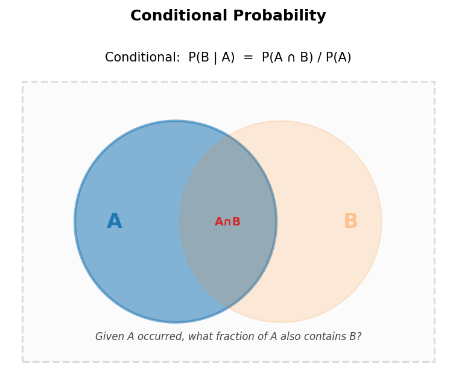</p>

An important question in computing joint and conditional probabilities is whether the events are independent or not. The tree diagram below offers a helpful visual intution of independence. Rather than showing overlapping regions, a tree diagram traces sequential paths through two events, making it especially clear whether A and B are **independent** or **dependent**. On the left, the branches for B shift depending on whether A occurred — this is dependence. On the right, the branches for B are identical regardless of A — this is independence: formally, P(B | A) = P(B | Ā) = P(B), where Ā is the complement of A. 

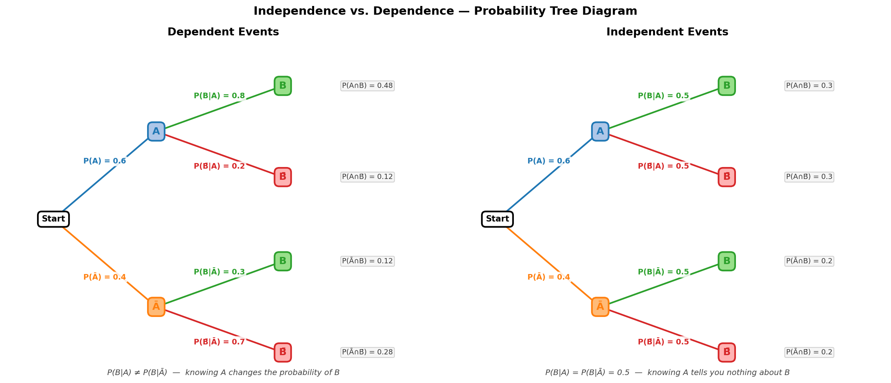

---

### Probability distributions

A **probability distribution** is a complete description of how probability is spread across the possible values of a random variable. Just as a single probability is a number assigned to one event, a distribution assigns probabilities to *all* possible outcomes at once.

Distributions can be interpreted in two ways — matching two popular views of probability. Under the **frequentist** view, a distribution describes long-run frequencies: the distribution is the histogram the data would converge to. Under the **Bayesian** view, a distribution represents *uncertainty*: it encodes your current state of knowledge about a quantity, not a physical frequency.

**Discrete vs. continuous.** When the variable takes countable values (e.g. the number of heads in 10 flips), the distribution is **discrete** and described by a **probability mass function (PMF)**: P(X = x) gives the probability of each exact value. When the variable takes values on a continuum (e.g. height, temperature), the distribution is **continuous** and described by a **probability density function (PDF)**: probabilities are areas under the curve, so P(a ≤ X ≤ b) = ∫ f(x) dx. A single point has zero probability under a PDF.

**Univariate vs. multivariate.** A distribution over a single variable is **univariate**. A distribution over two or more variables simultaneously is **multivariate** — also called a **joint distribution**. The joint distribution P(A, B) contains everything: the marginal distributions of A and B individually, and the dependence structure between them.


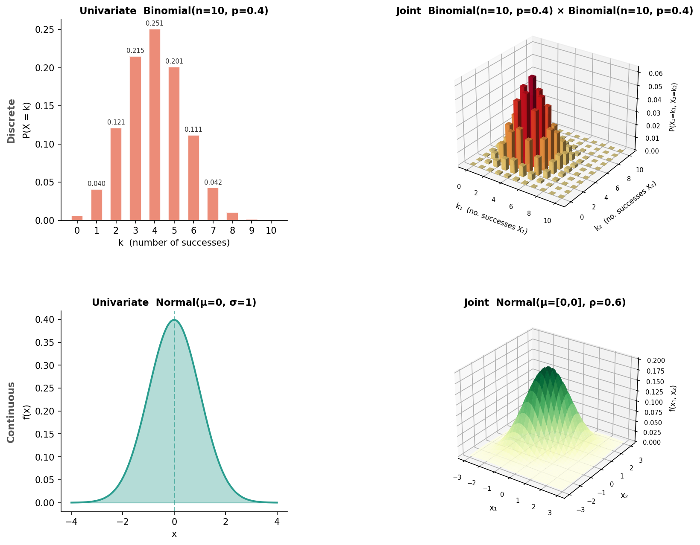


**Empirical vs. theoretical.** A **theoretical distribution** is a mathematical model — a named family such as Normal, Binomial, or Exponential — whose shape is fully determined by a small set of values called **parameters**. An **empirical distribution** is the one you observe directly from data: a histogram or a set of sample values. The goal of statistical modelling is often to find the theoretical distribution that best approximates the empirical one.

**Parameters vs. moments.** 

- **Parameters** are the *inputs* to a distribution — the knobs you turn to define its shape. For a Normal distribution the parameters are μ (location) and σ (spread); for a Binomial they are n (number of trials) and p (success probability). Parameters are properties of the model, not of the data.
- **Moments** are *properties* computed from the distribution itself. The first moment is the **mean** (expected value), the second central moment is the **variance**, the standardised third is **skewness**, and so on. Moments describe the shape of a distribution regardless of how it was parameterised.

For many common distributions the two are closely related — for example, the parameters of a Normal *are* its mean and variance — but in general they are distinct concepts: parameters define the distribution, moments describe it. 

Before moving on, it is worth spending some time on understanding two moments of distributions: the expected value and the variance. These are often encountered in practice.

**Expected value.** The expected value E[X] is the probability-weighted average of all possible outcomes — the "centre of mass" of the distribution.

For a **discrete** variable with PMF P(X = x):

> E[X] = Σ x · P(X = x)

For a **continuous** variable with PDF f(x):

> E[X] = ∫ x · f(x) dx

In both cases the idea is the same: multiply each value by its probability (or probability density), then sum (or integrate) over everything.

**Variance.** The variance Var(X) measures the average squared deviation from the mean. It captures how spread out the distribution is around E[X].

For a **discrete** variable:

> Var(X) = Σ (x − E[X])² · P(X = x)

For a **continuous** variable:

> Var(X) = ∫ (x − E[X])² · f(x) dx

An equivalent and often more convenient form is:

> Var(X) = E[X²] − (E[X])²

The **standard deviation** σ = √Var(X) is simply the square root of the variance, restoring the original units.


---

### Bayes' Theorem


Bayes' Theorem is a useful consequence of the conditional probability formula. Recall the definition of conditional probability for B given that A has occured: P(B | A) = P(B and A) / P(A). Also, we can talk about the probability of A given than B has occured: P(A | B) = P(B and A) / P (B)

It seems that using both formulas, we can do some algebra and arrive at an interesting result. The joint probability P(A ∩ B) can be written in two equivalent ways — starting from A or starting from B:

> P(B | A) = P(A ∩ B) / P(A)   →   P(A ∩ B) = P(B | A) · P(A)
>
> P(A | B) = P(A ∩ B) / P(B)   →   P(A ∩ B) = P(A | B) · P(B)

Setting the two right-hand sides equal and rearranging gives **Bayes' theorem**:

> **P(A | B) = P(B | A) · P(A) / P(B)**

Nothing more than algebra — but the result is profound. It tells you how to *reverse* a conditional probability: if you know how likely B is given A, you can compute how likely A is given B.

The tree diagram below illustrates a concrete example of Bayes’ theorem. The explanation below should make the theorem more intuitive. 

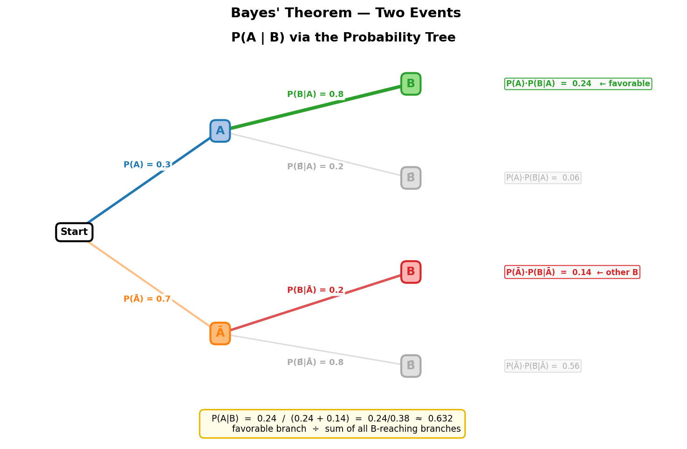

In the image above we are given the following probabilities:

- Prior probability of A and the complement of A (or not A): P(A) = 0.3,  P(Ā) = 0.7
- Conditional probabilities of B given A and A's complement: P(B|A) = 0.8,  P(B|Ā) = 0.2

> **Note:** The events are *dependent* — knowing whether A occurred changes the probability of B, which is why P(B|A) ≠ P(B|Ā). The gray branches (B̄) are not needed for this example as we will focus only on the scenario where B occured. 

**Step 1 — Observe B.**  Suppose B has occurred. This means we must be on one of the two branches that lead to B:

- The **green branch**: A → B
- The **red branch**: Ā → B

Our goal is to compute P(A|B) — the probability that A occurred, given that we observed B. In terms of the tree, this is the probability we are on the green branch, given that we are on either the green or red branch. We are on either the green or red because we observed B.

**Step 2 — Compute the probability of each B-reaching branch.**

We use the multiplication rule (i.e., the probability of two events happening) to compute the probability of each branch. For the green branch, this is the probability that A happened and B happened. For the red branch this the probability of A did not happen but B happened. 

> P(A ∩ B) = P(A) · P(B|A) = 0.3 × 0.8 = 0.24   ← green branch
>
> P(Ā ∩ B) = P(Ā) · P(B|Ā) = 0.7 × 0.2 = 0.14   ← red branch

**Step 3 — Normalise (apply Bayes’ theorem).**  

We want to know the probability of the green branch given that we are either on the green or on the red. This is like asking what is the fraction of the probability that the green represents out of the total probability. 

The total probability of reaching B is the sum of both B-branches (addition rule)

> P(B) = 0.24 + 0.14 = 0.38

Dividing the favorable branch by the total gives:

> P(A|B) = P(A ∩ B) / P(B) = 0.24 / 0.38 ≈ 0.632

This is the probability of being on the green branch, given that we only know that B happened. 

Notice that even though A was initially less likely (0.3), observing B raises its probability to about 0.632. This happens because B is far more likely to occur when A is true than when it is not (0.8 vs. 0.2), so observing B is evidence in favour of A.

This example extends naturally to events that have more than two possibilities. In the image below, instead of two first-level branches, there are three, one for each Aᵢ. From each branch, B can still occur or not, giving each Aᵢ. We can compute the probability of being in each branch just as in the example before. 

Furthermore, we can plot the probability of A before and after observing B.  The former is called the "prior", whereas the latter is called the "posterior". The branches of interest between A and B - for instance, P (B|Ai) - form another distribution called the "likelihood". It is not a probability distribution because its sum can exceed 1. 

Do not confuse the likelihood distribution or the posterior distribution with the distribution obtained after multiplying the likelihood by the prior (the probabilities at the end of the branches).  That distribution corresponds to the **unnormalized posterior**—it shows how the prior is reweighted after incorporating the evidence, but before normalization. As such, the unormalized posterior is proportional to the normalized posterior. This is often used in practice and can be written as: 

> **P( Aᵢ| B) ∝ P(B| Aᵢ) × P(Aᵢ)**

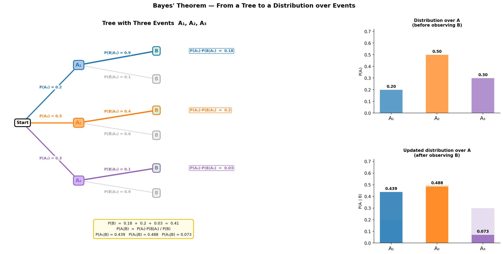

When the number of events grows to infinity — think of all possible values of a continuous parameter θ — the distributions (i.e., the prior, the likelihood, the posterior) become continuous. 

The diagram below illustrates these  using a coin-flipping example. Suppose we observe 7 heads and want to infer the parameter θ, the probability of landing heads.

Instead of representing each possibility as a separate branch, we use continuous distributions:

- The **prior** is a distribution over possible values of θ, expressing our belief about θ before observing the data (this equivalent to drawing the first layer of branches and attaching probabilities to them)
- The **likelihood** is another function over θ, representing how probable the observed data (7 heads) is for each possible value of θ (this is equivalent with drawing the second layer of branches and attaching the probability of those that correspond to the event that was observed)
- The **posterior** is obtained by combining the prior and the likelihood. Before normalization, this corresponds to the **unnormalized posterior**, which shows how the prior is reweighted in light of the observed data.


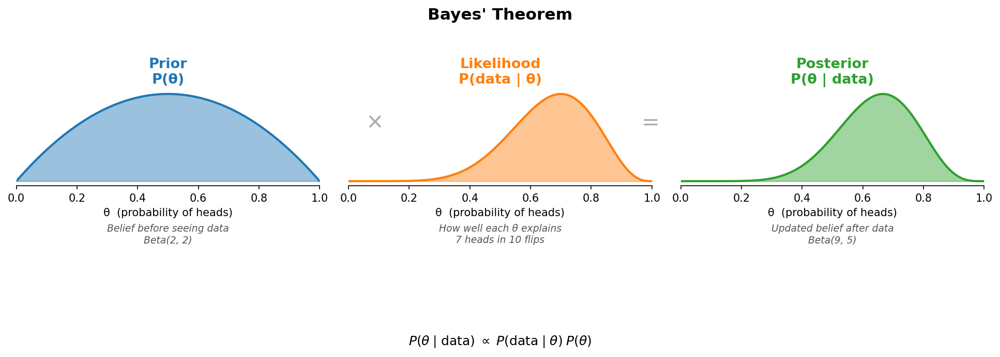

---

## Part II: Sampling Distributions and the Central Limit Theorem

### From population to statistic

In most real problems you cannot measure the entire population — you have a **sample**. A **statistic** (such as the sample mean x̄ or the sample maximum) is a function of the sample. It acts as an estimate of the corresponding population parameter.

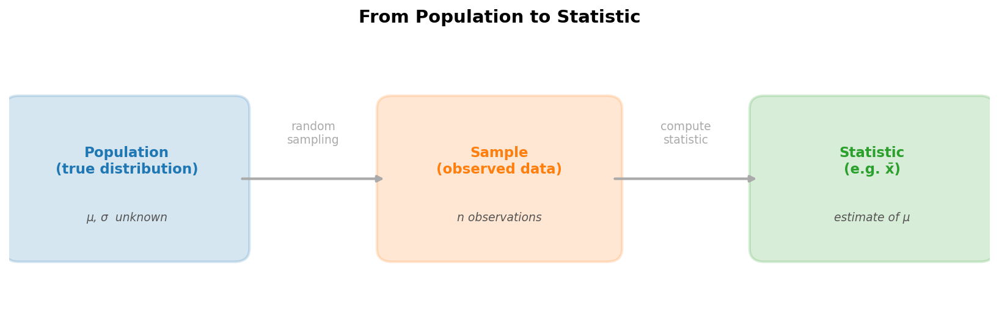

The key insight is that if you could repeat the sampling process many times — drawing random samples of the same size in the same conidtions and computing the statistic each time — the resulting collection of values would form its own distribution. This is the **sampling distribution** of the statistic.

---

### Three ways to build a sampling distribution

Sampling distributions of statistics (e.g., mean, max, standard deviation, etc.) are useful for various procedures. There are various ways to construct (or approximate) a sampling distribution. 

**Repeated sampling via simulation (Monte Carlo)** This process assumes that the population distribution is known. You then draw many independent samples and compute the statistic for each sample. In practice, this approach is often difficult to apply because the goal is typically to learn about the population itself, which is therefore unknown. Nonetheless, this method remains useful in various contexts and provides a valuable way to illustrate key concepts, as will be shown.

**Bootstrap** works from a *single* observed sample. You resample from it *with replacement*, creating artificial new samples of the same size, and compute the statistic on each. Because resampling with replacement mimics the act of drawing a new sample from the population, the bootstrap distribution approximates the true sampling distribution.

**Permutation** is a method for constructing a sampling distribution from a single observed sample. It is designed for a specific purpose: assessing whether the observed pattern could have arisen by chance if there were no true difference between at least two population distributions. This assumes a sample extracted from each population. Then, you pool all observations, randomly shuffle the group labels, and compute the statistic for each shuffled dataset. The resulting distribution represents the sampling distribution under the assumption of no difference in the population.

The diagram below compares all three methods for building the sampling distribution of the difference in means between two populations. The top row shows the two populations. The bottom row shows the sampling distributions, each built using a different approach:

1) **Repeated sampling** — draw fresh random samples of size 30 from each population, compute the mean of each, take their difference, and repeat. Plot the resulting differences.
2) **Bootstrap** — draw one sample of size 30 from each population, then repeatedly resample (with replacement) from those fixed samples to generate new samples of same size, compute the mean difference each time, and plot the results.
3) **Permutation** — draw one sample of size 30 from each population, pool all observations together, randomly reassign group membership, compute the mean difference for each shuffle, and plot the results.

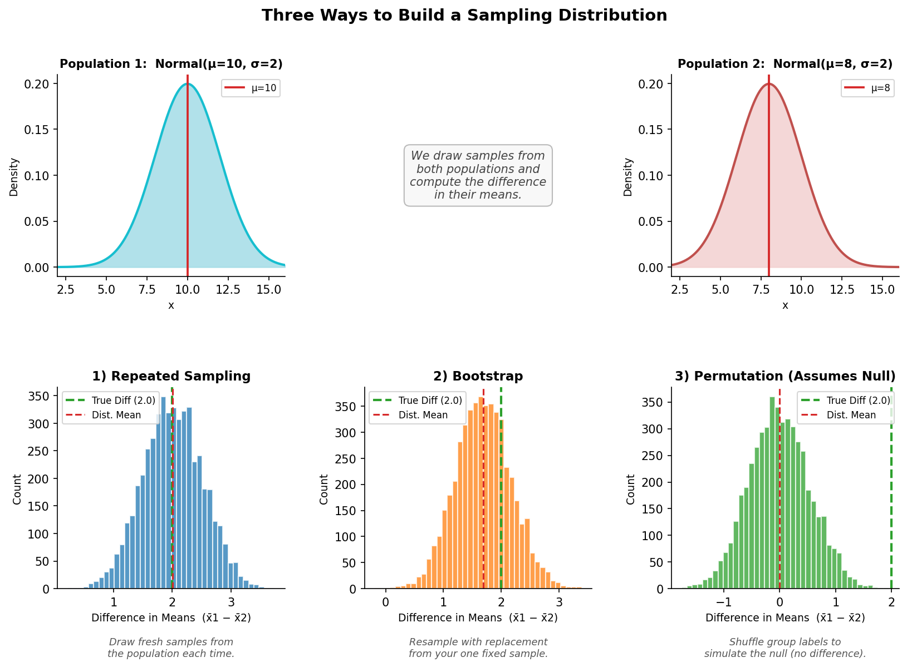

Notice that repeated sampling and bootstrap are centred on the true difference (they describe the estimator), while permutation is centred on zero (it simulates the assumptions that the population difference in means is 0). The three distributions have different purposes and should not be confused with one another.

One more important aspect to consider is that the term sampling distribution refers to the **probability distribution of a statistic** computed from random samples. In other words, the sampling distributions presented in the image above can be turned into probability distributions. This is important to remember because, when the statistic is used to estimate an unknown parameter, this same distribution is also referred to as the probability distribution of the estimator. Thus, the sampling distribution and the probability distribution of an estimator describe the same object, with the terminology depending on whether the focus is on the statistic itself or its role in estimation.

---

### The Central Limit Theorem

The **Central Limit Theorem (CLT)** is one of the most important results in all of statistics. It states:

> Regardless of the shape of the population distribution, the sampling distribution of the sample mean x̄ approaches a **normal distribution** as the sample size n increases — with mean equal to the population mean μ and standard deviation equal to σ/√n (the *standard error*).

In other words, the Central Limit Theorem (CLT) provides a theoretical way of constructing the sampling distribution for a specific statistic—namely, the sample mean. It tells us that this distribution will have a predictable shape and well-defined parameters.

The diagram below demonstrates this with an exponential (right-skewed) population. For n = 2, the sampling distribution of the sample mean is still clearly skewed. By n = 30, it closely follows a normal curve. Notice how the sampling distribution has its mean equal to the population mean (i.e., 1)

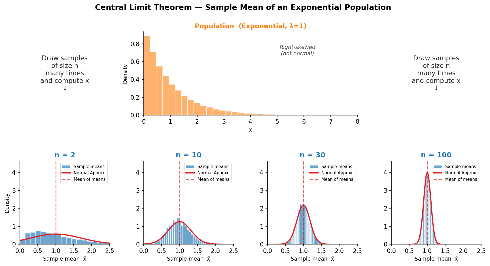

The CLT is what makes the normal distribution so central to classical statistics: even when individual observations are not normally distributed, averages of large samples are. This justifies using normal-based formulas for confidence intervals and hypothesis tests whenever n is reasonably large (a common rule of thumb is n ≥ 30).

---

## Part III: The German Tank Problem

This problem serves as an introduction to statistical estimation. It illustrates what an estimator is, how to construct one, and how to evaluate its performance. It also introduces essential concepts such as the bias and variance of an estimator.

### The problem

During World War II, Allied analysts needed to estimate the total number of German tanks produced (N) using only the serial numbers on a small number of captured tanks. If tanks are numbered sequentially from 1 to N and a random sample of m tanks is captured, the question is: what is the best estimate of N?

This is a beautifully clean **estimation problem**: the parameter of interest is N (a single integer), the data are the m serial numbers in the sample, and the estimator is the rule we apply to those numbers to produce a guess.

The three terms to keep straight are:

- **Estimand** — the unknown quantity you want to know (here: N, the true total number of tanks).
- **Estimator** — the rule or formula you apply to sample data (here: one of the four formulas below).
- **Estimate** — the specific number produced by applying the estimator to a particular sample.

---

### Four estimators

There are at least 4 estimators that can be used to estimate the parameter of interest. 

**Maximum likelihood estimator (MLE) — sample maximum:**
The value of N that makes the observed sample *most likely* is the sample maximum x_max. Intuitively, no tank observed has a number above x_max, so N cannot be less than x_max. Under a uniform model, x_max maximises the likelihood.

> N̂_MLE = x_max

The core principle of Maximum Likelihood Estimation (MLE) is to consider the joint probability distribution of the observed tank serial numbers (assumed to follow a uniform distribution) and then vary the parameter N. The value of N is chosen to maximize the probability of the observed data.

For example, suppose we observe just two tanks with serial numbers 2 and 5. The image below illustrates that, for different values of N, we can define different joint uniform distributions over the two possible tank serial numbers that could have been observed. For each candidate N, we compute the probability of observing the specific pair (2, 5) under that joint distribution. Comparing these probabilities across values of N gives us the likelihood function, and we then select the value N that maximizes the probability of the observed data.

The image below illustrates the MLE process for the example with the two observed serial numbers, 2 and 5. Each bar in the top graph corresponds to a different uniform distribution over tank serial numbers, each defined by a candidate value of N, as shown below the top plot. For each N, we compute the likelihood of observing the pair (2, 5). The value of N that maximizes this likelihood is 5, which coincides with the sample maximum.

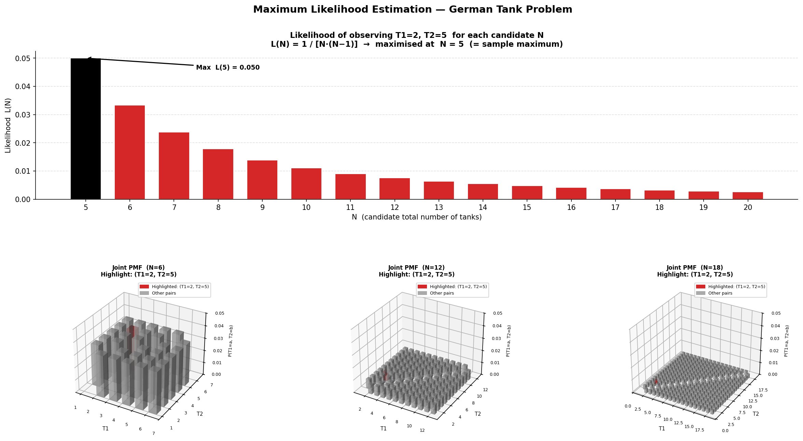

**Method of Moments (MoM):**
The population mean of a uniform distribution on {1, …, N} is (N+1)/2. Setting this equal to the sample mean x̄ and solving for N gives:

> N̂_MoM = 2x̄ − 1

The Method of Moments relies on the same underlying assumption of a uniform distribution over the tank serial numbers as in the MLE approach. However, instead of evaluating multiple candidate distributions and selecting the one that maximizes the likelihood of the observed data, it uses the fact that the distribution’s moments are related to the parameter of interest. In particular, it exploits the relationship between the first moment (i.e., the expected value) and N. By estimating this moment from the sample and equating it to its theoretical expression, we can solve for the parameter N.

The result of this process is an unbiased estimator. An estimator is said to be unbiased if the expected value of its probability (sampling) distribution equals the true parameter (the estimand). In other words, on average, the estimator recovers the true value. To illustrate this, consider the empirical distributions (i.e., sampling distributions) of the MLE and MoM estimators shown below. Notice that the MoM estimator is unbiased (i.e., the mean is equal to the true N). The small deviation observed is due to the use of simulated (empirical) distributions rather than the exact theoretical distribution.


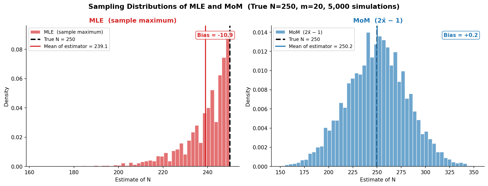

**Minimum Variance Unbiased Estimator (MVUE):** is an estimator of N that has the smallest variance among all unbiased estimators. Its derivation typically starts from a sufficient statistic and an unbiased estimator, and then applies results such as the Rao–Blackwell and Lehmann–Scheffé theorems to construct an optimal estimator. This leads to:

> N̂_MVUE = x_max + x_max/m − 1

The MVUE can be derived by starting from an unbiased estimator, such as the Method of Moments estimator presented above, and combining it with the sample maximum as a sufficient statistic. Alternatively, it can be obtained by adjusting the MLE to remove its bias. Both approaches ultimately lead to the same result.

**Bayesian estimator (posterior mean):** is a way of applying Bayes’ theorem to the German Tank Problem. This yields a posterior distribution over the possible values of N. The mean of this posterior is given by:

> N̂_Bayes = (x_max − 1)(m − 1)/(m − 2)

The Bayesian approach follows the same process outlined in the dedicated section of this tutorial by treating event A as the parameter N taking a specific value n, and event B as the observed sample maximum x_max=x. Bayes’ theorem is then used to compute the probability of A (i.e.,N=n) given that x_max  has been observed. Repeating this calculation for all possible values of n yields a posterior distribution over N.

---

### Bias, Variance, and MSE

Before comparing the estimators in the exercises, consider that every estimator has two sources of error. **Bias** is the systematic offset of the estimator's average from the true value. **Variance** measures how much the estimator fluctuates from sample to sample. The **mean squared error (MSE)** combines both:

> MSE = Bias² + Variance

Each of these can be viewed as an evaluation criterion for comparing and selecting estimators. If you want an estimator that, over repeated samples, recovers the true value on average, you should prefer one with low (or zero) bias. If you want an estimator that produces stable and consistent results across samples, you should prefer one with low variance. If you want to balance both considerations, you should choose an estimator with low mean squared error (MSE), which combines bias and variance into a single measure.

The diagram below illustrates combinations you may encounter in practice.

<p align="center">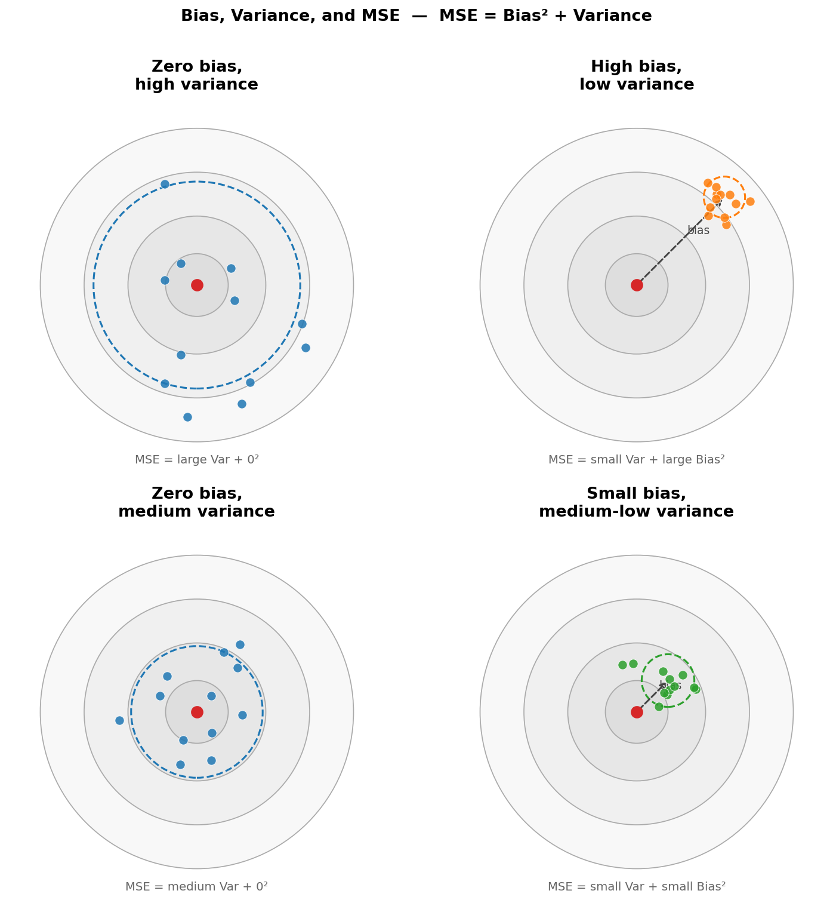</p>

The MVUE approach imposes the constraint of zero bias and then minimises variance within that constraint. The Bayesian approach minimises MSE without the zero-bias constraint, which is why it can sometimes achieve lower MSE by accepting a small bias in exchange for reduced variance. This bias–variance trade-off reappears throughout machine learning whenever you choose model complexity.

---

## Part IV: The Overselling Problem

This problem serves as an introduction to how estimation, prediction, and optimization procedures can work toghether. These operations are key in most machine learning and deep learning algorithms. 

### The problem

Airlines routinely sell more tickets than there are seats, because some passengers always fail to show up (no-shows). If they sell exactly as many tickets as seats, no-shows mean lost revenue. If they oversell too aggressively, they may have to bump paying passengers at significant cost. The question is: **how many tickets should be sold to maximise expected revenue?**

Solving this problem requires three stages: *estimation* of the no-show probability, *prediction* of the number of no-shows for any given number of tickets, and *optimisation* to find the revenue-maximising ticket count.

---

### Stage 1 — Estimation

Model each ticket independently: either the passenger shows up (with probability 1 − p) or does not (with probability p). This is a **Bernoulli trial** with unknown parameter p. The **sample proportion** p̂ = (number of no-shows) / (total tickets observed) is the natural estimator of p. 

The sample proportion is an **unbiased estimator**: its expected value equals the true p. It also has the smallest possible variance among unbiased estimators for a Bernoulli proportion (it is the MVUE in this setting too).

Say, for example, that we estimate the p to be 0.05. 

<p align="center">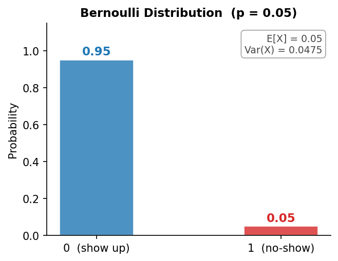</p>

---

### Stage 2 — Prediction

Once p is estimated, model the total number of no-shows for n tickets as a **Binomial(n, p)** random variable. The Binomial distribution gives the probability of every possible number of no-shows (0, 1, 2, …, n), for any choice of n. This turns the unknown number of no-shows into a full probability distribution rather than a point prediction.

This procedure provides a distribution of possible no-shows for any given number of tickets sold. For example, consider that we want to compare the scenario in which we sell 400 tickets, 410 tickets, and 420 tickets.

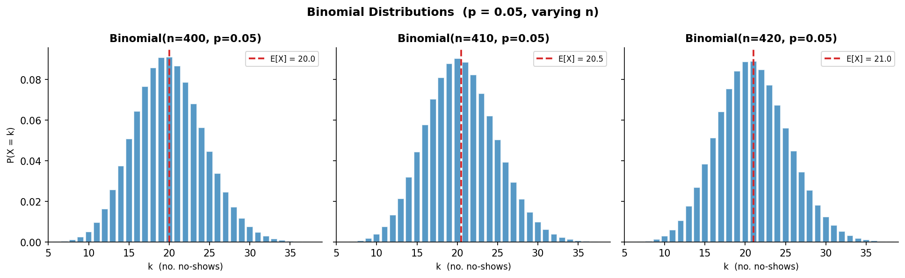

The expected value can be computed for each distribution and represents the average number of no-shows in the long run (i.e., the value we would obtain by observing many realizations of the distribution and taking their mean)
---

### Stage 3 — Optimisation

Each distribution represents the possible number of no-shows for a given number of tickets sold. Consider, for example, a plane with 400 seats. The airline may choose to sell exactly 400 tickets or overbook by selling more, such as 410 or 420 tickets. For each of these scenarios, we can have the distribution of the possible number of no-shows.

If, for instance, 410 tickets are sold for a 400-seat plane and 10 passengers do not show up, all remaining passengers can be accommodated, and the airline earns revenue from all 410 tickets without incurring any losses. However, if only 9 passengers fail to show up, there will be one extra passenger without a seat. In this case, the airline must refund the ticket and provide compensation.

Following this logic, within each scenario (i.e., each distribution), we can map each possible number of no-shows to the corresponding revenue that would result if that outcome occurs. We just have to consider the number of seats (here, 400), the ticket price (here, 100$), and the refound (or bump) in case of passangers without seat (here 300). 

The figure below shows the distributions for the three scenarios described earlier (400, 410, and 420 tickets), where the number of no-shows has been translated into corresponding revenue outcomes. The red bars represent cases in which more passengers arrive than there are available seats; in these situations, some passengers must be bumped and therefore refunded and compensated.

<p align="center">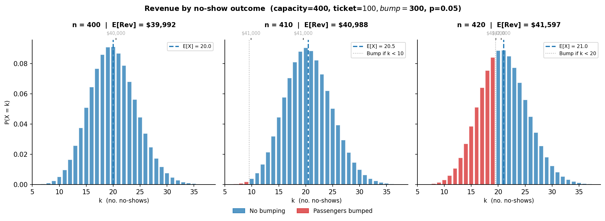</p>

For each distribution, we can compute the expected value, which represents the long-run expected revenue. We can then select the scenario with the highest expected value. This process can be viewed as generating multiple such distributions, computing their expected revenues, and plotting them. The optimal choice is the one that achieves the highest value on this plot—similar in spirit to a maximization procedure, though here we are maximizing expected revenue rather than likelihood. The image below illustrates this. 


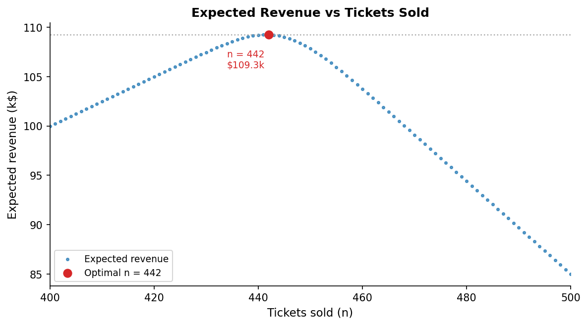

---

## Summary

**Part I** built the language of uncertainty. Probabilities are numbers between 0 and 1 that obey three rules — complement, addition, and multiplication — and conditional probability P(A | B) formalises what it means to update on new information. Probability distributions formalise uncertainty over outcomes: discrete distributions assign probability mass to counts, continuous ones assign probability density to real values; both can be univariate or multivariate, empirical or theoretical. A distribution is characterised by its parameters and summarised by its moments — the expected value captures the centre and the variance captures the spread. Bayes' theorem follows directly from conditional probability and provides a principled way to revise distributions understood as beliefs: posterior ∝ likelihood × prior.

**Part II** introduced the machinery of inference. A sampling distribution describes how a statistic varies across repeated samples from the same population — it is the bridge between a single dataset and the underlying population. Monte Carlo simulation constructs this distribution by drawing many samples from a known model; the bootstrap approximates it by resampling with replacement from the data itself; permutation tests simulate the null hypothesis by shuffling group labels. The Central Limit Theorem provides a theoretical guarantee: regardless of the population shape, sample means converge to a Normal distribution as n grows.

**Part III** tackled the German Tank Problem as a concrete case study in estimation. The key distinction is between the estimand (the true unknown quantity), estimators (the rules for computing a guess), and estimates (the specific values those rules produce on a given sample). MLE maximises the likelihood of the observed data; MoM matches sample moments to theoretical ones; MVUE minimises variance among all unbiased estimators; the Bayesian estimator incorporates prior knowledge and returns a full posterior distribution. Bias, variance, and MSE — where MSE = Bias² + Variance — are the three criteria for evaluating and comparing estimators.

**Part IV** applied everything to the Overselling Problem, illustrating a general workflow for decision-making under uncertainty. Estimation comes first: fit a Bernoulli model to historical no-show data to obtain p. Prediction follows: use a Binomial(n, p) model to obtain a full distribution of no-shows for any ticket count n. Optimisation is the final step: define a revenue criterion that accounts for ticket income and bumping costs, then find the n that maximises expected revenue. Choosing a criterion and maximising it is the essence of decision-making — probability and estimation are what make that choice principled.

---

## Requirements

```bash
pip install numpy scipy matplotlib
```

| Package | Purpose |
|---|---|
| `numpy` | Array operations, random sampling, numerical computations |
| `scipy` | Statistical distributions (`binom`, `norm`, `beta`, `expon`) |
| `matplotlib` | All plots and visualisations in the simulation script |
