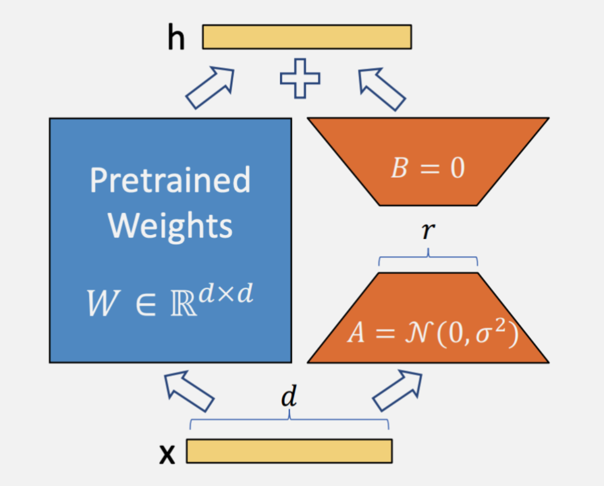

# The Decoder-Only Transformer

Large Language Models (LLMs) are neural networks trained on vast amounts of text data to learn the statistical patterns of language. By predicting and generating words based on context, they can perform a wide range of tasks, including text completion, translation, summarization, and reasoning. Modern LLMs are typically built on the decoder-only transformer architecture, which enables efficient modeling of long-range dependencies in text through self-attention mechanisms. Compared to the original transformer decoder, contemporary LLMs primarily differ in scale, architectural refinements, and the use of extensive pretraining and alignment procedures. Therefore, understanding how the transformer decoder operates is a fundamental step toward understanding the design and behavior of current LLMs.

## Architecture


The model begins by converting input tokens into continuous vectors through a token embedding layer. To encode word order, a positional embedding is added to these token representations. The resulting vectors are then passed into a stack of identical transformer blocks (repeated N times).

Each decoder block consists of two main sublayers:
1. <strong>Masked Multi-Head Self-Attention</strong><br>
This layer allows each token to attend only to previous tokens in the sequence (via causal masking), ensuring autoregressive behavior for next-token prediction. Multiple attention heads operate in parallel to capture different types of relationships.

2. <strong>Feed-Forward Network (FFN)</strong><br>
A position-wise fully connected network that processes each token representation independently after attention has mixed contextual information.

Both sublayers are wrapped with residual connections (skip connections) and followed by layer normalization, which stabilizes training and improves gradient flow. After passing through the stacked decoder blocks, the final hidden states are fed into a linear projection (often tied to the embedding matrix) to produce logits over the vocabulary, enabling next-token prediction.

## Attention
### Self-Attention
#### Conceptual Overview

Self-attention is a mechanism that enables each token in a sequence to compute a contextualized representation by attending to all other tokens in the same sequence. Self-attention allows direct pairwise interactions between all positions, enabling efficient modeling of long-range dependencies.

#### Mathematical Formulation

Given an input sequence represented as embeddings:

$
X = [x_1, x_2, \dots, x_n] \in \mathbb{R}^{n \times d}
$

Three linear projections are applied:

$
Q = XW^Q, \quad K = XW^K, \quad V = XW^V
$

where:

* $Q$ = Queries
* $K$ = Keys
* $V$ = Values

The attention mechanism computes:

$
\text{Attention}(Q,K,V) = \text{softmax}\left(\frac{QK^T}{\sqrt{d_k}}\right)V
$

* ($QK^T$) computes similarity scores.
* Division by $\sqrt{d_k}$ stabilizes gradients.
* The softmax produces attention weights.
* These weights are used to compute a weighted sum of value vectors.

#### Structural Interpretation

Each token representation is updated as a weighted combination of all tokens:

```
        x1   x2   x3   x4
x1  →  [ •    •    •    • ]
x2  →  [ •    •    •    • ]
x3  →  [ •    •    •    • ]
x4  →  [ •    •    •    • ]
```

Each row corresponds to the attention distribution of a token over the sequence. Thus, self-attention produces context-aware token embeddings.

### Masked Self-Attention (Causal Attention)
#### Motivation

In autoregressive language modeling, the objective is next-token prediction. Therefore, when predicting the token at position $t$, the model must not access information from positions $> t$. Standard self-attention allows full bidirectional access. To prevent information leakage, a **causal mask** is applied.

#### Causal Mask Mechanism

The attention matrix is modified by masking future positions before applying softmax.

Instead of:

```
        x1   x2   x3   x4
x1  →  [ •    •    •    • ]
x2  →  [ •    •    •    • ]
x3  →  [ •    •    •    • ]
x4  →  [ •    •    •    • ]
```

We enforce:

```
        x1   x2   x3   x4
x1  →  [ •    0    0    0 ]
x2  →  [ •    •    0    0 ]
x3  →  [ •    •    •    0 ]
x4  →  [ •    •    •    • ]
```

The upper-triangular portion is masked (set to $-\infty$ before softmax), ensuring:

$
x_t \text{ attends only to } x_{\leq t}
$

This produces an autoregressive model suitable for text generation.

### Masked Multi-Head Self-Attention
#### Motivation

A single attention operation may not capture all relevant relational patterns in the data. Different linguistic or structural relationships may require distinct representational subspaces. Multi-head attention addresses this by running several independent attention mechanisms in parallel.

#### Mechanism

Instead of a single set of projections $(W^Q, W^K, W^V)$, we define (h) sets:

$
Q_i = XW_i^Q, \quad K_i = XW_i^K, \quad V_i = XW_i^V
$

Each head computes:

$
\text{head}_i = \text{Attention}(Q_i, K_i, V_i)
$

The outputs are concatenated:

$
\text{MultiHead}(Q,K,V) = \text{Concat}(\text{head}_1, \dots, \text{head}_h)W^O
$

where $W^O$ is a learned projection matrix.

#### Structural Illustration

```
                Input X
                    |
        ----------------------------
        |      |      |      |     |
      Head1  Head2  Head3  ...  Headh
        |      |      |            |
     Attention Attention         Attention
        |      |      |            |
        --------------------------------
                   Concatenate
                        |
                 Linear Projection
                        |
                      Output
```

Each head may learn to specialize in distinct types of relationships (e.g., syntactic dependencies, semantic similarity, positional structure). In decoder-only transformer architectures, masked multi-head self-attention constitutes the core operation enabling scalable, parallelizable, and autoregressive language modeling.


## Training Objective

### 1. Next-Token Prediction as a Classification Problem

The training objective of a decoder-only transformer can be formulated as a sequence of classification tasks. At each position $t$, given the previous tokens $x_{<t} = (x_1, \dots, x_{t-1})$, the model predicts a probability distribution over the entire vocabulary $\mathcal{V}$:

$
P(x_t \mid x_{<t})
$

Since the vocabulary contains $|\mathcal{V}|$ discrete tokens, this prediction corresponds to a **multi-class classification problem**, where:

* The classes are all tokens in the vocabulary,
* The model outputs a probability distribution via a softmax layer,
* The correct class is the actual next token in the sequence.

This process occurs at every time step of the sequence. At a high level, the model learns to continue a given text prefix. During inference, generation proceeds iteratively:

1. Provide an initial prompt.
2. Predict a distribution over the next token.
3. Sample or select the most likely token.
4. Append it to the input.
5. Repeat.

The next figure showcases this behaviour.


### 2. Cross-Entropy Loss

Training aims to minimize the **cross-entropy loss** between the predicted distribution and the true token at each position.

For a single position $t$, the loss is:

$
\mathcal{L}*t = - \log P*\theta(x_t \mid x_{<t})
$

For a sequence of length $ T $:

$
\mathcal{L} = - \sum_{t=1}^{T} \log P_\theta(x_t \mid x_{<t})
$

This is equivalent to maximizing the likelihood of the training data (Maximum Likelihood Estimation).

### 3. Training

During pretraining, the input and target sequence are identical, but shifted internally by one position.

Example:

**Text sequence:**

> "There are 8 planets."

Conceptually:

* Input to predict token 2 is token 1.
* Input to predict token 3 is tokens 1–2.
* And so forth.

Although the full sequence is fed into the model in parallel, causal masking ensures that position $ t $ only attends to positions $ < t $.

---

During supervised fine-tuning, training data often consists of:

* A **prompt**
* A desired **completion**

Example:

**Input:**

> "Respond to the following question: How many planets are in our solar system? There are 8 planets."

If we compute loss over the entire sequence, the model would be trained to reproduce both the prompt and the answer. However, the objective in instruction tuning is to train the model to generate only the completion, conditioned on the prompt. To prevent computing loss on the prompt portion, the labels corresponding to the prompt tokens are masked.

Example:

**Input tokens:**

$
[tok_1, tok_2, \dots, tok_n, tok_{n+1}, \dots, tok_T]
$

where:

* $ tok_1 \dots tok_n $ = prompt
* $ tok_{n+1} \dots tok_T $ = target completion

**Labels:**

$
[-100, -100, \dots, -100, tok_{n+1}, \dots, tok_T]
$

Here:

* The special value (e.g., -100 in PyTorch) indicates that loss should **not** be computed for those positions.
* Gradients are propagated only for the completion tokens.

Thus, the loss becomes:

$
\mathcal{L} = - \sum_{t=n+1}^{T} \log P_\theta(x_t \mid x_{<t})
$

The model still *conditions on the prompt*, but it is only penalized for errors in generating the response.

## Parameter Efficient Fine-Tuning
### Why is it necessary?

As the scale of Large Language Models (LLMs) has expanded, **Parameter-Efficient Fine-Tuning (PEFT)** has emerged as a critical methodology to mitigate the computational and storage problems associated with fine-tuning. Historically, the models utilized in standard NLP pipelines were significantly smaller than today's state-of-the-art (SOTA) decoder architectures. To put this into perspective:

* **BERT-base:** 110 million parameters.
* **FLAN-T5-small:** 77 million parameters.
* **Qwen (1.5B/0.5B variant):** Approximately 494 million parameters.

In contrast, models have transitioned from the millions to billions, typically starting from **7 billion parameters** and scaling upwards to **hundreds of billions**. At this magnitude, updating every weight in the network (Full Fine-Tuning) is no longer viable for most organizations due to memory constraints and high GPU costs.

### How PEFT Optimizes Adaptation

Instead of performing a global update of all model weights, PEFT strategies focus on modifying only a specialized, task-specific subset of parameters. The core weights of the original pre-trained model remain **frozen**, which yields several advantages:

* **Resource Efficiency:** By only training a fraction of the total parameters (often less than 1%), the memory footprint during training is drastically reduced.
* **Mitigation of Catastrophic Forgetting:** Keeping the base weights fixed helps the model retain its general knowledge while learning new tasks.
* **Modular Portability:** Since the original model remains unchanged, practitioners only need to store small "checkpoints" (adapters) for each specific task, rather than multiple full-sized versions of the model.

### Low-Rank Adaptation (LoRA)

In the context of modern chat-based models, **Low-Rank Adaptation (LoRA)** has become the industry-standard PEFT technique. LoRA functions by injecting trainable low-rank matrices into the transformer layers. This allows the model to learn task-specific nuances through a highly compressed mathematical representation, ensuring that even billion-parameter models can be adapted on consumer-grade hardware.



## Dockerfile

```
FROM ubuntu:24.04

RUN apt-get update &&     apt-get install -y     python3-pip     python3-venv     && apt-get clean

RUN python3 -m venv /opt/venv
ENV PATH="/opt/venv/bin:$PATH"

COPY requirements.txt /tmp/
RUN pip install --upgrade pip wheel
RUN pip install torch torchvision --index-url https://download.pytorch.org/whl/cu128 
RUN pip install -r /tmp/requirements.txt
```

## Requirements

```
transformers>=5.2.0
lightning>=2.6.1
datasets>=4.5.0
evaluate>=0.4.6
bitsandbytes>=0.49.0
peft>=0.18.0
wandb>=0.25.0
```