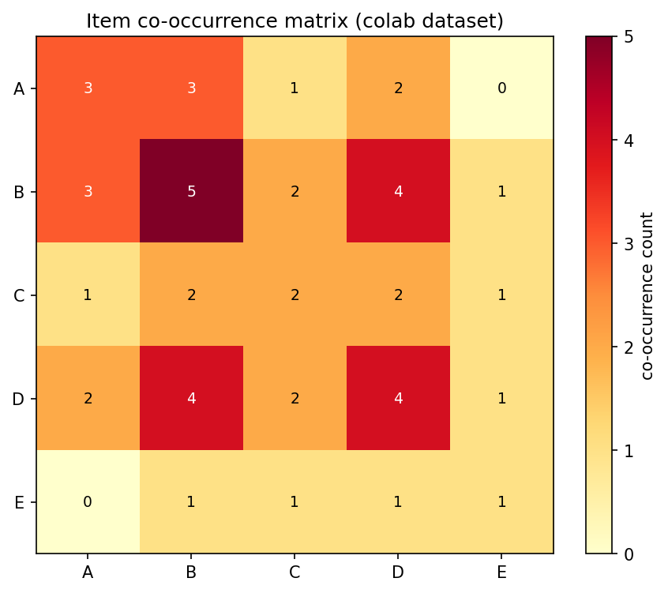
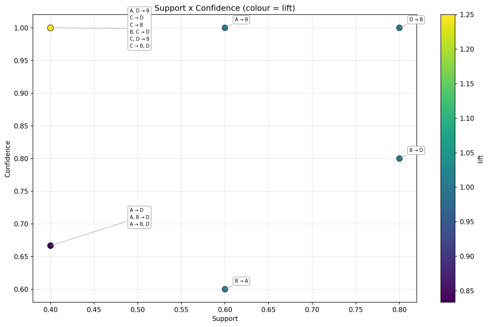
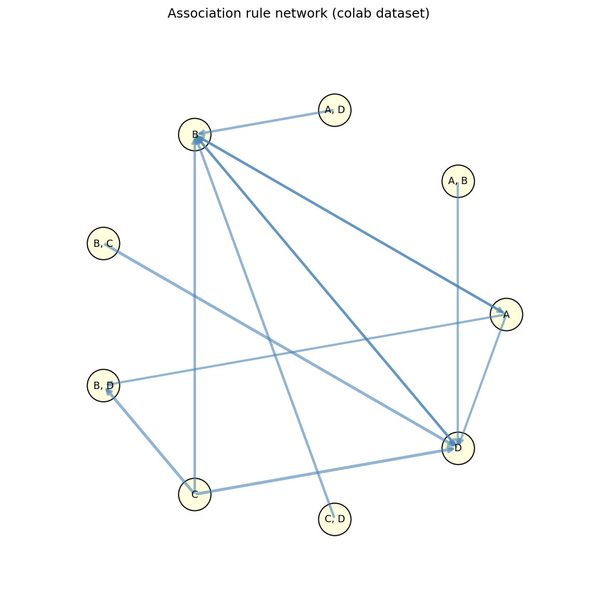
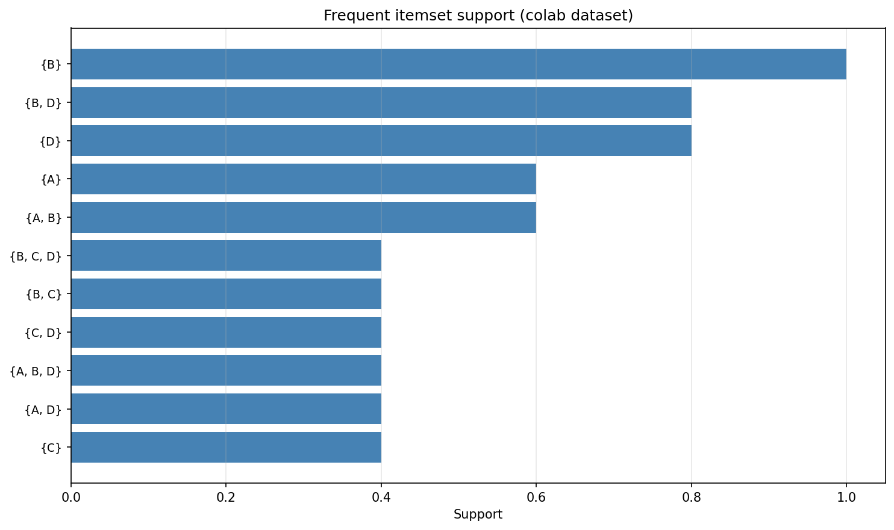
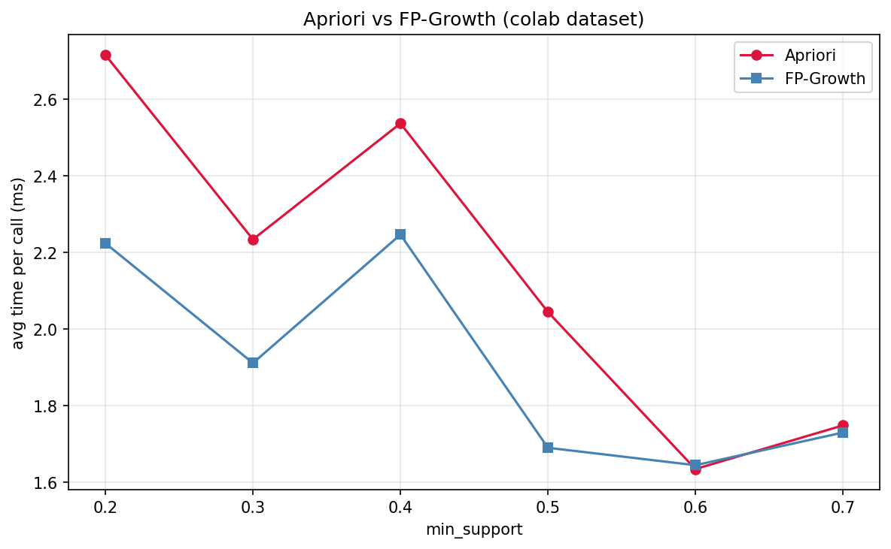
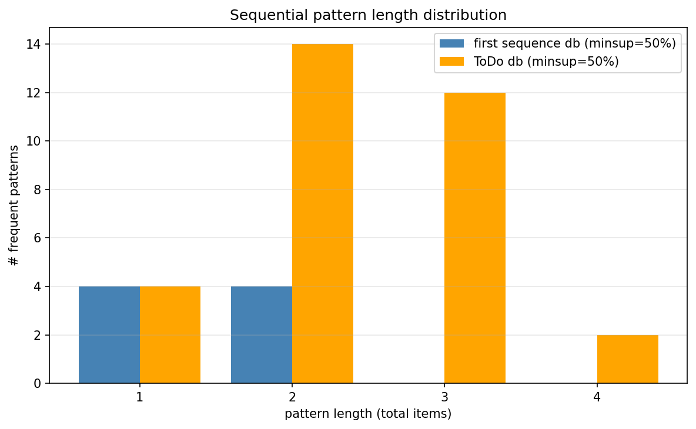

# Association Rules and Sequential Patterns

**Association rule mining** discovers relations between entities co-occurring in a *transaction database*. Given a multiset of transactions $T = \{t_1, t_2, \dots, t_m\}$ over an item universe $I = \{i_1, i_2, \dots, i_n\}$, the goal is to find rules of the form $X \rightarrow Y$ (with $X, Y \subseteq I$ and $X \cap Y = \emptyset$) that hold *frequently* and with high *confidence*.

```
Transactions                       Frequent Itemsets             Rules
 ┌─────────────────────┐            ┌──────────────┐         ┌──────────────────────────┐
 │ t1: {bread, milk}   │            │ {bread,milk} │         │ bread → milk             │
 │ t2: {bread, butter} │   ──►      │ {bread,…}    │  ──►    │ diapers → beer           │
 │ t3: {diapers, beer} │            │ {diapers,…}  │         │ {rule, tree} → datamining│
 │ …                   │            │ …            │         │ …                        │
 └─────────────────────┘            └──────────────┘         └──────────────────────────┘
```

The pattern *"85 % of shopping carts that contain bread also contain mineral water"* - `Bread → Mineral water` - is the canonical example. Association rules drive **market-basket analysis**, recommendation engines, web log mining, document analysis, intrusion detection, and bioinformatics (gene co-expression).

When the input has **temporal order** (clicks, purchases over time, system events), the same machinery generalises to **sequential pattern mining** - discovering ordered sub-sequences that appear in many event histories.

## 1. Frequent Itemsets and Association Rules

### 1.1 Items and Transactions

| Symbol | Meaning |
|---|---|
| $I = \{i_1, \dots, i_n\}$ | Universe of *items* (products, words, events) |
| $t \subseteq I$ | A *transaction* - a set of items |
| $T = \{t_1, \dots, t_m\}$ | The *transaction database* |
| $X \subseteq I$ | An *itemset* |
| $\mathrm{sup}(X)$ | *Support* of $X$ - count or fraction of transactions in $T$ containing $X$ |

An itemset is **frequent** when $\mathrm{sup}(X) \geq s$ for a user-chosen threshold $s$ (the *minimum support*).

**Worked example** - documents and keywords:

```
Doc1 = {rule, tree, classification}
Doc2 = {relation, tuple, join, algebra, recommendation}
Doc3 = {variable, loop, procedure, rule}
Doc4 = {clustering, rule, tree, recommendation}
Doc5 = {join, relation, selection, projection, classification}
Doc6 = {rule, tree, recommendation}
```

- $\mathrm{sup}(\{rule, tree\}) = 3 / 6 = 50\%$ → **frequent** at $s = 50\%$.
- $\mathrm{sup}(\{relation, join\}) = 2 / 6 = 33\%$ → **not frequent** at $s = 50\%$.

<p align="center"></p>
<p align="center"><em>Item × item co-occurrence heatmap — how often each pair of items appears together in the transactions.</em></p>

### 1.2 Association Rules

For two disjoint itemsets $X, Y \subseteq I$, an **association rule** is written $X \rightarrow Y$. We call $X$ the *antecedent* and $Y$ the *consequent*. Two key quality metrics:

$$
\mathrm{sup}(X \rightarrow Y) \;=\; \frac{\mathrm{count}(X \cup Y)}{m}
\qquad
\mathrm{conf}(X \rightarrow Y) \;=\; \frac{\mathrm{sup}(X \cup Y)}{\mathrm{sup}(X)}
$$

- **High support** - the rule covers many transactions; statistically reliable.
- **High confidence** - a transaction containing $X$ has a *high probability* of containing $Y$.

Continuing the example:

| Rule | Support | Confidence |
|---|---|---|
| `rule → tree` | $3/6 = 50\%$ | $3/4 = 75\%$ |
| `tree → rule` | $3/6 = 50\%$ | $3/3 = 100\%$ |

The two rules carry the **same support** but **different confidences** - confidence is *asymmetric*. Every transaction with `tree` also contains `rule`, but the reverse does not hold.

### 1.3 Beyond Support and Confidence - Lift, Conviction, Leverage

High confidence alone is misleading: `bread → milk` may have 90 % confidence simply because `milk` appears in 90 % of *every* transaction.

| Metric | Formula | Interpretation |
|---|---|---|
| **Lift** | $\dfrac{\mathrm{conf}(X \rightarrow Y)}{\mathrm{sup}(Y)}$ | $>1$ means $X$ and $Y$ co-occur more often than independence predicts. $=1$ means independent. |
| **Leverage** | $\mathrm{sup}(X \cup Y) - \mathrm{sup}(X)\mathrm{sup}(Y)$ | Same intuition as lift, but additive. |
| **Conviction** | $\dfrac{1 - \mathrm{sup}(Y)}{1 - \mathrm{conf}(X \rightarrow Y)}$ | $\infty$ when the rule never fails; $1$ for independence. |

A rule with `conf = 90 %, lift = 1.0` is uninformative; one with `conf = 50 %, lift = 5.0` is *much* more interesting.

<p align="center"></p>
<p align="center"><em>Every mined rule plotted by support × confidence, coloured by lift — the top-right, brightly-coloured rules are the strong ones.</em></p>

### 1.4 Goals for Mining Transactions

```
                   ┌──────────────────────────────┐
                   │   Mining transaction data    │
                   └──────────────────────────────┘
                             │
        ┌────────────────────┼─────────────────────┐
        ▼                    ▼                     ▼
 Find Frequent       Find Association       Find Causalities
   Itemsets               Rules
   ─────────────       ───────────────      ────────────────
 Place co-bought       Recommend Y to       Diapers → Beer
 products together     buyers of X          (causation, not
 in store flyers       Cross-sell           correlation)
```

**Three Wal-Mart anecdotes** (BI mythology, but still teaches the point):

- *"People who buy gin are likely to buy tonic water and lemons."*
- *"On Friday afternoons, young American males who buy diapers also buy beer."*
- Causal use: keep `diapers` cheap (attracts buyers) and `beer` priced for margin.

<p align="center"></p>
<p align="center"><em>The top-N rules as a graph: nodes are items, arrows point antecedent → consequent.</em></p>

### 1.5 Why Specialised Algorithms

A naive count over $2^{|I|}$ candidate itemsets is hopeless: with $n = 1\,000$ items, there are $\approx 10^{301}$ itemsets. **Apriori** and **FP-Growth** exploit structural properties of frequent itemsets to prune most of this space *before* counting.

## 2. Apriori

**Apriori** (Agrawal & Srikant, 1994) is the original frequent-itemset miner.

### 2.1 The Apriori Principle

> **Any subset of a frequent itemset is also frequent.**
> Equivalently: *if an itemset is infrequent, then every superset of it is also infrequent.*

Consequence: a $k$-itemset can only be frequent if **all** of its $k-1$-subsets are frequent. Each frequent $v$-itemset is the union of two frequent $(v-1)$-itemsets that share a $(v-2)$-prefix.

```
   Level 1:   {A}    {B}    {C}    {D}         all four singletons frequent
                          │
                          ▼   join pairs (i, j) with i < j

   Level 2:   {A,B}  {A,C}  {B,C}  {B,D}       {A,D} is below minsup  ⇒ PRUNED
                          │
                          ▼   join pairs sharing a 1-prefix, then check
                              that every 2-subset of the triple is frequent

   Level 3:   {A,B,C}    {B,C,D}               {A,B,D} and {A,C,D} would need
                                               the pruned {A,D}, so they are
                                               never even tried

   Level 4:   no candidate survives             ⇒ STOP
```

### 2.2 Algorithm (Level-Wise Search)

```
L1 ← scan(T) ; keep 1-itemsets with sup ≥ minsup
for (k = 2; L_{k-1} ≠ ∅; k++):
    Ck    ← apriori-gen(L_{k-1})            # join + prune
    for each transaction t ∈ T:
        for each candidate c ∈ Ck:
            if c ⊆ t: c.count++
    L_k   ← { c ∈ Ck | c.count ≥ minsup }
return ⋃_k L_k
```

A $k$-itemset miner makes **$k$ full passes** over the dataset - the main bottleneck for disk-resident data.

### 2.3 The Join Step

Generate $k$-candidates from pairs of $(k-1)$-itemsets sharing a $(k-2)$-prefix:

```
INSERT INTO C_k
SELECT  p.item1, p.item2, …, p.item_{k-1}, q.item_{k-1}
FROM    L_{k-1} p, L_{k-1} q
WHERE   p.item1     = q.item1,
        …,
        p.item_{k-2}= q.item_{k-2},
        p.item_{k-1}< q.item_{k-1};
```

### 2.4 The Prune Step

Any candidate $c \in C_k$ with a $(k-1)$-subset *not* in $L_{k-1}$ is killed before counting:

```
foreach c ∈ C_k:
    foreach (k-1)-subset s of c:
        if s ∉ L_{k-1}:
            remove c from C_k
```

### 2.5 Stopping Criteria

- $L_k$ is empty - no candidate at level $k$ met the support threshold.
- $C_{k+1}$ is empty - no $(k+1)$-itemset survives the join (a frequent $(k+1)$-itemset would need all its $k$-subsets in $L_k$, which is impossible if $L_k$ is small enough).

### 2.6 Worked Example

Transaction database with $|T| = 9$, **min support count = 2**:

| TID | Items |
|---|---|
| T1 | I1, I2, I5 |
| T2 | I2, I4 |
| T3 | I2, I3 |
| T4 | I1, I2, I4 |
| T5 | I1, I3 |
| T6 | I2, I3 |
| T7 | I1, I3 |
| T8 | I1, I2, I3, I5 |
| T9 | I1, I2, I3 |

**Step 1 - 1-itemsets:** $I_1\!:\!6, I_2\!:\!7, I_3\!:\!6, I_4\!:\!2, I_5\!:\!2$ - all survive.

**Step 2 - 2-itemsets:**

| Pair | Support | Pair | Support |
|---|---|---|---|
| `{I1,I2}` | 4 | `{I2,I3}` | 4 |
| `{I1,I3}` | 4 | `{I2,I4}` | 2 |
| `{I1,I4}` | 1 ❌ | `{I2,I5}` | 2 |
| `{I1,I5}` | 2 | `{I3,I4}` | 0 ❌ |
| `{I3,I5}` | 1 ❌ |  `{I4,I5}` | 0 ❌ |

**Step 3 - 3-itemsets** generated only from surviving 2-itemsets, then pruned by checking *every* 2-subset:

| Candidate | Pruned because… |
|---|---|
| `{I1,I2,I3}` | survives - count = 2 ✅ |
| `{I1,I2,I5}` | survives - count = 2 ✅ |
| `{I1,I2,I4}` | contains `{I1,I4}` (infrequent) |
| `{I1,I3,I5}` | contains `{I3,I5}` (infrequent) |

**Step 4 - 4-itemsets:** `{I1,I2,I3,I5}` would need `{I1,I3,I5}` ∈ $L_3$, which is not - STOP.

**Rule generation** from a single frequent itemset (e.g. `{I1, I2, I3}`, support 2, **min confidence = 50 %**):

| Rule | Confidence | Keep? |
|---|---|---|
| `{I1, I2} → I3` | $2 / 4 = 50\%$ | ✅ |
| `{I1, I3} → I2` | $2 / 4 = 50\%$ | ✅ |
| `{I2, I3} → I1` | $2 / 4 = 50\%$ | ✅ |
| `I1 → {I2, I3}` | $2 / 6 = 33\%$ | ❌ |
| `I2 → {I1, I3}` | $2 / 7 = 28\%$ | ❌ |
| `I3 → {I1, I2}` | $2 / 6 = 33\%$ | ❌ |

<p align="center"></p>
<p align="center"><em>Support of the frequent itemsets Apriori discovers — the bars are exactly the itemsets that clear the minimum-support threshold.</em></p>

### 2.7 Strengths and Weaknesses

| ✅ Pros | ❌ Cons |
|---|---|
| Simple, intuitive, easy to parallelise | Requires **$k$ full passes** over the data |
| Pruning kills most of the candidate space | Generates **many candidates** when long itemsets are frequent |
| Output ordered by itemset size - interpretable | Slow when $|I|$ is huge (e.g. web logs) |
| Many extensions (CARs, sequential, weighted) | Memory-heavy for candidate sets at deeper levels |

## 3. FP-Growth

**Frequent Pattern Growth** (Han, Pei & Yin, 2000) avoids candidate generation entirely. It compresses the database into a compact **FP-Tree** and mines patterns by recursive projection.

### 3.1 Why a Tree?

Apriori's bottleneck is the *candidate explosion*. FP-Growth's insight: many transactions share prefixes when items are sorted by frequency. A **trie** (prefix tree) stores them compactly, and the tree itself is enough to enumerate all frequent itemsets - **2 passes** over the data, period.

### 3.2 The Trie Data Structure

```
              root
             /    \
          A:8     B:2              ← children of root; format = item:count
         / | \      \
       B:5 C:1 D:1   C:1           ← shared prefixes share a node
       / \
     C:3 D:1
      |
     D:1
```

Each path from root to a node encodes a *prefix* common to one or more transactions. Counters track how many transactions follow that path.

### 3.3 Building the FP-Tree

**Pass 1** - count each item; discard infrequent ones; sort the rest by descending support (the **F-list**).

**Pass 2** - for each transaction:

1. Filter out infrequent items.
2. Sort remaining items by the F-list order.
3. Insert the sorted list into the tree; bump counters on shared prefixes.
4. Link nodes carrying the same item with a *side-link* (the **header table** indexes them).

**Example** - 10 transactions, **min support count = 2**:

```
TID   Items                Ordered-Item Set
T1    {A, B}               {A, B}
T2    {B, C, D}            {B, C, D}
T3    {A, C, D, E}         {A, C, D, E}
T4    {A, D, E}            {A, D, E}
T5    {A, B, C}            {A, B, C}
T6    {A, B, C, D}         {A, B, C, D}
T7    {A}                  {A}
T8    {A, B, C}            {A, B, C}
T9    {A, B, D}            {A, B, D}
T10   {B, C, E}            {B, C, E}
```

F-list (sorted): `A:8, B:7, C:6, D:5, E:3`. All items survive.

### 3.4 Mining: Conditional FP-Trees

For each item $\alpha$ in the F-list (bottom up):

1. Collect every path from root to an $\alpha$-node - this is $\alpha$'s **conditional pattern base**.
2. Build a **conditional FP-tree** from those paths, keeping only items that are frequent in this projection.
3. Recurse: mine the conditional tree the same way.

```
Conditional E FP-Tree    ← built from transactions {T3, T4, T10}
             root
            /    \
         A:2     B:1
        /   \      \
      C:1   D:1    C:1
             |
            D:1
                                  Result: {E}, {A,E}, {C,E}, {D,E}, {A,D,E}
```

After processing every item in the F-list, the final frequent itemset table is:

| Suffix item | Frequent itemsets discovered |
|---|---|
| **E** | `{E}, {D,E}, {A,D,E}, {C,E}, {A,E}` |
| **D** | `{D}, {C,D}, {B,C,D}, {A,C,D}, {B,D}, {A,B,D}, {A,D}` |
| **C** | `{C}, {B,C}, {A,B,C}, {A,C}` |
| **B** | `{B}, {A,B}` |
| **A** | `{A}` |

### 3.5 Apriori vs FP-Growth

| Aspect | **Apriori** | **FP-Growth** |
|---|---|---|
| Passes over data | $k$ (one per level) | **2** |
| Candidate generation | Yes (huge $C_k$) | **No** |
| Memory | Candidate sets | FP-Tree (compact in practice) |
| Worst case | Long frequent itemsets | Dense data → huge tree |
| Implementation | Simple | More involved |
| Typical real-world speed | Slow | **5–10× faster** |

<p align="center"></p>
<p align="center"><em>Apriori vs FP-Growth wall-clock on the same data — FP-Growth avoids repeated candidate generation and pulls ahead as the problem grows.</em></p>

## 4. Class Association Rules (CARs)

In **classification** every transaction carries a *class label* $c \in C$ (with $C \cap I = \emptyset$). A **Class Association Rule** restricts the consequent to a single class:

$$
X \rightarrow y, \quad X \subseteq I,\ y \in C
$$

### 4.1 Worked Example

```
TID   Transaction                                       Label
Doc1  {rule, tree, classification}                      datamining
Doc2  {relation, tuple, join, algebra, recommendation}  database
Doc3  {variable, loop, procedure, rule}                 programming
Doc4  {clustering, rule, tree, recommendation}          datamining
Doc5  {join, relation, selection, projection, …}        database
Doc6  {rule, tree, recommendation}                      datamining
```

- `rule → datamining` - $\mathrm{sup} = 3/6 = 50\%$, $\mathrm{conf} = 3/3 = 100\%$.
- `recommendation → database` - $\mathrm{sup} = 1/6 = 17\%$, $\mathrm{conf} = 1/3 = 33\%$.

### 4.2 Mining CARs (Modified Apriori)

Almost identical to Apriori; the only twist is in **candidate generation** - pairs are joined only when they predict the **same class**:

```
C_k ← ∅
foreach f1, f2 ∈ F_{k-1}:                  # each pair of CARs at level k-1
    f1 = {i1, …, i_{k-2}, i_{k-1}} → y
    f2 = {i1, …, i_{k-2}, i'_{k-1}} → y    # same class y on RHS
    i_{k-1} < i'_{k-1}:                    # only last item differs
        c = {i1, …, i_{k-1}, i'_{k-1}} → y
        C_k ← C_k ∪ {c}
        foreach (k-1)-subset s of {i1, …, i_{k-1}, i'_{k-1}}:
            if (s → y) ∉ F_{k-1}:
                remove c from C_k          # prune
```

### 4.3 Building a Classifier from CARs (CBA)

Algorithms like **CBA** (Classification Based on Associations) sort the surviving CARs by `(confidence, support, antecedent length)` and assemble them into a decision list. At prediction time, the first rule whose antecedent matches the test transaction wins; a default class catches everything else. CARs are a bridge between rule mining and interpretable classification.

## 5. Sequential Patterns

When the input is ordered - purchases over months, clicks within a session, log events - frequent **subsequences** (not subsets) are the right unit.

### 5.1 Model

| Symbol | Meaning |
|---|---|
| $I = \{i_1, \dots, i_n\}$ | Universe of items |
| **Event** $e$ | Non-empty itemset, e.g. `{A,B}` - bought together |
| **Sequence** $s = \langle e_1, e_2, \dots, e_m \rangle$ | Ordered list of events |
| **Length** of a sequence | Total number of items (with repetition across events) |
| Sequence database $X$ | Set of sequences |

$\langle \mathrm{AM, CDE, AE} \rangle$ has length **7** (2 + 3 + 2 items).

### 5.2 Subsequence Containment

$\langle a_1, a_2, \dots, a_p \rangle$ is contained in $\langle b_1, b_2, \dots, b_q \rangle$ when there exist indices $j_1 < j_2 < \dots < j_p$ with $a_i \subseteq b_{j_i}$ for every $i$.

- `<A, BC>` *is* a subsequence of `<AB, ABCD>`  (pick `j_1 = 1, j_2 = 2`).
- `<AB, C>` *is not* a subsequence of `<ABC>`  (one event in the candidate cannot match part of a single event in the host).

A **sequential pattern** is a sequence with $\mathrm{sup}(s) \geq \mathrm{minsup}$.

### 5.3 Worked Example

```
ID  Sequence
1   <A, B, C>
2   <AB, C, AD>
3   <ABC, BCE>
4   <AD, BC, AE>
5   <B, E>
```

At **min support = 50 %** (≥ 3 out of 5):

- 1-sequences: `<A>, <B>, <C>, <D>, <E>` - all appear in ≥ 3 sequences.
- 2-sequences: `<A, B>, <A, C>, <B, C>, <B, E>` - note `<A, B>` requires `A` *before* `B`; sequence 1 has it, 2 has it (`AB` then `C` - `A` and `B` are in the same event, so it counts), 3 has it.

### 5.4 Algorithms

| Algorithm | Idea |
|---|---|
| **GSP** | Generalised Sequential Pattern - Apriori on sequences |
| **FreeSpan** | Frequent-pattern-projected mining |
| **PrefixSpan** | Pattern-growth: project the database on each frequent prefix |
| **SPADE** | Vertical id-list representation; equivalence classes |

### 5.5 GSP - Apriori for Sequences

```
C1 = I
L1 = { <{f}> | f ∈ C1, f.count / n ≥ minsup }
for (k = 2; L_{k-1} ≠ ∅; k++):
    C_k = candidate-generation(L_{k-1})
    foreach s ∈ X:
        foreach c ∈ C_k:
            if c is-contained-in s: c.count++
    L_k = { c ∈ C_k | c.count / n ≥ minsup }
return ⋃_k L_k
```

**Candidate generation.** Two sequences $f_1, f_2 \in L_{k-1}$ are joined when $f_1$ with its first item removed equals $f_2$ with its last item removed. The joined sequence appends the last item of $f_2$ to $f_1$ - either as a **separate event** or as **part of the last event** of $f_1$, depending on the form of $f_2$.

Example - joining $L_3$ to build $C_4$:

```
L_3                          C_4 candidates
<AB, C>                      <AB, CD>          (extends last event)
<B, CD>                      <AB, C, E>        (extends as new event)
<B, C, E>
```

### 5.6 PrefixSpan - Pattern Growth

PrefixSpan recursively projects the database on each frequent prefix instead of generating candidates:

```
prefix-span(prefix α, projected DB D_α):
    scan D_α, find every item b such that <α, b> or <α∪{b}> is frequent
    foreach such b:
        emit the extended pattern β
        build D_β = projected DB on β
        recurse: prefix-span(β, D_β)
```

The recursion explores the same lattice as GSP but **never builds candidate sets**, so it is dramatically faster on real workloads.

<p align="center"></p>
<p align="center"><em>Distribution of the lengths of the sequential patterns mined by PrefixSpan.</em></p>

## 6. Choosing the Right Algorithm

```
Small data, want to "see how it works"?      → Apriori (clearest semantics)
Dense, repetitive data, many long itemsets?  → FP-Growth (no candidate blow-up)
Need rules per class label?                  → CARs (classification by association)
Event order matters (clicks, purchases)?     → GSP or PrefixSpan
Massive data on a cluster?                   → Spark FP-Growth / PrefixSpan
```

A practical pipeline:

1. **Pre-process** - clean items, normalise text, bucket numeric attributes.
2. **Discover frequent itemsets** with Apriori or FP-Growth.
3. **Generate rules** at a chosen `min_confidence`, then rank by **lift** or **conviction**.
4. **Interpret** - read the top rules, decide which to act on.
5. **Validate** - split transactions chronologically, check that rules learned on the past still hold on more recent data.

## Tutorial

The companion script `association_rules.py` walks through the algorithms above on the same datasets used in this README. Run all labs:

```bash
python association_rules.py
```

Or a specific one:

```bash
python association_rules.py --lab 1   # Items, transactions, support, confidence
python association_rules.py --lab 2   # Apriori - mlxtend
python association_rules.py --lab 3   # FP-Growth - mlxtend
python association_rules.py --lab 4   # Class Association Rules (CARs)
python association_rules.py --lab 5   # Sequential Patterns + visualisations
```

### Pipeline

1. **Lab 1** - define small transaction databases (`Doc1…Doc6`, T1…T9), compute support / confidence / lift / conviction by hand and by formula.
2. **Lab 2** - Apriori with `mlxtend.frequent_patterns.apriori`. Reproduce the T1…T9 walk-through and the `[A,B], [A,B,D], [B,D], [B,C,D,E], [A,B,C,D]` ToDo example.
3. **Lab 3** - FP-Growth with `mlxtend.frequent_patterns.fpgrowth`. Compare to Apriori on the 10-transaction dataset; cross-check that both algorithms produce identical itemsets.
4. **Lab 4** - modify the Apriori miner to enforce a single class label on the right-hand side; build a CBA-style classifier on the labelled documents.
5. **Lab 5** - sequential patterns via a built-in GSP miner and `prefixspan` (PrefixSpan). Mine the two sequence databases; produce a suite of comparison plots:
   - Frequent itemset support bar chart
   - Top-N association rules table
   - Support–confidence and support–lift scatter plots
   - Rule-network diagram
   - Item co-occurrence heatmap
   - Apriori vs FP-Growth runtime comparison
   - Sequential-pattern length distribution

All plots are saved to `./outputs/association_rules/`.

### Installation

```bash
# Create a virtual environment
python -m venv arsp-course
source arsp-course/bin/activate   # Windows: arsp-course\Scripts\activate

# Install dependencies
pip install -r requirements.txt
```

### Outputs

All plots are written to `outputs/association_rules/` (and are shown inline in
the sections above): `itemset_support.png`, `rules_scatter.png`,
`rules_network.png`, `item_cooccurrence.png`, `algo_runtime.png`,
`sequence_lengths.png`.
