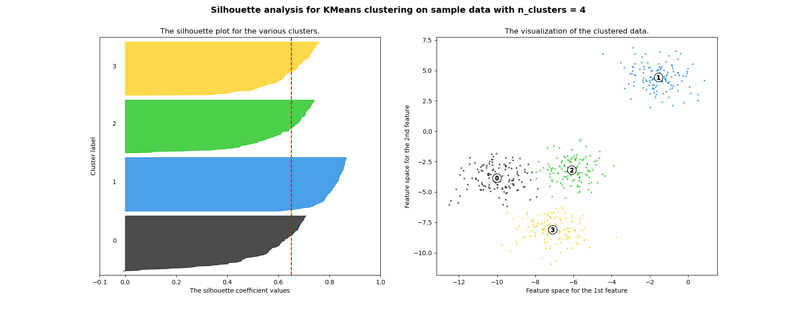
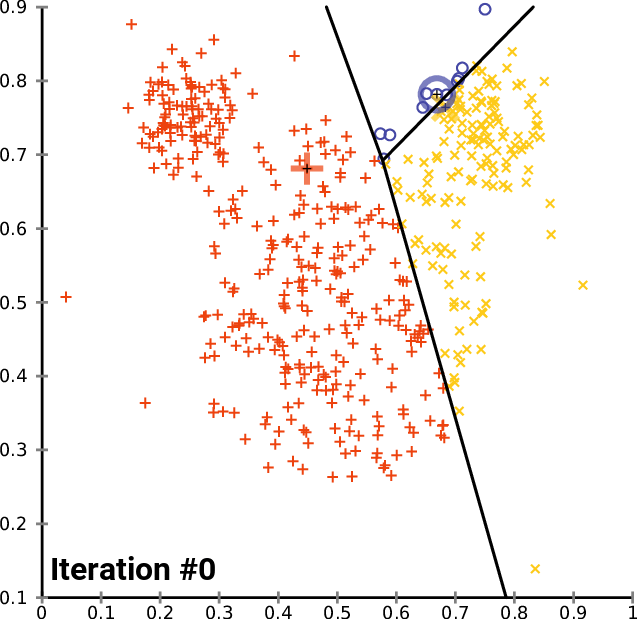
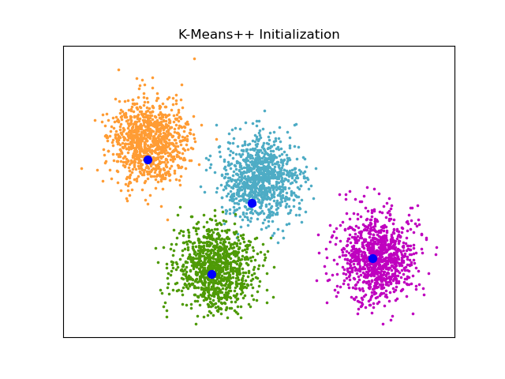
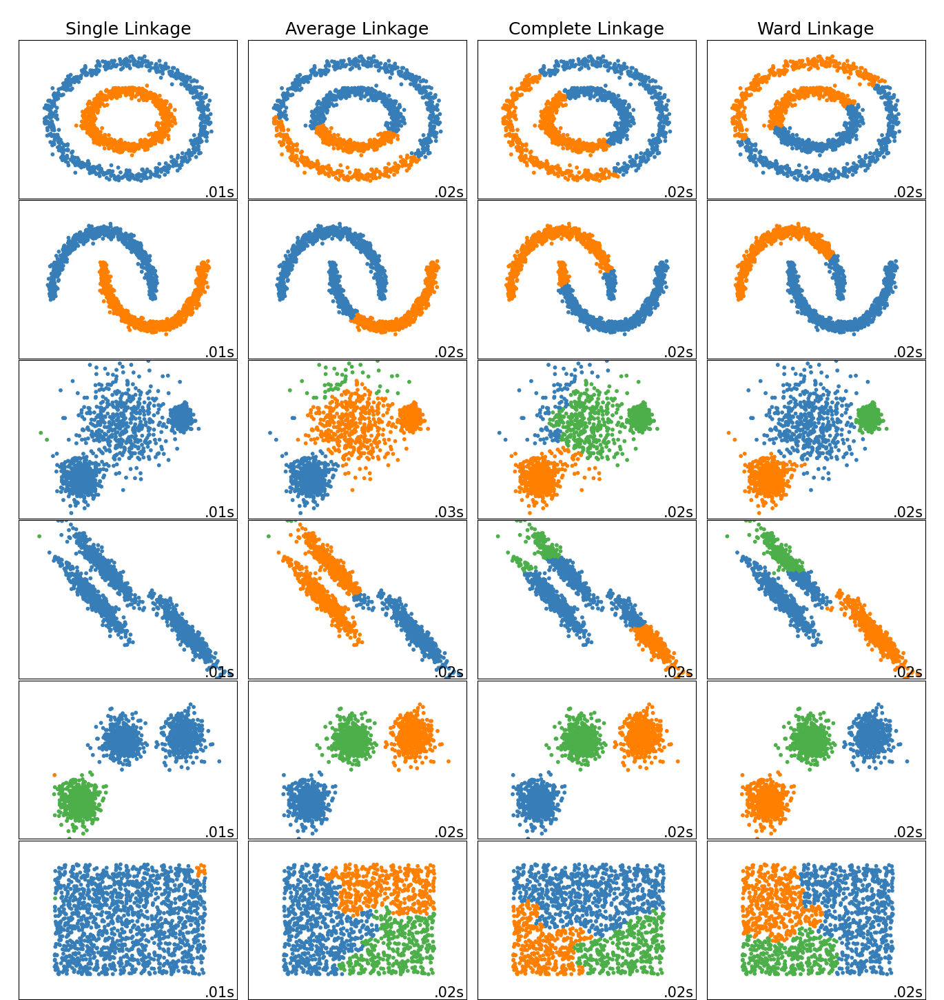
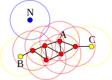
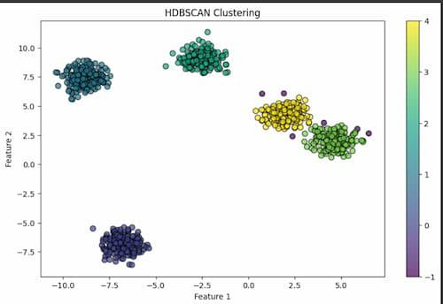
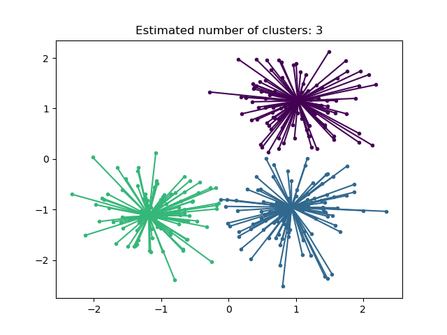

# Unsupervised Learning: Clustering

Clustering is a family of unsupervised learning methods whose goal is to partition a dataset into groups — **clusters** — such that points within the same group are more similar to one another than to points in other groups. Unlike supervised learning, no labels are provided during training; the algorithm must discover structure purely from the geometry of the data.

Clustering is used in customer segmentation, anomaly detection, image compression, document organization, bioinformatics, and as a preprocessing step for downstream supervised models.

---

## Types of Clustering Algorithms

Different algorithms define "similarity" and "cluster" in fundamentally different ways:

| Paradigm | Algorithms | Key idea |
|---|---|---|
| **Centroid-based** | k-Means, k-Means++ | Clusters represented by a central point; minimize intra-cluster variance |
| **Hierarchical** | Agglomerative, Divisive | Build a tree of nested partitions by successively merging or splitting |
| **Density-based** | DBSCAN, HDBSCAN | Clusters are dense regions separated by low-density areas; noise is explicit |
| **Summarization-based** | BIRCH | Compress data into a tree of cluster features, then cluster summaries |
| **Message-passing** | Affinity Propagation | Points vote for exemplars via iterative message exchange |

---

## Evaluation Metrics

Because ground truth labels are typically unavailable, clustering evaluation relies on **internal metrics** that measure cluster quality from the data geometry alone. When labels happen to be available (e.g., for benchmarking), **external metrics** measure agreement with the true partition.

### Internal Metrics

#### Silhouette Score

For each sample $i$, let:
- $a(i)$ = mean intra-cluster distance (average distance to all other points in the same cluster)
- $b(i)$ = mean nearest-cluster distance (average distance to all points in the closest foreign cluster)

The per-sample silhouette coefficient is:

$$
s(i) = \frac{b(i) - a(i)}{\max\{a(i),\, b(i)\}}
$$

Values range from $-1$ to $+1$. A score close to $+1$ means the sample is well inside its own cluster and far from neighboring clusters. A score near $0$ means it lies on a cluster boundary. A negative score means the sample would be better assigned to a neighboring cluster.

The **dataset-level silhouette score** is the mean over all samples:

$$
\text{Silhouette} = \frac{1}{n} \sum_{i=1}^{n} s(i)
$$

**Interpretation:** higher is better. Typically $> 0.5$ indicates a reasonable structure; $> 0.7$ is strong.

<p align="center">
<br>
<em>Source: <a href="https://scikit-learn.org/stable/auto_examples/cluster/plot_kmeans_silhouette_analysis.html">Selecting the number of clusters with silhouette analysis on KMeans clustering — scikit-learn</a></em>
</p>

---

#### Davies-Bouldin Index

For each cluster $C_k$, define its scatter (average distance from the centroid):

$$
s_k = \frac{1}{|C_k|} \sum_{x \in C_k} \|x - \mu_k\|
$$

The Davies-Bouldin index for clusters $i$ and $j$ measures how similar the clusters are to each other (higher scatter relative to their separation):

$$
R_{ij} = \frac{s_i + s_j}{\|\mu_i - \mu_j\|}
$$

The index is the mean of the worst-case similarity for each cluster:

$$
\text{DB} = \frac{1}{K} \sum_{k=1}^{K} \max_{j \neq k} R_{kj}
$$

**Interpretation:** lower is better. A value of $0$ is the theoretical minimum (perfectly separated clusters).

---

#### Calinski-Harabasz Index

Also called the **Variance Ratio Criterion**, it is the ratio of between-cluster dispersion to within-cluster dispersion:

$$
\text{CH} = \frac{\text{tr}(B_K)}{\text{tr}(W_K)} \cdot \frac{n - K}{K - 1}
$$

where:
- $B_K$ is the between-cluster scatter matrix: $B_K = \sum_{k=1}^{K} n_k (\mu_k - \mu)(\mu_k - \mu)^\top$
- $W_K$ is the within-cluster scatter matrix: $W_K = \sum_{k=1}^{K} \sum_{x \in C_k}(x - \mu_k)(x - \mu_k)^\top$
- $\mu$ is the overall mean, $n_k = |C_k|$

**Interpretation:** higher is better. Compact, well-separated clusters produce large values.

---

### External Metrics (when ground truth is available)

#### Adjusted Rand Index

The **Rand Index** counts the fraction of pairs of samples that are either in the same cluster in both the predicted and true partition, or in different clusters in both:

$$
\text{RI} = \frac{a + b}{\binom{n}{2}}
$$

where $a$ = number of pairs agreeing as "same cluster" and $b$ = pairs agreeing as "different clusters."

The **Adjusted Rand Index (ARI)** corrects for chance:

$$
\text{ARI} = \frac{\text{RI} - \mathbb{E}[\text{RI}]}{\max(\text{RI}) - \mathbb{E}[\text{RI}]}
$$

Values range from $-1$ to $+1$. A value of $1$ means perfect agreement with ground truth; $0$ means random labeling.

---

## k-Means and k-Means++

### k-Means Algorithm (Lloyd's Algorithm)

k-Means seeks a partition $\{C_1, \dots, C_K\}$ of $n$ points that minimizes the **within-cluster sum of squares (WCSS)**, also called *inertia*:

$$
\mathcal{L} = \sum_{k=1}^{K} \sum_{x \in C_k} \|x - \mu_k\|^2
$$

where $\mu_k = \frac{1}{|C_k|}\sum_{x \in C_k} x$ is the centroid of cluster $k$.

**Lloyd's algorithm** iterates two steps until convergence:

1. **Assignment step:** assign each point to the nearest centroid:

$$
c(i) = \arg\min_{k} \|x_i - \mu_k\|^2
$$

2. **Update step:** recompute centroids as the mean of assigned points:

$$
\mu_k \leftarrow \frac{1}{|C_k|}\sum_{i: c(i)=k} x_i
$$

The algorithm is guaranteed to converge (inertia decreases monotonically) but may reach a local, not global, minimum. It is sensitive to initialization.

<p align="center">
<br>
<em>Source: <a href="https://en.wikipedia.org/wiki/K-means_clustering">k-means clustering — Wikipedia</a> (CC BY-SA 3.0)</em>
</p>

**Time complexity:** $O(n K d T)$ where $T$ is the number of iterations and $d$ is the number of features.

### k-Means++ Initialization

Poor initialization (e.g., two initial centroids in the same cluster) causes slow convergence and poor solutions. **k-Means++** selects initial centroids with a probability proportional to the squared distance to the nearest already-chosen centroid — a scheme called $D^2$ sampling:

1. Choose the first centroid $\mu_1$ uniformly at random from the data.
2. For each subsequent centroid $\mu_k$ ($k = 2, \dots, K$):

$$
P(x_i \text{ is chosen}) = \frac{D(x_i)^2}{\sum_{j=1}^{n} D(x_j)^2}
$$

where $D(x_i) = \min_{j < k} \|x_i - \mu_j\|$ is the distance to the nearest already-selected centroid.

This ensures initial centroids are spread across the data. k-Means++ provides an expected approximation ratio of $O(\log K)$ relative to the optimal solution, and in practice converges faster and to better minima than random initialization.

<p align="center">
<br>
<em>Source: <a href="https://scikit-learn.org/stable/auto_examples/cluster/plot_kmeans_plusplus.html">An example of K-Means++ initialization — scikit-learn</a></em>
</p>

---

## Hierarchical Clustering

Hierarchical clustering builds a **dendrogram** — a binary tree encoding a sequence of nested partitions. The leaves are individual samples; the root is a single cluster containing all samples. The tree can be cut at any height to produce a flat clustering.

### Agglomerative (Bottom-Up) Algorithm

Starting from $n$ singleton clusters, successively merge the two most similar clusters until one cluster remains:

```
Initialization: each sample is its own cluster
Repeat until one cluster:
    Find the pair (Ci, Cj) with minimum merge cost d(Ci, Cj)
    Merge Ci and Cj into a new cluster
    Update the distance matrix
```

Naive implementation is $O(n^3)$ in time and $O(n^2)$ in space; efficient implementations achieve $O(n^2 \log n)$.

<p align="center">
<br>
<em>Source: <a href="https://scikit-learn.org/stable/auto_examples/cluster/plot_agglomerative_dendrogram.html">Plot Hierarchical Clustering Dendrogram — scikit-learn</a></em>
</p>

### Linkage Criteria

The merge cost $d(C_i, C_j)$ between two clusters depends on the **linkage criterion**:

| Linkage | Formula | Behavior |
|---|---|---|
| **Single** | $\min_{x \in C_i, y \in C_j} \|x - y\|$ | Chaining effect; finds elongated clusters |
| **Complete** | $\max_{x \in C_i, y \in C_j} \|x - y\|$ | Compact, roughly equal-sized clusters |
| **Average** | $\frac{1}{\vert C_i \vert \vert C_j \vert} \sum_{x \in C_i, y \in C_j} \|x - y\|$ | Compromise between single and complete |
| **Ward** | $\Delta \mathcal{L} = \frac{\vert C_i \vert \vert C_j \vert}{\vert C_i \vert + \vert C_j \vert} \|\mu_i - \mu_j\|^2$ | Minimizes increase in total WCSS; tends to produce equal-sized, spherical clusters |

Ward linkage is analogous to k-Means in that it minimizes variance and typically produces the most visually interpretable dendrograms.

<p align="center">
<br>
<em>Source: <a href="https://scikit-learn.org/stable/auto_examples/cluster/plot_agglomerative_clustering_metrics.html">Agglomerative clustering with and without structure — scikit-learn</a></em>
</p>

---

## BIRCH (Balanced Iterative Reducing and Clustering using Hierarchies)

BIRCH is designed for **very large datasets** where loading all points into memory for pairwise distance computation is infeasible. It achieves a single-pass (or few-pass) compression of the data into a compact summary structure called a **CF-tree**, then applies a conventional clustering algorithm to the summaries.

### Clustering Feature (CF)

A **Clustering Feature** is a compact triple that summarizes a set of $N$ points $\{x_1, \dots, x_N\}$:

$$
\text{CF} = (N, \text{LS}, \text{SS})
$$

where:
- $N$ = number of data points
- $\text{LS} = \sum_{i=1}^{N} x_i$ = linear sum
- $\text{SS} = \sum_{i=1}^{N} \|x_i\|^2$ = squared sum

CFs are **additive**: if two clusters have features $\text{CF}_1$ and $\text{CF}_2$, their merged feature is $\text{CF}_1 + \text{CF}_2 = (N_1+N_2, \text{LS}_1+\text{LS}_2, \text{SS}_1+\text{SS}_2)$. This enables efficient incremental updates.

From a CF triple, useful statistics can be recovered:
- Centroid: $\mu = \text{LS} / N$
- Cluster radius (RMS distance to centroid): $R = \sqrt{(\text{SS}/N) - \|\mu\|^2}$

### CF-Tree

A B+-tree-like structure with two user parameters:
- **Branching factor** $B$: maximum number of CF entries per non-leaf node
- **Threshold** $T$: maximum radius a leaf entry's subcluster may have

When inserting a new point, BIRCH traverses the tree to the closest leaf and tries to absorb the point. If the radius would exceed $T$, a new entry is created; if the leaf is full, it is split. Non-leaf CF entries are updated accordingly. This ensures the tree height stays $O(\log n)$ and the memory footprint remains bounded.

After building the CF-tree, an optional second pass applies agglomerative or k-Means clustering to the leaf entries to produce the final clusters.

---

## DBSCAN (Density-Based Spatial Clustering of Applications with Noise)

DBSCAN defines clusters as **dense regions** of points separated by sparse regions. It is parameterized by:
- $\varepsilon$ (`eps`): neighborhood radius
- $m$ (`min_samples`): minimum points required to form a dense region

### Point Classification

For each point $x_i$, define its $\varepsilon$-neighborhood:

$$
N_\varepsilon(x_i) = \{x_j \mid \|x_i - x_j\| \leq \varepsilon\}
$$

Points are classified as:
- **Core point:** $|N_\varepsilon(x_i)| \geq m$ (at least $m$ neighbors including itself)
- **Border point:** not a core point, but lies within the $\varepsilon$-neighborhood of a core point
- **Noise point:** neither core nor border

### Density Reachability and Connectivity

A point $x_j$ is **directly density-reachable** from $x_i$ if $x_j \in N_\varepsilon(x_i)$ and $x_i$ is a core point.

A point $x_j$ is **density-reachable** from $x_i$ if there exists a chain of points $x_i = p_1, p_2, \dots, p_k = x_j$ where each $p_{l+1}$ is directly density-reachable from $p_l$.

Two points are **density-connected** if there exists a core point $o$ from which both are density-reachable.

A **cluster** is a maximal set of mutually density-connected points.

<p align="center">
<br>
<em>Source: <a href="https://en.wikipedia.org/wiki/DBSCAN">DBSCAN — Wikipedia</a> (CC BY-SA 3.0)</em>
</p>

**Key properties:**
- Discovers clusters of **arbitrary shape**
- Explicitly identifies **noise** (labeled $-1$)
- Does not require specifying the number of clusters $K$
- Sensitive to choice of $\varepsilon$ and $m$; struggles with varying-density clusters

**Time complexity:** $O(n \log n)$ with spatial indexing; $O(n^2)$ without.

---

## HDBSCAN (Hierarchical DBSCAN)

HDBSCAN eliminates DBSCAN's sensitivity to a global density threshold by building a hierarchy of density levels and extracting stable clusters from that hierarchy.

<p align="center">
<br>
<em>Source: <a href="https://www.geeksforgeeks.org/machine-learning/hdbscan/">Hierarchical Density-Based Spatial Clustering of Applications with Noise (HDBSCAN) — GeeksForGeeks</a></em>
</p>

### Mutual Reachability Distance

Given a minimum cluster size parameter $m_{\text{pts}}$, define the **core distance** of a point $x_i$ as the distance to its $m_{\text{pts}}$-th nearest neighbor:

$$
d_{\text{core}}(x_i) = d(x_i,\, x_i^{(m_{\text{pts}})})
$$

The **mutual reachability distance** between $x_i$ and $x_j$ is:

$$
d_{\text{mreach}}(x_i, x_j) = \max\!\big(d_{\text{core}}(x_i),\, d_{\text{core}}(x_j),\, d(x_i, x_j)\big)
$$

This smooths the distance metric in sparse regions by treating all low-density points as though they are at least $d_{\text{core}}$ apart from each other, reducing noise sensitivity.

### Building the Cluster Hierarchy

1. Construct the **minimum spanning tree (MST)** of the complete graph weighted by mutual reachability distances.
2. Convert the MST into a **cluster hierarchy** by removing edges in decreasing weight order. Each removal splits a cluster; this produces a full dendrogram.
3. Condense the dendrogram by removing clusters smaller than `min_cluster_size` (such splits produce singletons that are absorbed into the parent as noise).

### Cluster Stability and Extraction

For each cluster $C$ born at level $\lambda_{\text{birth}} = 1/d_{\text{birth}}$ and dying at $\lambda_{\text{death}} = 1/d_{\text{death}}$, define its **stability** as:

$$
\text{stability}(C) = \sum_{x_i \in C} (\lambda_{\text{death}}(x_i) - \lambda_{\text{birth}}(C))
$$

where $\lambda_{\text{death}}(x_i)$ is the level at which point $x_i$ falls out of the cluster (either through a split or noise ejection).

HDBSCAN selects the flat clustering that maximizes total stability, using a bottom-up greedy procedure over the condensed tree. This produces a variable number of clusters without requiring a global density threshold.

---

## Affinity Propagation

Affinity Propagation clusters by having points simultaneously compete to become **exemplars** — representative points that other points can "belong to." It passes two types of messages between all pairs of points until convergence.

### Input: Similarity Matrix

Define $s(i, k)$ as the similarity of point $i$ to candidate exemplar $k$ (typically the negative squared Euclidean distance: $s(i,k) = -\|x_i - x_k\|^2$). The diagonal $s(k,k)$ is a tunable preference: higher values encourage more exemplars (more clusters).

### Message Passing

Two matrices of messages are updated iteratively:

**Responsibility** $r(i, k)$: how well-suited point $k$ is to serve as the exemplar for point $i$, relative to all other candidate exemplars:

$$
r(i, k) \leftarrow s(i, k) - \max_{k' \neq k} \big[ a(i, k') + s(i, k') \big]
$$

**Availability** $a(i, k)$: how appropriate it would be for point $i$ to choose $k$ as its exemplar, given the support $k$ has already received from other points:

$$
a(i, k) \leftarrow \min\!\left(0,\, r(k,k) + \sum_{i' \notin \{i,k\}} \max(0, r(i', k))\right), \quad i \neq k
$$

$$
a(k, k) \leftarrow \sum_{i' \neq k} \max(0, r(i', k))
$$

To avoid oscillations, messages are damped by a factor $\lambda \in (0.5, 1)$:

$$
r_t \leftarrow (1 - \lambda)\, r_{t-1} + \lambda\, r_{t}
$$

(and similarly for $a$).

### Exemplar Selection and Convergence

At each iteration, a point $k$ is declared an exemplar if $a(k,k) + r(k,k) > 0$. Each non-exemplar point $i$ is assigned to the exemplar $k$ that maximizes $a(i,k) + r(i,k)$.

Convergence is detected when the exemplar assignments remain stable for a set number of consecutive iterations.

<p align="center">
<br>
<em>Source: <a href="https://scikit-learn.org/stable/auto_examples/cluster/plot_affinity_propagation.html">Demo of affinity propagation clustering algorithm — scikit-learn</a></em>
</p>

**Key properties:**
- Does not require specifying $K$ (controlled by preference diagonal)
- Time complexity $O(n^2 T)$; can be slow for large $n$
- Produces real exemplar points (not synthetic centroids)

---

## Tutorial

The companion script `clustering.py` demonstrates the full pipeline on the **Wine dataset** (UCI Machine Learning Repository, available in scikit-learn). The dataset contains 178 samples of Italian wines from 3 cultivars, described by 13 chemical features. It provides a natural 3-cluster structure that is well-separated but not trivially separable — a good benchmark.

### Pipeline

1. **Load and preprocess:** standardize all features to zero mean and unit variance.
2. **Run all algorithms:** k-Means++, Agglomerative (Ward and Complete linkage), BIRCH, DBSCAN, HDBSCAN, Affinity Propagation.
3. **Evaluate:** compute Silhouette, Davies-Bouldin, Calinski-Harabasz, and ARI (using the true cultivar labels as reference).
4. **Visualize:**
   - Scatter plots of each algorithm's clustering in PCA-reduced 2D space
   - Bar charts comparing all metrics side by side
   - Silhouette coefficient plots per algorithm
   - Truncated dendrogram (Ward linkage)

All plots are saved to `./outputs/clustering/`.

### Running

```bash
python clustering.py
```

---

## Dockerfile

```
FROM ubuntu:24.04

RUN apt-get update && \
    apt-get install -y \
    python3-pip \
    python3-venv \
    && apt-get clean

RUN python3 -m venv /opt/venv
ENV PATH="/opt/venv/bin:$PATH"

COPY requirements.txt /tmp/
RUN pip install --upgrade pip wheel
RUN pip install -r /tmp/requirements.txt
```

## Requirements

```
scikit-learn>=1.3.0
numpy>=1.24.0
matplotlib>=3.7.0
seaborn>=0.12.0
scipy>=1.10.0
```
