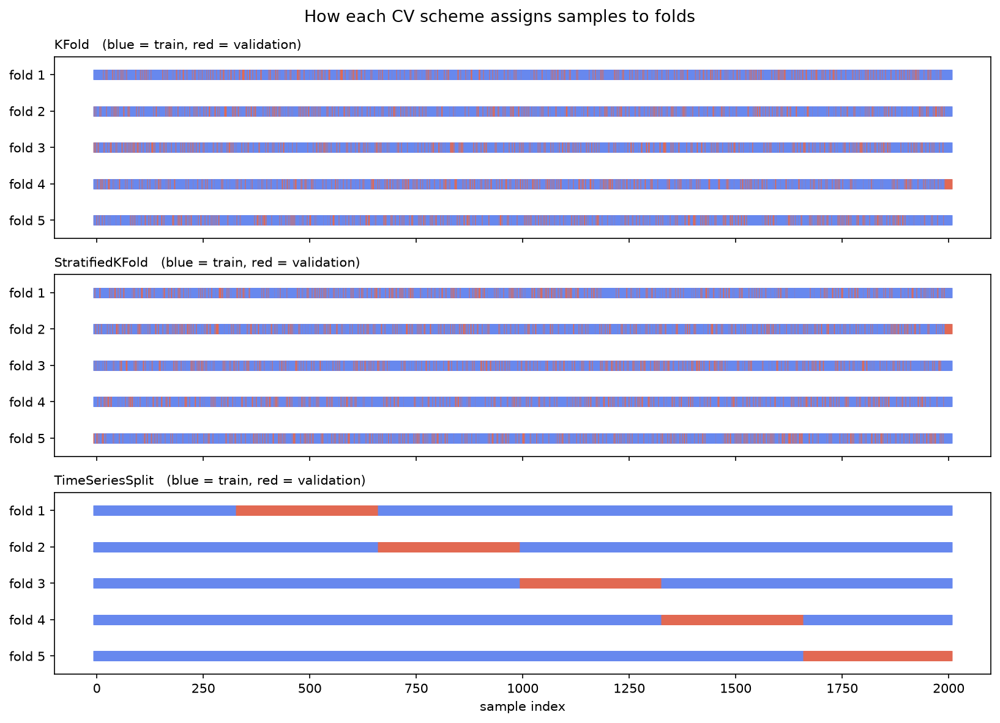
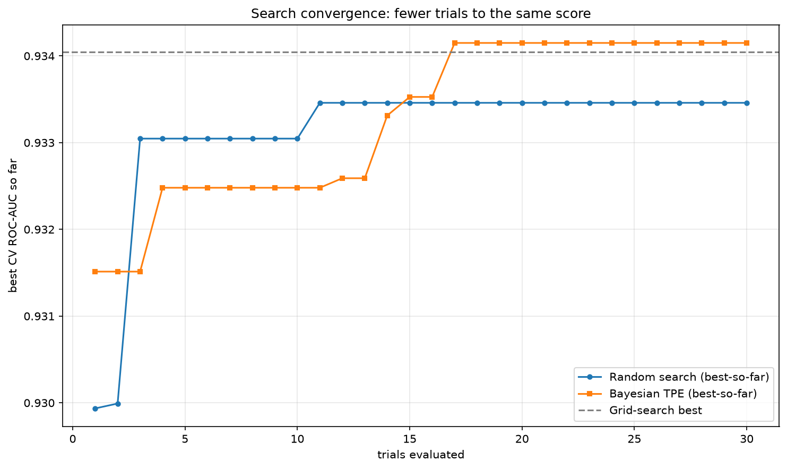
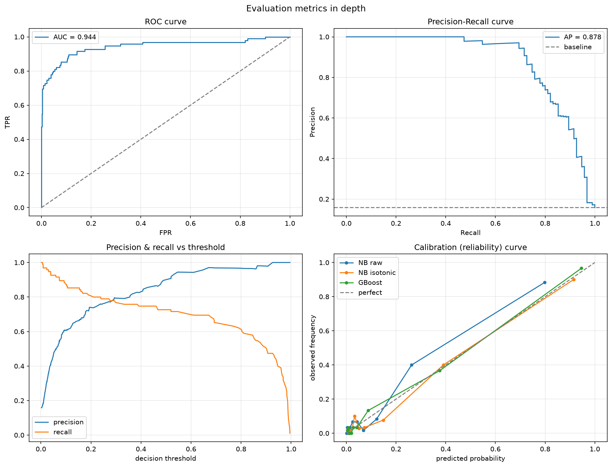
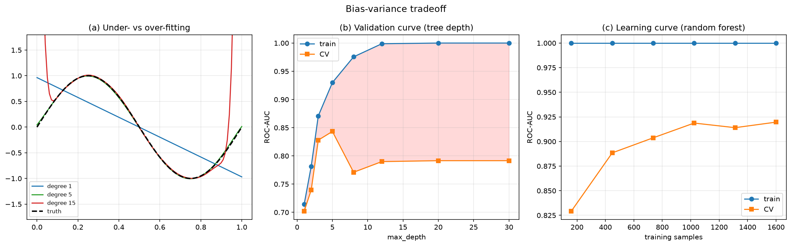
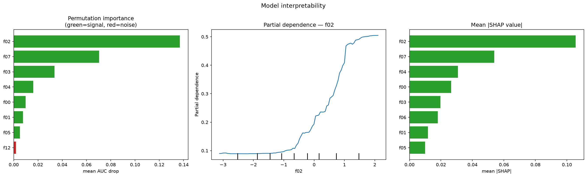
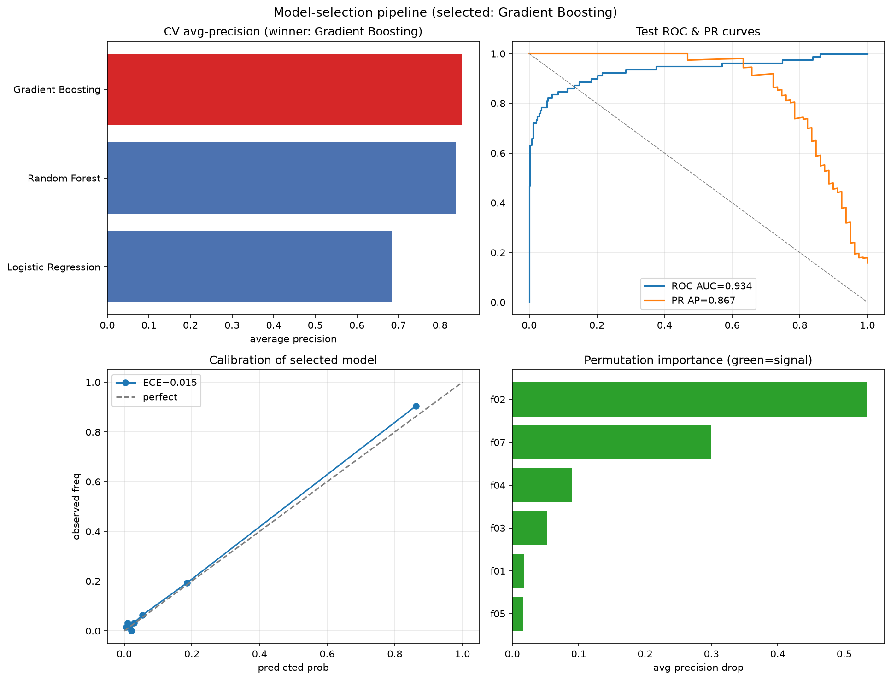

# Model Selection, Evaluation, and Deployment Readiness

Training a model is the easy part. The hard part — the part that decides whether
a model helps or quietly harms — is everything around it: **estimating how well
it will generalize, tuning it fairly, measuring it with the right metric,
understanding *why* it predicts what it does, and confirming it is fit to
deploy.** This tutorial covers that whole loop.

```
Candidate models → [ Cross-validation ] → [ Tuning ] → [ Evaluation ] → [ Interpretation ] → [ Deploy? ]
   LR / RF / GB       honest estimate       best hparams   right metric      why it decides     ready checks
```

Everything runs on one controlled problem: a `make_classification` dataset of
2000 samples and 20 features, imbalanced (~15% positive), where the **first 8
features are known to carry signal** and the rest are pure noise. Because we
know the ground truth, the interpretability lab is *verifiable* — we can check
whether each method actually recovers the real drivers.

## 1. Cross-Validation Strategies

To know if a model is any good you test it on data it didn't train on. If you
split your data just once into a training part and a test part, your score
depends on *which* rows happened to land in the test set — one split is one
noisy number. **Cross-validation (CV)** fixes this: it slices the data into *k*
equal parts ("folds"), trains *k* times each holding out a different fold as the
test set, and averages the *k* scores. You get a stable estimate plus a sense of
how much it wobbles (the ± spread) — like averaging five quizzes instead of
betting everything on one exam.

```
5-fold CV — each row is one training run; the held-out fold rotates:

  run 1:  [ TEST ][        train        ]
  run 2:  [train][ TEST ][    train      ]
  run 3:  [   train  ][ TEST ][  train   ]   →   average score ± spread
  run 4:  [     train      ][ TEST ][train]
  run 5:  [        train        ][ TEST ]
```

This only works if each fold is a fair miniature of the whole dataset, which is
where the *strategy* matters:

| Scheme | Use when | Pitfall it avoids |
|--------|----------|-------------------|
| **KFold** | plain independent rows, balanced classes | — |
| **StratifiedKFold** | classification, esp. imbalanced (**default**) | a fold with too few positives |
| **TimeSeriesSplit** | temporal / sequential data | training on the future (leakage) |
| **GroupKFold** | repeated subjects (patients, users) | the same entity in train *and* test |
| **LeaveOneOut** | tiny datasets | wasting data (but high variance, costly) |

The single most common CV mistake is **leakage**: shuffling time-ordered data,
or fitting a scaler/imputer on the full dataset before splitting. Fit every
preprocessing step *inside* the CV loop, on the training fold only — a
`Pipeline` does this for you.

<p align="center"></p>
<p align="center"><em>How KFold, StratifiedKFold and TimeSeriesSplit each assign samples to folds (blue = train, red = validation).</em></p>

## 2. Hyperparameter Tuning

Two kinds of numbers control a model. **Parameters** are what the model *learns*
from the data during training — the weights of a linear model, the split points
of a tree. **Hyperparameters** are the settings *you* choose *before* training
that shape how learning happens: how deep a tree may grow, the learning rate,
how much regularization (a penalty that discourages over-complex models). Tuning
means searching for the hyperparameter values that give the best
cross-validation score.

| Strategy | How it works | Cost | When |
|----------|--------------|------|------|
| **Grid search** | Try every combination in a discrete grid | Explodes multiplicatively | Few hyperparameters, small ranges |
| **Random search** | Sample `n_iter` random configs | You set the budget | Strong default — usually matches grid for less |
| **Bayesian (TPE / GP)** | Model score-vs-hparams, probe where improvement is likely | Sample-efficient | Expensive models, larger spaces |

> **Why random beats grid so often:** in most problems only a couple of
> hyperparameters actually matter. A grid wastes its budget varying the
> irrelevant ones in lockstep; random search explores the important axes more
> densely for the same number of fits (Bergstra & Bengio, 2012).

**Bayesian optimization** (this course uses Optuna's TPE sampler) keeps a memory
of past trials and concentrates new ones where the expected improvement is
highest — reaching a strong configuration in fewer evaluations. Optuna is
optional; the script falls back gracefully if it isn't installed.

**Golden rule:** never tune on the test set. Tune with CV on the training data;
the test set is spent **once**, at the very end.

<p align="center"></p>
<p align="center"><em>Best-score-so-far vs trials: random and Bayesian (TPE) search reach grid search's score in far fewer evaluations.</em></p>

## 3. Evaluation Metrics in Depth

On imbalanced data, **accuracy is a trap** — predicting the majority class can
score 85% while catching zero positives.

### 3.1 The Confusion Matrix and Its Children

Every prediction on a two-class problem falls into one of four boxes. Writing
"positive" for the class we care about (fraud, disease, churn):

```
                 Predicted +      Predicted −
   Actual +      TP               FN            TP = true positive  (caught, correctly)
   Actual −      FP               TN            FN = false negative (a miss)
                                                FP = false positive (a false alarm)
                                                TN = true negative  (correctly ignored)

   recall    = TP / (TP + FN)      precision = TP / (TP + FP)
```

- **Precision** — of everything I flagged as positive, how much really was?
  (the cost of false alarms). Say I flag 100 transactions as fraud and 90 truly
  are: precision is 90%.
- **Recall** — of all the real positives out there, how many did I catch?
  (the cost of misses). If 120 frauds existed and I caught 90, recall is 75%.
- **F1** — a single score balancing the two (their harmonic mean), useful when
  you want one number instead of a precision/recall pair.

### 3.2 The Precision/Recall Tradeoff Is a Threshold

A classifier outputs a *probability*; the 0.5 cutoff is a **choice**, not a law.
Raise it → higher precision, lower recall. Lower it → the reverse. Pick the point
on the curve your application can live with (e.g. "≥90% recall for cancer
screening") — a business decision, not a modelling one.

### 3.3 ROC-AUC vs Average Precision

Instead of judging a model at one threshold, we can sweep *every* threshold and
plot the trade-off as a curve. The **ROC curve** (Receiver Operating
Characteristic — the name is a WWII radar leftover, don't read into it) plots
the true-positive rate (= recall, the fraction of real positives caught) against
the false-positive rate (the fraction of negatives wrongly flagged) as the
threshold moves. A perfect model hugs the top-left corner; random guessing is
the diagonal. The **AUC** ("Area Under the Curve") squashes that whole curve into
one number from 0.5 (useless) to 1.0 (perfect) — a threshold-free summary of how
well the model *ranks* positives above negatives.

| Curve | Plots | Best for |
|-------|-------|----------|
| **ROC** | true-positive rate vs false-positive rate | Balanced classes |
| **Precision-Recall (PR)** | precision vs recall | **Imbalanced** classes (ignores true negatives) |

ROC-AUC can look flatteringly high under heavy imbalance, because the huge pool
of easy true negatives keeps the false-positive rate tiny. The **PR curve**
ignores true negatives entirely, so its summary number — **Average Precision**
(the area under the PR curve) — is the more honest headline when positives are
rare.

### 3.4 Calibration

A model is **calibrated** if, among samples it gives probability 0.8, about 80%
are truly positive. Many strong classifiers (Naive Bayes, SVMs, boosted trees)
are *not* calibrated out of the box. Measured by the **reliability curve** and
the **Brier score** (mean squared error of probabilities); fixed with
`CalibratedClassifierCV` (Platt scaling or isotonic regression). It matters
whenever a downstream decision consumes the probability, not just the label.

<p align="center"></p>
<p align="center"><em>ROC curve, precision-recall curve, precision/recall vs threshold, and the calibration (reliability) curve.</em></p>

## 4. The Bias-Variance Tradeoff

A model can fail in two opposite ways. It can be **too simple** to capture the
real pattern (imagine fitting a straight line to a curve) — that's **high bias**,
or *underfitting*. Or it can be **too flexible**, chasing every wiggle and random
quirk of the training data (a wildly squiggly line through every point) — that's
**high variance**, or *overfitting*, and it falls apart on new data. The skill of
model selection is landing between the two.

Formally, expected test error decomposes into three additive parts:

```
E[(y − f̂)²]  =  bias²        +     variance      +   irreducible noise
                (wrong on avg —      (over-sensitive     (data is noisy —
                 too simple)          to the sample)       nothing helps)
```

| Symptom | Diagnosis | Remedy |
|---------|-----------|--------|
| Train **and** CV error both high, close | **High bias** (underfit) | More complexity, better features, less regularization |
| Train error low, CV error much higher | **High variance** (overfit) | More data, regularization, simpler model, ensembling |

Two diagnostic plots:

- **Validation curve** — score vs one hyperparameter (e.g. tree depth). Test
  error is U-shaped: it falls as bias drops, then rises as variance grows.
- **Learning curve** — score vs training-set size. Curves that converge low and
  together ⇒ high bias (more data won't help). A wide persistent gap ⇒ high
  variance (more data *will* help).

<p align="center"></p>
<p align="center"><em>Under- vs over-fitting polynomial fits, the U-shaped validation curve, and a learning curve as the training set grows.</em></p>

## 5. Model Interpretability

Many strong models are "black boxes" — they predict well but don't tell you
*why*. Interpretability tools crack that box open: they rank which features drive
the predictions and show how. A model you can't explain is one you can't debug,
trust, or defend to a regulator.

The most powerful tool here is **SHAP** (SHapley Additive exPlanations). It
borrows an idea from game theory — treat each feature as a "player" contributing
to the prediction, and fairly divide the credit among them — to tell you, for
*any single prediction*, how much each feature pushed it up or down. Average
those contributions across many predictions and you also get a trustworthy
global ranking of feature importance.

| Method | Scope | Notes |
|--------|-------|-------|
| **Impurity importance** (`feature_importances_`) | Global | Free, but **biased** toward high-cardinality features; computed on *training* data |
| **Permutation importance** | Global | Model-agnostic; shuffle a feature, measure the score drop on held-out data — reflects real predictive value |
| **SHAP** (Shapley values) | Local **and** global | Signed per-prediction attributions, theoretically grounded; `mean|SHAP|` gives a consistent global ranking |
| **Partial dependence** | Global | Shows the *shape* of a feature's effect (direction, not just magnitude) |

Because our synthetic data has known signal features (`f00`–`f07`) and known
noise (`f08`–`f19`), Lab 5 checks how many real drivers each method recovers in
its top 8 — impurity importance typically leaks a noise feature or two;
permutation and SHAP are more faithful. SHAP is optional (`pip install shap`);
permutation importance covers the same global need if it's absent.

<p align="center"></p>
<p align="center"><em>Permutation importance, partial dependence, and mean |SHAP| — green bars are true signal features, red are noise (a check the methods pass).</em></p>

## 6. Putting It Together — and Deployment Readiness

The full workflow, in order:

1. **Split** off a test set and don't touch it.
2. **Tune** each candidate family with random search + stratified CV on train.
3. **Compare** the tuned models by cross-validation; **select** by the metric
   that matches the problem (average precision here, not accuracy).
4. **Evaluate once** on the held-out test set — metrics, curves, calibration.
5. **Interpret** the winner so you understand *why* it decides.
6. **Check deployment readiness**, not just accuracy:

| Dimension | Question |
|-----------|----------|
| **Latency** | Fast enough for the request budget? |
| **Size** | Small enough to ship and load? |
| **Calibration** | Are the probabilities trustworthy if consumed? |
| **Reproducibility** | Pinned data + seed + code + environment? |
| **Monitoring** | Will you detect input/label drift after launch? |
| **Packaging** | Ship the whole `Pipeline` (preprocessing + model) as one artefact |

> A model that is 1% more accurate but 50× slower, uncalibrated, or
> unexplainable is often the *worse* choice in production. "Best" means best for
> the deployment, not best on a leaderboard.

<p align="center"></p>
<p align="center"><em>The end-to-end pipeline: CV model comparison, the winner's test ROC/PR curves, its calibration, and its permutation importances.</em></p>

## Tutorial

### Installation

```bash
# Create a virtual environment
python -m venv model-course
model-course\Scripts\activate      # Linux/macOS: source model-course/bin/activate

# Install dependencies
pip install scikit-learn numpy pandas matplotlib scipy optuna shap
```

`optuna` (Bayesian search, Lab 2) and `shap` (Lab 5) are optional — the script
prints a note and skips their sections if they aren't installed. Everything
else runs on scikit-learn alone. No dataset download is needed; the data is
generated synthetically.

### Quick Start

```bash
# Run everything (inside the virtual environment)
python model_selection.py

# Or run individual labs
python model_selection.py --lab 1   # Cross-validation strategies
python model_selection.py --lab 2   # Hyperparameter tuning
python model_selection.py --lab 3   # Evaluation metrics in depth
python model_selection.py --lab 4   # Bias-variance tradeoff
python model_selection.py --lab 5   # Model interpretability
python model_selection.py --lab 6   # Full model-selection pipeline
```

Every lab writes a figure to `./outputs/model_selection/`:

| File | Lab |
|------|-----|
| `01_cv_strategies.png` | How KFold / Stratified / TimeSeries assign samples to folds |
| `02_tuning_search.png` | Search convergence: random vs Bayesian vs grid |
| `03_metrics_in_depth.png` | ROC, PR, threshold sweep, calibration curve |
| `04_bias_variance.png` | Under/overfit fits, validation curve, learning curve |
| `05_interpretability.png` | Permutation importance, partial dependence, SHAP |
| `06_model_selection_pipeline.png` | Model comparison, test curves, calibration, importance |

> **Note:** Labs 2 and 6 run cross-validated hyperparameter searches over
> several model families — expect a couple of minutes on CPU.
