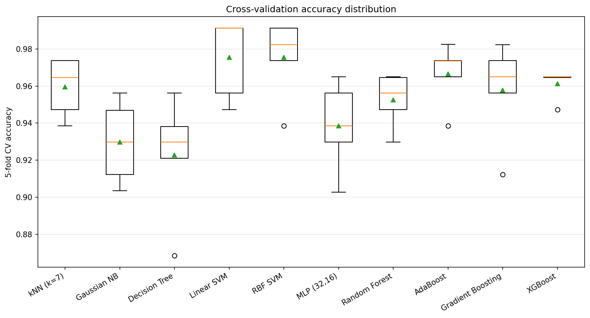
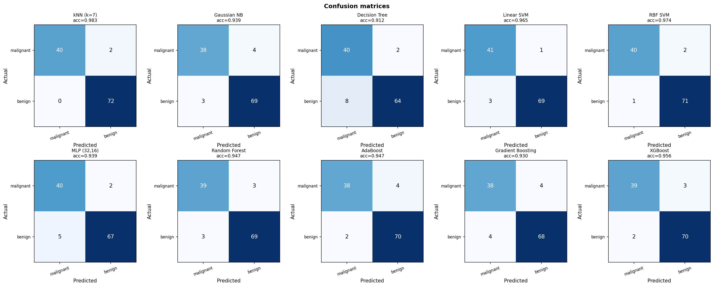
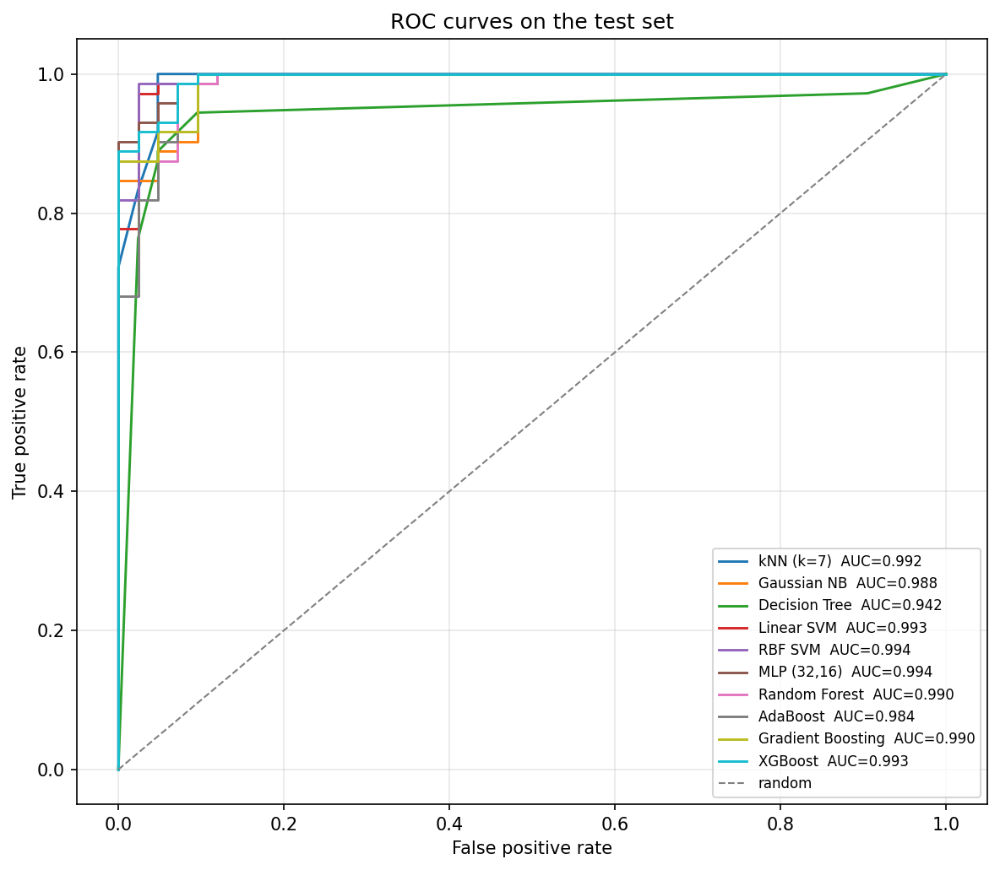
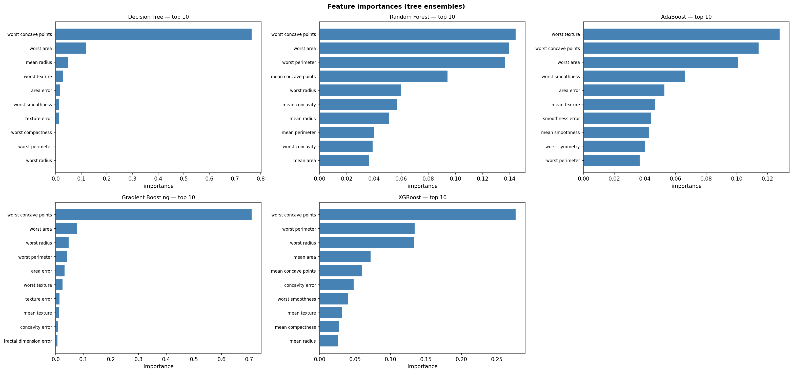
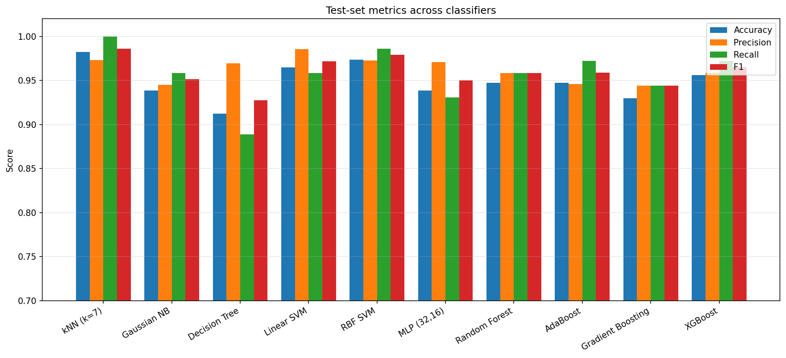
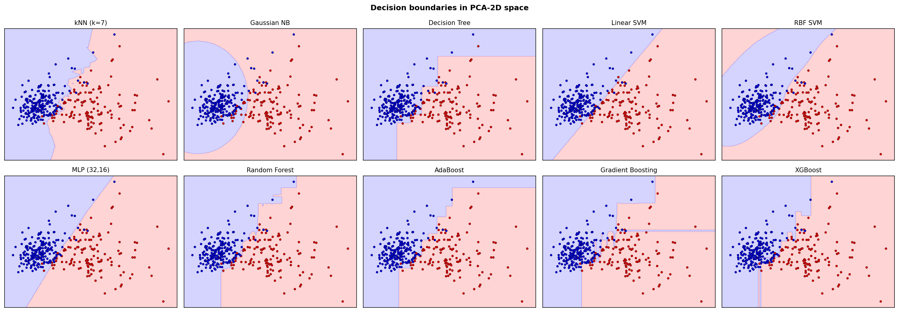

# Supervised Learning: Classification

**Classification** is the supervised-learning task of mapping an input vector $x \in \mathbb{R}^d$ to a discrete label $y \in \{c_1, c_2, \dots, c_K\}$. Given a labeled training set $D = \{(x_i, y_i)\}_{i=1}^n$, the goal is to learn a function $f: \mathbb{R}^d \rightarrow \{c_1, \dots, c_K\}$ that generalizes to *unseen* inputs.

```
Input Features (x) → [ Classifier f ] → Predicted Class ŷ
   age, income,           KNN / NB / DT             spam / not spam
   pixels, embeddings…    SVM / MLP / RF / XGBoost  benign / malignant
```

Classification underlies spam filtering, medical diagnosis, credit scoring, fraud detection, object recognition, sentiment analysis, and most "yes/no/which-bucket" decisions taken by ML systems.

## 1. Supervised Learning & Evaluation

### 1.1 The Supervised Setting

In supervised learning, the algorithm is "corrected by a supervisor": for every training input $x_i$, the *correct* label $y_i$ is provided. The model adjusts its parameters to minimize a loss between its prediction and the ground truth. Training stops when an acceptable level of accuracy is reached on held-out data.

Two ingredients are required:

| Ingredient | Role |
|---|---|
| **Training data** $\{(x_i, y_i)\}$ | examples the model learns from |
| **Inductive bias** (model family) | restricts which functions $f$ are considered |

Supervised learning splits into two sub-tasks based on the output type:

- **Classification** — output is a *discrete* class (this course).
- **Regression** — output is a *continuous* value.

### 1.2 Train / Validation / Test

A model that simply memorizes the training set has zero training error but learns nothing useful. To estimate **generalization**, the dataset is partitioned into three disjoint subsets:

```
┌───────────────────────────────────────────────────────────────┐
│           Full Labeled Dataset D                              │
├───────────────────┬────────────────┬──────────────────────────┤
│  Training (60%)   │ Validation 20% │       Test (20%)         │
│  fit parameters   │ tune hparams   │   final, untouched eval  │
└───────────────────┴────────────────┴──────────────────────────┘
```

- **Training set** — the model fits its parameters here (weights of an MLP, splits of a tree, support vectors of an SVM).
- **Validation set** — used to choose hyperparameters (the $k$ in kNN, the depth of a tree, the kernel of an SVM, the learning rate of XGBoost).
- **Test set** — touched **once**, at the very end, to report final, unbiased performance. Tuning on the test set leaks information and inflates accuracy.

### 1.3 Cross-Validation

When the dataset is small, a single train/val split is noisy. **k-fold cross-validation** splits the data into $k$ disjoint folds, trains $k$ classifiers — each using a different fold as validation and the other $k-1$ as training — then averages the $k$ scores:

```
Fold 1: [ val ][        train         ]
Fold 2: [train][ val ][     train     ]
Fold 3: [    train   ][ val ][ train  ]
Fold 4: [        train       ][  val  ]
                  ↓
         mean accuracy ± std
```

| Variant | Description |
|---|---|
| **k-fold** | Standard; typical $k = 10$. |
| **Stratified k-fold** | Each fold preserves the original class distribution — important for imbalanced data. |
| **Leave-one-out (LOO)** | $k = n$ (one example per fold). Almost unbiased, but expensive. |
| **2-fold** | Uses large train *and* test sets in each round. |
| **Bootstrap** | Sample $n$ training examples with replacement; ~36.8 % of points are never picked and form the test set. |

<p align="center"></p>
<p align="center"><em>5-fold cross-validation accuracy for every classifier — the box shows the spread across folds, not just the mean.</em></p>

### 1.4 The Confusion Matrix (Binary)

For a binary problem with a "positive" class (e.g., *malignant*) and a "negative" class (e.g., *benign*), the predictions and ground truth assemble a **confusion matrix**:

```
                  Predicted Positive   Predicted Negative
Actual Positive          TP                  FN
Actual Negative          FP                  TN
```

- **TP** — true positives, correctly predicted positives
- **TN** — true negatives, correctly predicted negatives
- **FP** — false positives ("false alarm")
- **FN** — false negatives ("missed detection")

<p align="center"></p>
<p align="center"><em>Confusion matrix for each classifier on the test set — the diagonal is correct predictions, off-diagonal are the mistakes.</em></p>

### 1.5 Binary Metrics

$$
\text{Accuracy} = \frac{TP + TN}{TP + FP + TN + FN}
$$

$$
\text{Precision} = \frac{TP}{TP + FP} \qquad \text{Recall} = \frac{TP}{TP + FN} \qquad \text{Specificity} = \frac{TN}{TN + FP}
$$

$$
F_1 = \frac{2 \cdot P \cdot R}{P + R}
$$

**Why F1 and not just accuracy?** With 100 positive and 100 negative examples, a classifier with precision $P = 100\%$ and recall $R = 30\%$ has $F_1 = 46\%$. The harmonic mean is dominated by the smaller of the two — it punishes models that win on one metric while failing on the other.

Use **precision** when false alarms are costly (spam labelled as ham reaches the inbox vs. ham labelled as spam is *lost*), **recall** when missed detections are costly (cancer screening), and **F1** when both matter.

### 1.6 Multi-Class Metrics

For $K > 2$ classes, the confusion matrix becomes $K \times K$. Per-class precision, recall, and F1 are computed by treating each class as "positive" and the rest as "negative", then aggregated:

| Aggregation | Definition | When to use |
|---|---|---|
| **Macro** | Mean of per-class scores; classes weighted equally | Imbalanced data when minority classes matter |
| **Micro** | Sum TP/FP/FN over all classes, then compute the metric globally | Dominated by majority classes |
| **Weighted** | Per-class scores weighted by support (number of true instances) | Reports overall performance while accounting for support |

### 1.7 Scoring, Ranking, and Lift Curves

Most classifiers output not just a label but a **probability estimate** $\hat{p}(y = c \mid x)$. Ranking examples by this score and inspecting the top-$k$ is useful when only a fraction of the population can be acted on (e.g., mailing 5 000 of 10 000 prospects).

A **lift curve** plots the cumulative fraction of true positives captured against the cumulative fraction of the population targeted. A perfect classifier hugs the ideal line (all positives in the top fraction); a random one follows the diagonal. The **lift** is the improvement of the model over random.

```
%TP captured
 100 ┤───────────────────●─── ideal
     │              ╭───
     │         ╭────  ← model
     │    ╭────
     │ ╭──        ╭──── random
     │╱       ╭───
     │   ╭────
   0 ┼───────────────────────  → % population targeted
     0       50        100
```

<p align="center"></p>
<p align="center"><em>ROC curves with AUC for every classifier — closer to the top-left corner is better; the diagonal is random guessing.</em></p>

## 2. K-Nearest Neighbors

**kNN** is a *lazy*, *non-parametric* classifier. There is no explicit training phase: the model **is** the training set. At prediction time, the algorithm finds the $k$ closest training points to the query $x$ and votes:

```
Input:  training set D, distance function d, integer k, test point x
Method: 1. Compute d(x, x_i) for every x_i ∈ D
        2. Select the k nearest training points
        3. Return the majority class among them
```

### 2.1 Distance Functions

Any function $d(\cdot, \cdot)$ satisfying the four metric axioms qualifies:

$$
d(x,y) \geq 0 \qquad d(x,x) = 0 \qquad d(x,y) = d(y,x) \qquad d(x,y) \leq d(x,z) + d(z,y)
$$

Common choices:

- **Euclidean** $\sqrt{\sum_i (x_i - y_i)^2}$ — the default for continuous, scaled features.
- **Manhattan** $\sum_i |x_i - y_i|$ — robust to outliers, natural in grid-like spaces.
- **Cosine** $1 - \tfrac{x \cdot y}{\|x\|\|y\|}$ — for high-dimensional sparse vectors (text, embeddings).
- **Hamming** — for categorical/binary features.

### 2.2 Choosing k

```
k = 1  ──→  overfits; very jagged boundary, sensitive to noise
k = 3  ──→  small smoothing
k = 5  ──→  typical sweet spot
k = √n ──→  rule-of-thumb upper bound
k → n  ──→  underfits; predicts the global majority class
```

The best $k$ is found by **cross-validation** on the training set. Odd values are preferred for binary problems to avoid ties.

### 2.3 Strengths and Weaknesses

| ✅ Pros | ❌ Cons |
|---|---|
| Simple, intuitive, no training | $O(n d)$ at prediction time — slow at scale |
| Non-parametric (no distribution assumption) | Sensitive to **feature scale** — always standardize |
| Naturally multi-class | Sensitive to noise, outliers, irrelevant features |
| Adapts to new data instantly | "**Curse of dimensionality**" — distances concentrate in high $d$ |
| Decent baseline for small, low-dim datasets | High memory (must store all $n$ training points) |

## 3. Naïve Bayes

A **probabilistic** classifier built on Bayes' theorem. Given $K$ classes and a feature vector $x = (a_1, \dots, a_d)$, it computes

$$
P(c \mid a_1, \dots, a_d) = \frac{P(c) \cdot P(a_1, \dots, a_d \mid c)}{P(a_1, \dots, a_d)}
$$

and predicts the class with the highest posterior. The **naïve** assumption is that features are *conditionally independent* given the class:

$$
P(a_1, \dots, a_d \mid c) = \prod_{j=1}^d P(a_j \mid c)
$$

The denominator $P(x)$ is the same for every class and can be dropped, giving the decision rule:

$$
\hat{y} = \arg\max_{c \in C} \; P(c) \prod_{j=1}^d P(a_j \mid c)
$$

In practice, sums of log-probabilities are used to avoid underflow.

### 3.1 Worked Example — PlayTennis

| Outlook | Humidity | Play? |
|---|---|---|
| Sunny | High | No |
| Sunny | High | No |
| Overcast | High | Yes |
| Rain | Normal | Yes |
| Sunny | Normal | Yes |

To classify `(Sunny, Normal)`:

$$
P(\text{Yes}\mid\text{Sunny, Normal}) \propto P(\text{Yes}) \cdot P(\text{Sunny}\mid\text{Yes}) \cdot P(\text{Normal}\mid\text{Yes})
$$

Repeat for `No` and compare. The class with the highest score wins.

### 3.2 The Zero-Frequency Problem

If a feature value never co-occurs with a given class in the training set, the conditional probability is $0$ and the entire product collapses to $0$. **Laplace (add-one) smoothing** fixes this:

$$
P(a_j = v \mid c) = \frac{\text{count}(a_j = v, c) + \alpha}{\text{count}(c) + \alpha \cdot V_j}
$$

where $V_j$ is the number of distinct values for feature $j$ and $\alpha$ is typically $1$.

### 3.3 Variants of Naïve Bayes

| Variant | Likelihood $P(a_j \mid c)$ | Use case |
|---|---|---|
| **Gaussian NB** | $\mathcal{N}(\mu_{jc}, \sigma_{jc}^2)$ — Gaussian per (feature, class) | Continuous features |
| **Multinomial NB** | Multinomial counts | Text classification (bag-of-words) |
| **Bernoulli NB** | Bernoulli (presence/absence) | Binary features, short documents |
| **Complement NB** | Like Multinomial but inverts counts | Imbalanced text |

Continuous features can also be **discretized** (binned) and treated as categorical.

### 3.4 Strengths and Weaknesses

| ✅ Pros | ❌ Cons |
|---|---|
| Extremely fast to train and predict (closed form) | Independence assumption is rarely true |
| Excellent baseline for text | Probability estimates are often poorly calibrated |
| Works with small datasets and many features | Highly correlated features hurt performance |
| Naturally multi-class | Zero-frequency needs smoothing |

## 4. Decision Trees

A **decision tree** is a rooted tree where:

- **Internal nodes** test a single feature (`Outlook = ?`, `Age < 35`).
- **Branches** correspond to outcomes of that test.
- **Leaves** carry a class label and, optionally, support/confidence.

```
                  Outlook ?
              /      |       \
          Sunny  Overcast    Rain
            |        |        |
        Humidity?   Yes     Wind?
        /    \              /   \
     High  Normal        Weak  Strong
      No    Yes          Yes    No
```

Each path from root to leaf is an `if–then` rule, which makes trees uniquely **interpretable** among ML models.

### 4.1 ID3 — Top-Down Induction

ID3 (Quinlan, 1986) builds the tree greedily: at each node, choose the attribute that **maximizes information gain** and split on it.

**Entropy** of a set $S$ with class proportions $p_1, \dots, p_K$:

$$
H(S) = -\sum_{k=1}^K p_k \log_2 p_k
$$

$H(S) = 0$ when $S$ is pure (one class). $H(S) = \log_2 K$ when classes are uniform — maximally uncertain.

**Information gain** of splitting $S$ on attribute $A$ with values $\{v_1, \dots, v_m\}$:

$$
\text{Gain}(S, A) = H(S) - \sum_{i=1}^m \frac{|S_{v_i}|}{|S|} H(S_{v_i})
$$

The attribute with the highest gain is chosen. Repeat recursively on each child. Stop when all examples have the same class or no attributes remain (label the leaf with the majority class).

**Bias of pure gain:** attributes with many values (e.g., `customer_id`) trivially have high gain because each split shard is pure. **Gain ratio** normalizes by the entropy of the split itself:

$$
\text{GainRatio}(S, A) = \frac{\text{Gain}(S, A)}{H(\text{split by } A)}
$$

### 4.2 Gini Impurity (CART)

An alternative to entropy used by **CART** (Breiman, 1984) — and by scikit-learn's default `DecisionTreeClassifier`:

$$
\text{Gini}(S) = 1 - \sum_{k=1}^K p_k^2
$$

Gini and entropy disagree only marginally in practice; Gini is slightly cheaper to compute.

### 4.3 Continuous Attributes

ID3 was designed for categorical inputs. For continuous $A$, candidate thresholds are tested:

1. Sort training examples by $A$.
2. Each midpoint between consecutive points where the class changes is a candidate $t$.
3. Compute gain of the binary split $A \le t$ vs. $A > t$.
4. Keep the threshold with maximum gain; this attribute then competes with the others.

### 4.4 Overfitting and Pruning

A deep, fully grown tree memorizes the training set. Two remedies:

| Strategy | Description |
|---|---|
| **Pre-pruning** | Stop growing when a criterion is met (max depth, min samples per leaf, min gain). Risk: stop too early. |
| **Post-pruning** | Grow the full tree, then prune sub-trees whose removal does not hurt validation accuracy. |

**Post-pruning** is generally preferred — it is hard to know in advance when growth has gone "too far".

### 4.5 ID3 → C4.5 → C5.0

C4.5 (Quinlan, 1993) extends ID3 with:

- **Continuous attributes** via threshold search.
- **Missing values** handling (probabilistic distribution of the example over branches).
- **Gain ratio** instead of pure gain.
- **Post-pruning** via subtree replacement and subtree raising.

C5.0 further improves speed, memory, and adds boosting support.

### 4.6 Strengths and Weaknesses

| ✅ Pros | ❌ Cons |
|---|---|
| Highly interpretable | Easy to **overfit** without pruning |
| No feature scaling required | **Unstable** — small data changes give different trees |
| Handles mixed types and missing values | Greedy splits may miss the global optimum |
| Captures non-linear relationships | Biased toward features with many levels |
| Implicit feature selection | Poor at modelling smooth, additive functions |

## 5. Support Vector Machines

SVMs are **maximum-margin** linear classifiers. Given linearly separable data with labels $y_i \in \{-1, +1\}$, infinitely many hyperplanes $w \cdot x + b = 0$ separate the classes. SVM picks the one that maximizes the **margin** — the distance to the nearest training point on either side.

```
            ●          ○
       ●           ⇡ margin ⇡
   ● ────────────────────────────── ○      decision boundary
                          ⇣ margin ⇣
            ●                          ○
                            ↑
                support vectors
       (the only points that determine w, b)
```

### 5.1 The Hard-Margin Primal

The signed distance from a point $x_i$ to the hyperplane is $\frac{y_i (w \cdot x_i + b)}{\|w\|}$. By scaling so that the closest points satisfy $y_i (w \cdot x_i + b) = 1$, the margin becomes $\frac{1}{\|w\|}$. Maximizing the margin is therefore equivalent to minimizing $\|w\|^2$:

$$
\min_{w, b} \; \tfrac{1}{2} \|w\|^2 \quad \text{s.t.} \quad y_i (w \cdot x_i + b) \geq 1, \quad \forall i
$$

This is a **convex quadratic program** with a unique global optimum, solved efficiently by modern QP solvers.

### 5.2 Soft Margin

Real data is rarely linearly separable. **Slack variables** $\xi_i \geq 0$ relax the constraints, and a penalty $C$ trades off margin width against misclassification:

$$
\min_{w, b, \xi} \; \tfrac{1}{2} \|w\|^2 + C \sum_{i=1}^n \xi_i \quad \text{s.t.} \quad y_i (w \cdot x_i + b) \geq 1 - \xi_i, \quad \xi_i \geq 0
$$

- Small $C$ → wider margin, more tolerance for misclassifications (less overfitting).
- Large $C$ → narrower margin, fewer misclassifications (closer to hard margin).

### 5.3 The Kernel Trick

Non-linearly separable data in $\mathbb{R}^d$ can become separable after a mapping $\phi: \mathbb{R}^d \to \mathbb{R}^D$ to a higher-dimensional space. The **dual** formulation depends on inner products $\phi(x_i) \cdot \phi(x_j)$, which can be replaced by a **kernel function** $K(x_i, x_j)$ without ever computing $\phi$ explicitly:

| Kernel | Formula | Notes |
|---|---|---|
| **Linear** | $K(x, y) = x \cdot y$ | Equivalent to no kernel; fast, baseline |
| **Polynomial** | $(\gamma x \cdot y + r)^p$ | Degree $p$ controls flexibility |
| **RBF / Gaussian** | $\exp(-\gamma \|x - y\|^2)$ | Default; $\gamma$ controls locality |
| **Sigmoid** | $\tanh(\gamma x \cdot y + r)$ | Inspired by neural networks; rarely best |

```
1-D data:  ● ● ○ ○ ○ ● ●         (not linearly separable)
                  ↓  φ(x) = (x, x²)
                  ↓
2-D image:   ●               ●
                  ○ ○ ○          ← a line separates the classes
             ●               ●
```

### 5.4 Multi-Class SVM

SVMs are inherently binary. Multi-class is built on top:

- **One-vs-rest (OvR)** — train $K$ classifiers; each separates class $k$ from the rest. Pick the one with highest score.
- **One-vs-one (OvO)** — train $K(K-1)/2$ classifiers, one per pair. Vote.

### 5.5 Strengths and Weaknesses

| ✅ Pros | ❌ Cons |
|---|---|
| Strong theoretical foundation (max-margin) | $O(n^2)$–$O(n^3)$ training — slow at scale |
| Effective in high-dimensional spaces | Needs careful kernel and $C, \gamma$ tuning |
| Kernel trick handles non-linearity | Hard to interpret |
| Robust via soft margin | Native to binary only |
| Convex → global optimum | Probability outputs require extra calibration |

## 6. Multilayer Perceptron

The **MLP** is the canonical feed-forward neural network: stacked linear layers separated by non-linearities. Each layer transforms its input as:

$$
h^{(l)} = \sigma\!\left( W^{(l)} h^{(l-1)} + b^{(l)} \right)
$$

```
                Input            Hidden 1       Hidden 2      Output
              x ∈ ℝ^d          h₁ ∈ ℝ^32       h₂ ∈ ℝ^16     ŷ ∈ ℝ^K
                ●─────W₁,σ─────●─────W₂,σ─────●─────W₃,softmax──→
                ●              ●              ●
                ●              ●              ●
                ●              ●
```

with $\sigma$ a non-linear activation. The final layer uses **softmax** for multi-class probabilities:

$$
\hat{p}(y = k \mid x) = \frac{e^{z_k}}{\sum_{j=1}^K e^{z_j}}
$$

### 6.1 Activations

| Activation | Formula | Notes |
|---|---|---|
| **ReLU** | $\max(0, z)$ | Default; cheap, fights vanishing gradients |
| **Sigmoid** | $1 / (1 + e^{-z})$ | Output of binary classifiers; saturates |
| **Tanh** | $(e^z - e^{-z}) / (e^z + e^{-z})$ | Zero-centered alternative to sigmoid |
| **Softmax** | $e^{z_k}/\sum_j e^{z_j}$ | Output layer for multi-class |

### 6.2 Training — Backpropagation + SGD

The loss for $K$-class classification is **cross-entropy**:

$$
\mathcal{L} = -\frac{1}{n}\sum_{i=1}^n \sum_{k=1}^K \mathbb{1}[y_i = k] \log \hat{p}(y_i = k \mid x_i)
$$

Gradients $\partial \mathcal{L} / \partial W^{(l)}$ are computed by the **chain rule** (backpropagation), then weights are updated with **stochastic gradient descent** (or Adam):

$$
W^{(l)} \leftarrow W^{(l)} - \eta \, \frac{\partial \mathcal{L}}{\partial W^{(l)}}
$$

### 6.3 Hyperparameters

- **Depth** (number of hidden layers) and **width** (neurons per layer) — capacity.
- **Activation** — ReLU is the safe default.
- **Learning rate** $\eta$ — too high diverges, too low stalls.
- **Batch size** — trades off gradient noise vs. throughput.
- **Regularization** — L2 weight decay, dropout, early stopping.
- **Optimizer** — SGD with momentum, Adam, RMSProp.

### 6.4 Strengths and Weaknesses

| ✅ Pros | ❌ Cons |
|---|---|
| Universal approximator (with enough width) | Needs lots of data to outshine simpler models |
| Captures complex non-linear interactions | Many hyperparameters to tune |
| GPU-friendly, scales to huge datasets | Sensitive to feature scaling and initialization |
| Foundation of modern deep learning | Black-box compared to trees |
| Naturally multi-class via softmax | Local minima / saddle points in the loss landscape |

## 7. Ensemble Methods

A single classifier has limited capacity and high variance. **Ensembles** combine many *weak* classifiers — each only slightly better than random — into a *strong* classifier whose errors cancel out. Three dominant paradigms: **bagging**, **boosting**, and **stacking**.

```
   Bagging                Boosting                  Stacking
  (parallel)            (sequential)             (heterogeneous)
                                                                   
  ┌──────┐               ┌──────┐                ┌──────┐  ┌──────┐
  │ M₁   │               │ M₁   │                │ KNN  │  │ SVM  │
  ├──────┤               └───┬──┘                ├──────┤  ├──────┤
  │ M₂   │  ──→ vote       reweight              │ Tree │  │ MLP  │
  ├──────┤                   │                   └──┬───┘  └──┬───┘
  │ M₃   │                ┌──┴───┐                  └────┬────┘
  └──────┘                │ M₂   │                       │
                          └───┬──┘                  ┌────┴────┐
   trained                  ⋮                       │  Meta   │
   independently          add up                    │ learner │
   on bootstraps        weighted vote               └─────────┘
```

### 7.1 Bagging — Bootstrap Aggregating

Train $T$ identical models on $T$ different **bootstrap samples** of the training set (sampling $n$ examples *with replacement*). Aggregate predictions by **majority vote** (classification) or **average** (regression).

Bagging reduces **variance**: errors from individual trees cancel when they are uncorrelated. It works best with **high-variance, low-bias** base learners — typically *unpruned* decision trees.

### 7.2 Random Forest

A **Random Forest** is bagging on decision trees with two sources of randomness:

1. **Bootstrap sampling** of the training data (as in bagging).
2. **Random feature subsampling**: at every split, only $m$ randomly chosen features (out of $M$) are considered as candidates. Typical $m = \sqrt{M}$ for classification.

This **decorrelates** the trees — without it, every tree would pick the same dominant feature as its root, and bagging would barely help. Trees are grown to maximum depth (no pruning); over-fitting is controlled by averaging.

**Hyperparameters that matter:**

| Hyperparameter | Effect |
|---|---|
| `n_estimators` (T) | More trees → smoother, slower; diminishing returns past a few hundred |
| `max_features` (m) | Lower → more decorrelation, more variance per tree |
| `max_depth` | Usually unrestricted; control noise via `min_samples_leaf` |
| `bootstrap` | `True` for bagging; `False` for fully random forests |

Random Forests also provide **feature importance** (mean impurity decrease across all trees), an out-of-the-box interpretability tool.

<p align="center"></p>
<p align="center"><em>Feature importances from the tree ensembles (Random Forest / XGBoost) — which measurements drive the predictions.</em></p>

### 7.3 Boosting

Boosting builds trees **sequentially**. Each new tree focuses on the examples the previous ensemble got wrong:

```
1. Initialize sample weights w_i = 1/n
2. For t = 1, …, T:
       Train a weak learner h_t on weighted data
       Compute its weighted error ε_t
       Compute its vote α_t = ½ ln((1 − ε_t)/ε_t)
       Re-weight: increase w_i for misclassified examples
3. Final prediction: sign( Σ α_t h_t(x) )
```

Boosting reduces **bias** as well as variance — many shallow stumps can together fit complex boundaries.

### 7.4 AdaBoost

**AdaBoost** (Freund & Schapire, 1996) is the original boosting algorithm. Base learner: depth-1 trees ("decision stumps"). Misclassified examples gain exponential weight at each round.

| ✅ Pros | ❌ Cons |
|---|---|
| Few hyperparameters (depth, lr, T) | Sensitive to noisy data and outliers |
| Robust to overfitting in clean datasets | Slower than XGBoost |
| Works with any weak learner | Performs worse with many irrelevant features |

### 7.5 Gradient Boosting

**Gradient Boosting** generalizes boosting: each new tree is fit to the **negative gradient** of the loss with respect to the current ensemble's predictions. For squared error, this is just the residual; for cross-entropy, it is the pseudo-residual derived from the softmax gradient.

```
F₀(x) = constant (mean / log-odds)
For t = 1, …, T:
    rᵢ ← −∂L/∂F(xᵢ)  ← pseudo-residual
    fit tree h_t to (xᵢ, rᵢ)
    F_t(x) ← F_{t-1}(x) + η · h_t(x)
```

The **learning rate** $\eta$ (often called *shrinkage*) trades off the contribution of each tree against the number of trees needed.

### 7.6 XGBoost

**XGBoost** (Chen & Guestrin, 2016) is an engineering breakthrough of gradient boosting. Key innovations:

- **Second-order Taylor expansion** of the loss — uses both gradient and Hessian for sharper updates.
- **L1 + L2 regularization** on leaf weights → reduces overfitting.
- **Sparsity-aware split finding** — natively handles missing values.
- **Column block** storage for cache-efficient parallel split finding.
- **Approximate split finding** via histogram bins — scales to billions of rows.
- **Built-in cross-validation, early stopping, and feature importance**.

XGBoost (and its cousins **LightGBM**, **CatBoost**) is the de facto winner of Kaggle tabular competitions.

### 7.7 Bagging vs. Boosting at a Glance

| Aspect | **Bagging (Random Forest)** | **Boosting (AdaBoost, XGBoost)** |
|---|---|---|
| Training | Parallel, independent trees | Sequential, each fixes the last |
| Sample weights | Uniform (with replacement) | Reweighted toward errors |
| Bias / variance | Reduces variance | Reduces bias *and* variance |
| Robustness to noise | High | Lower — chases hard examples |
| Tendency to overfit | Low | Higher; controlled by depth, lr, regularization |
| Hyperparameter tuning | Light | Heavier (lr, depth, T, λ, α) |
| Typical winner | Robust baseline | Top of leaderboards |

### 7.8 Why Ensembles Work

Underlying weak learners are individually easy to understand (a single stump, a shallow tree). When combined:

- Non-parametric — no assumption about feature distributions.
- Handle mixed feature types out of the box.
- Multi-collinearity does not hurt.
- Robust to outliers (especially Random Forests).
- Often more accurate than any single tree, MLP, or SVM on tabular data.

## 8. Choosing a Classifier

```
Tabular data, moderate size?         → start with XGBoost / Random Forest
Need interpretability above all?     → Decision Tree (shallow)
Tiny dataset (< 1 000 rows)?         → kNN or Naïve Bayes
Text or bag-of-words features?       → Multinomial NB or linear SVM
High-dimensional, < 10 000 examples? → SVM (RBF or linear)
Massive structured/image data?       → MLP / deep network
Need a calibrated probability?       → Logistic regression, calibrated SVM/RF
```

A rough mental model for the *no free lunch* theorem: there is no single classifier that wins on every dataset. The right move is to benchmark several on a held-out validation set.

<p align="center"></p>
<p align="center"><em>Accuracy, precision, recall and F1 side by side across all classifiers on the test set.</em></p>

<p align="center"></p>
<p align="center"><em>Each classifier's decision boundary in PCA-projected 2-D space — a visual intuition for how differently the models carve up the feature space.</em></p>

## Tutorial

The companion script `supervised_classification.py` trains and benchmarks **all** the classifiers in this README on a shared dataset (Breast Cancer Wisconsin from `sklearn.datasets`, 569 samples × 30 features, 2 classes). It also produces visualisations to interpret what each model learned.

### Pipeline

1. **Load and preprocess** — split into train / validation / test; standardize features.
2. **Train each classifier**:
   - kNN — with cross-validated $k$
   - Gaussian Naïve Bayes
   - Decision Tree (with depth chosen by validation accuracy)
   - SVM (linear and RBF)
   - MLP (small 2-hidden-layer net)
   - Random Forest
   - AdaBoost
   - Gradient Boosting
   - XGBoost
3. **Evaluate** on the held-out test set: accuracy, precision, recall, F1, confusion matrix.
4. **Visualize**:
   - Bar chart comparing all metrics across classifiers
   - Confusion matrices for the top models
   - Decision boundaries in PCA-reduced 2-D space
   - ROC curves and AUC
   - Feature importance for the tree-based ensembles
5. **Cross-validation** — 5-fold stratified CV on the same dataset to confirm rankings.

All plots are saved to `./outputs/classification/`.

### Installation

```bash
# Create a virtual environment
python -m venv classification-course
source classification-course/bin/activate  # Windows: classification-course\Scripts\activate

# Install dependencies
pip install -r requirements.txt
```

### Quick Start

```bash
# Run all labs
python supervised_classification.py

# Or run a specific lab
python supervised_classification.py --lab 1   # Data, splits, evaluation metrics
python supervised_classification.py --lab 2   # kNN, Naïve Bayes, Decision Tree
python supervised_classification.py --lab 3   # SVM, MLP
python supervised_classification.py --lab 4   # Random Forest, AdaBoost, Gradient Boosting, XGBoost
python supervised_classification.py --lab 5   # Final benchmark + visualisations
```

### Outputs

```
outputs/classification/
├── metrics_comparison.png      ← bar chart of accuracy / precision / recall / F1
├── confusion_matrices.png      ← heat-maps for each classifier
├── decision_boundaries.png     ← PCA-2D boundaries for all classifiers
├── roc_curves.png              ← ROC + AUC for all classifiers
├── feature_importance.png      ← RF / XGBoost feature importance
└── cv_results.png              ← box-plots of 5-fold CV accuracies
```
